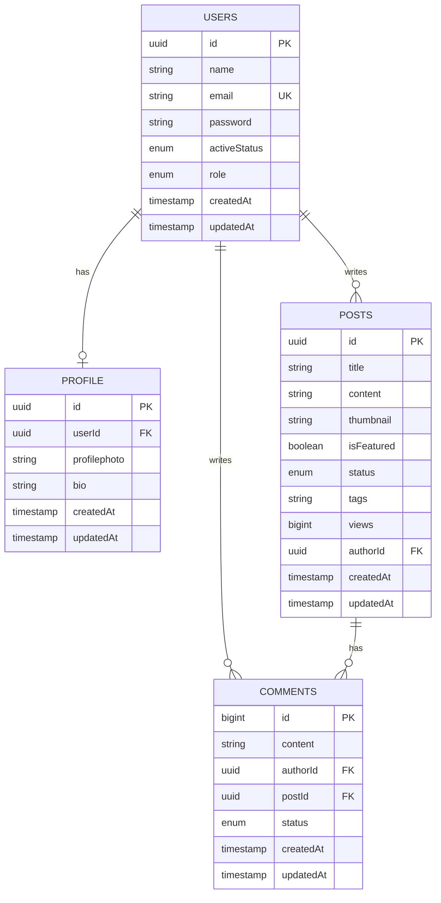

# Title: Requirement Analysis, Authentication System Design & Implementation

---

## 1. Roadmap of a project from beginning to completion

1. Read the project requirement or requirement analysis thoroughly.
2. Brainstorming.
3. Note down important topics — features, roles, API endpoints.
4. Note down the flow of the project: user flow (role-based), and how other features flow and connect with the user.
5. ERD design or database design.
6. Project setup with the required tech stack — e.g. Node, Express, Prisma, TypeScript, Dotenv.
7. Prisma schema models defining.
8. Prisma migrate & generate.
9. Project business logic implementation in API (for backend) or frontend components (for frontend).
10. Check new features & well-test the completed features.

---

## 2. Getting started with requirement analysis of the project

Based on the ERD, this looks like a **blog / content platform** with role-based authentication. Breaking it down the way step 3–4 of the roadmap suggests:

**Core entities identified**
- `users` — the account itself (credentials, role, status).
- `profile` — extra personal info about a user, kept separate from the core account table.
- `posts` — the content users publish.
- `comments` — replies attached to a post.

**Features implied by the schema**
- **Authentication** — `users.email` + `users.password` → register/login.
- **Role-based access** — `users.role` (enum) suggests at least two roles, e.g. `USER` / `ADMIN`, controlling who can manage posts, moderate comments, etc.
- **Account status control** — `users.activeStatus` (enum) suggests an `ACTIVE` / `BLOCKED` type state, used to disable an account without deleting it (this is exactly what the refresh-token flow checks before issuing a new access token).
- **Profile management** — a user can set a `profilephoto` and `bio`, separate from login credentials. Optional fields (`text?`) mean a profile can exist with these left empty.
- **Blogging / content publishing** — `posts` has `title`, `content`, `thumbnail`, `tags[]`, `isFeatured`, `status` (draft/published/etc.), and `views` for a basic analytics counter.
- **Commenting with moderation** — `comments` has its own `status` enum, implying comments may need approval before showing publicly (e.g. `PENDING` / `APPROVED` / `REJECTED`).
- **Ownership tracking** — both `posts.authorId` and `comments.authorId` point back to `users.id`, so every post and comment has a clear owner.

**User flow (role-based), high level**
1. A visitor registers → row created in `users` (default role, default active status).
2. User optionally fills out their `profile` (photo, bio).
3. User creates `posts` (owns them via `authorId`).
4. Other users read posts and leave `comments` (owns them via `authorId`, linked to the post via `postId`).
5. An admin role can likely moderate: change `posts.status`, `comments.status`, or set a user's `activeStatus` to `BLOCKED`.

**API endpoints this naturally leads to** (rough draft, refine during actual design)
- `POST /api/auth/register`, `POST /api/auth/login`, `POST /api/auth/refresh-token`
- `GET/PATCH /api/profile`
- `GET/POST/PATCH/DELETE /api/posts`
- `GET/POST/PATCH/DELETE /api/comments`

---

## 3. Drawing the ERD for the project



GitHub renders this `mermaid` code block natively in any `.md` file — no extra setup needed, just paste it as-is.

**Relationship notes**
- `users` ↔ `profile` — **one-to-one**. Each user has at most one profile row (`profile.userId` is a unique FK back to `users.id`).
- `users` ↔ `posts` — **one-to-many**. One user can author many posts (`posts.authorId`).
- `users` ↔ `comments` — **one-to-many**. One user can author many comments (`comments.authorId`).
- `posts` ↔ `comments` — **one-to-many**. One post can have many comments (`comments.postId`).

**Why split `profile` out of `users` instead of adding those columns directly to `users`?**
- Keeps the auth-critical table (`users`) lean — password, role, status — separate from optional, frequently-changing personal info (bio, photo).
- Lets you fetch just credentials for auth checks without pulling profile data every time.
- Makes it easy to add more profile fields later without touching the auth table or its indexes.

---

## Quick takeaways for future projects

- Always separate the **auth-critical table** (`users`) from **optional profile data** — don't cram everything into one table.
- Use an `activeStatus` enum on `users` from day one — it's the cheapest way to support banning/disabling accounts later, and it plugs directly into the refresh-token check.
- Give content tables (`posts`, `comments`) their own `status` enum if moderation or draft/publish states are even remotely likely — much easier to add now than to retrofit.
- Draw the ERD *before* writing any Prisma schema — it forces you to settle on relationships (1-1 vs 1-many) up front instead of discovering the mismatch mid-migration.


# 🚀 Generic Backend Project Template

This repository serves as a highly scalable, reusable boilerplate structure for modern Node.js / TypeScript backend services. It implements a **modular architecture**, ensuring that business domains are decoupled, readable, and highly maintainable.

---

## 📂 Folder Structure

```text
my-awesome-project/
├── dist/                        # Compiled JavaScript (production build target)
├── prisma/                      # Database ORM folder (schema & migrations)
│   └── schema.prisma            # Single source of truth for DB models
├── src/                         # All source code lives here
│   ├── config/                  # Environment variable validations & connection pool configurations
│   ├── lib/                     # Third-party wrappers (SDK initializations like Stripe, AWS, Twilio)
│   ├── middlewares/             # Global Express/Fastify request middleware (auth, error-handler, validation)
│   ├── modules/                 # Domain-driven feature sets (Isolated business modules)
│   │   ├── [feature_name_1]/    # Pluralized domain folder (e.g., users, posts, products)
│   │   │   ├── controllers.ts   # Parses incoming request objects & sends responses
│   │   │   ├── services.ts      # Pure business logic & orchestration of database layers
│   │   │   ├── routes.ts        # Module router mounting individual endpoint endpoints
│   │   │   └── types.ts         # Module-specific type-guards and interfaces
│   │   └── [feature_name_2]/
│   ├── utils/                   # Shared utility singletons (loggers, custom formatters)
│   ├── app.ts                   # Application configuration, instantiation, global middleware piping
│   └── server.ts                # Server entry point wrapper (listens to port, graceful shutdowns)
├── .env                         # Local runtime credentials (NEVER commit to version control)
├── .env.example                 # Clear contract representing necessary environmental configurations
├── .gitignore                   # Safe configuration exclusion masks
├── package.json                 # Core metadata, dependency manifests, build/run script macros
├── tsconfig.json                # Explicit TypeScript compilation rule definitions
└── README.md                    # System architecture documentation guide
