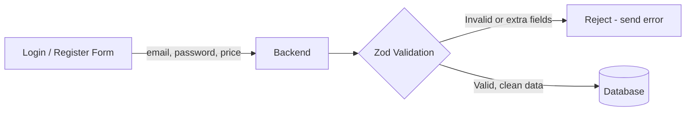
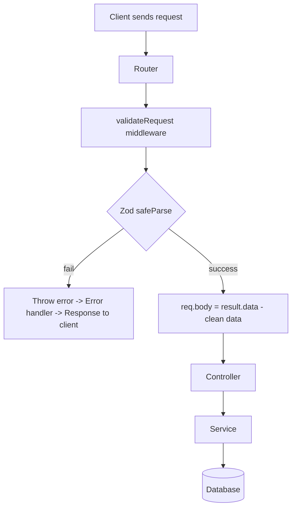

# Data Validation & Sanitization with Zod

Docs: https://zod.dev/

---

## 1. Why do we need data validation?

When a user registers/logs in, they send data from frontend to backend:

```json
{
  "email": "admin@gmail.com",
  "password": "12345678",
  "price": "100tk"
}
```

Here `price` is an **extra field** that should not exist in a login/register
request. The user (or a hacker using Postman) can send any extra field they
want. If we don't check it before it reaches the database:

- **SQL (Prisma/Postgres):** Prisma will throw an error because of the
  unknown field — but that error happens **after** a request already went to
  the database layer. That's a wasted trip.
- **NoSQL (MongoDB):** MongoDB has no fixed schema, so it will happily save
  `price` into the `users` collection. Now your database is polluted with
  fields that were never supposed to be there.

### The real cost

- Every unnecessary request that reaches the database wastes DB resources.
- More DB load → harder to scale / load balance.
- Bad or wrong-typed data in the DB → bugs later, hard to debug.

**So the rule is:** check and clean the data **before** it touches the
database. This is called:

- **Validation** → is the data correct? (right type, right format, required
  fields present)
- **Sanitization** → remove/strip anything that is not allowed (extra
  fields, unsafe input)

### Flow



Doing this check with plain `if/else` for every field is slow to write and
error-prone. So instead, we use a validation library — **Zod**.

---

## 2. What is Zod?

> Zod is a **TypeScript-first schema validation library**. You define a
> "schema" (shape + rules of the data) once, and Zod checks incoming data
> against it — from a simple string to a deeply nested object.

Think of it like a **Prisma model, but for request data** instead of the
database.

| Concept | Prisma | Zod |
|---|---|---|
| Purpose | Defines DB table shape | Defines request/input data shape |
| Where used | Database layer | Before DB layer (in API/controller) |
| Example | `model User { name String }` | `z.object({ name: z.string() })` |
| On failure | DB error | Validation error (caught early) |

**In short:** Zod = a schema for your incoming data, so you validate once,
in one place, instead of checking every field manually.

---

## 3. Basic Example

```ts
import { z } from "zod";

app.post("/zod", async (req: Request, res: Response, next: NextFunction) => {
  try {
    const userZodSchema = z.object({
      name: z.string().optional(),
      email: z.email().optional(),
      age: z.number().optional(),
      isVerified: z.boolean().optional(),
      books: z.array(z.string()).optional(),
    });

    const payload = req.body;

    const result = userZodSchema.parse(payload); // throws if invalid
    console.log(result);

    res.status(httpStatus.OK).json({
      success: true,
      message: "Validated successfully",
      data: result,
    });
  } catch (error) {
    console.log(error);
    next(error);
  }
});
```

---

## 4. `parse()` vs `safeParse()`

| Method | Behavior |
|---|---|
| `.parse(data)` | Returns clean data directly, but **throws an error** if invalid (need try/catch) |
| `.safeParse(data)` | Never throws. Returns `{ success, data, error }` so you can check manually |

```ts
const result = userZodSchema.safeParse(payload);

if (!result.success) {
  console.log(result.error); // ZodError object with details
}

if (result.success) {
  console.log(result.data); // clean, validated data (not optional anymore)
}
```

👉 **Best practice:** use `safeParse()` in real projects — it avoids
try/catch just for validation and gives clean control over error responses.

---

## 5. Custom Error Messages

You can attach a custom message to any rule:

```ts
z.string("Not a string!!!");
z.string().min(5, "Too short!");
z.uuid("Bad UUID!");
z.iso.date("Bad date!");
z.array(z.string(), "Not an array!");
z.array(z.string()).min(5, "Too few items!");
z.set(z.string(), "Bad set!");
```

### Real example — password rules

```ts
password: z
  .string()
  .min(8)
  .regex(/[A-Z]/, "Password must contain at least one uppercase letter.")
  .regex(/[a-z]/, "Password must contain at least one lowercase letter.")
  .regex(/[0-9]/, "Password must contain at least one number.")
  .regex(/[^A-Za-z0-9]/, "Password must contain at least one special character."),
```

### Reading all error messages

```ts
if (!payload.success) {
  console.log(payload.error);

  let errorMessage = "";
  payload.error.issues.forEach((issue) => {
    errorMessage = errorMessage + " " + issue.message;
  });

  throw new Error(errorMessage);
}
```

---

## 6. Step-by-Step: Using Zod in a Real Project

### Project structure

```
src/
 ├── prisma.ts
 ├── middleware/
 │    ├── checkAuth.ts
 │    ├── globalErrorHandler.ts
 │    ├── notFound.ts
 │    └── validateRequest.ts      → generic zod middleware
 ├── module/
 │    └── auth/
 │         ├── auth.controller.ts
 │         ├── auth.interface.ts
 │         ├── auth.route.ts
 │         ├── auth.service.ts
 │         └── auth.validation.ts → zod schemas
 ├── utils/
 └── generated/
```

### Step 1 — Define schemas: `auth/auth.validation.ts`

```ts
import z from "zod";

const PatientRegistrationZodSchema = z.object({
  name: z.string().min(3).max(10),
  email: z.email(),
  password: z
    .string()
    .min(8)
    .regex(/[A-Z]/, "Password must contain at least one uppercase letter.")
    .regex(/[a-z]/, "Password must contain at least one lowercase letter.")
    .regex(/[0-9]/, "Password must contain at least one number.")
    .regex(
      /[^A-Za-z0-9]/,
      "Password must contain at least one special character."
    ),
  patient: z
    .object({
      contactNumber: z.string().optional(),
    })
    .optional(),
});

const LoginZodSchema = z.object({
  email: z.email(),
  password: z
    .string()
    .min(8)
    .regex(/[A-Z]/, "Password must contain at least one uppercase letter.")
    .regex(/[a-z]/, "Password must contain at least one lowercase letter.")
    .regex(/[0-9]/, "Password must contain at least one number.")
    .regex(
      /[^A-Za-z0-9]/,
      "Password must contain at least one special character."
    ),
});

export const userValidation = {
  PatientRegistrationZodSchema,
  LoginZodSchema,
};
```

### Step 2 — Generic validation middleware: `middleware/validateRequest.ts`

```ts
import z from "zod";
import { catchAsync } from "../utils/catchAsync";
import { NextFunction, Request, Response } from "express";

export const validateRequest = (zodSchema: z.ZodObject) => {
  return catchAsync((req: Request, res: Response, next: NextFunction) => {
    const payload = req.body ?? {};

    const result = zodSchema.safeParse(payload);

    if (!result.success) {
      console.log(result.error);
      throw new Error(result.error.issues[0].message);
    }

    // sanitization: only the validated/clean fields go forward
    // (extra fields like "price" are automatically stripped)
    req.body = result.data;

    next();
  });
};
```

**Why this matters:** `result.data` only contains the fields defined in the
schema. Any extra field (like `price`) sent by the user is dropped here —
this IS the "sanitization" step. The controller and database never even see
the bad data.

### Step 3 — Use it in routes: `module/auth/auth.route.ts`

```ts
import { Router } from "express";
import { validateRequest } from "../../middleware/validateRequest";
import { userValidation } from "./auth.validation";
import { AuthController } from "./auth.controller";
import { auth } from "../../middleware/auth";
import { Role } from "../../generated/prisma/enums";

const router = Router();

router.post(
  "/register",
  validateRequest(userValidation.PatientRegistrationZodSchema),
  AuthController.registerPatient
);

router.post(
  "/login",
  validateRequest(userValidation.LoginZodSchema),
  AuthController.loginUser
);

router.get(
  "/me",
  auth(Role.ADMIN, Role.DOCTOR, Role.PATIENT, Role.SUPER_ADMIN),
  AuthController.getMe
);

export const authRoutes = router;
```

### Step 4 — Controller stays clean

Because validation already happened in the middleware, the controller
receives only clean, safe data:

```ts
// auth/auth.controller.ts
const registerPatient = catchAsync(async (req: Request, res: Response) => {
  // req.body is already validated + sanitized here
  const result = await AuthServices.registerPatient(req.body);

  res.status(httpStatus.CREATED).json({
    success: true,
    message: "Patient registered successfully",
    data: result,
  });
});
```

---

## Full Request Flow (with Zod in place)



---

## Quick Reference Table

| Task | Zod code |
|---|---|
| Required string | `z.string()` |
| Optional field | `z.string().optional()` |
| Email | `z.email()` |
| Number | `z.number()` |
| Boolean | `z.boolean()` |
| Array of strings | `z.array(z.string())` |
| Nested object | `z.object({ ... })` |
| Min length | `z.string().min(8)` |
| Custom regex + message | `z.string().regex(/.../, "message")` |
| Object schema | `z.object({ field: rule })` |
| Validate (throws) | `schema.parse(data)` |
| Validate (safe) | `schema.safeParse(data)` |

---

## Key Takeaways (for future me 🙂)

1. **Never trust incoming data** — always validate before hitting the DB.
2. Zod schema = same idea as a Prisma model, but for **input data**.
3. Use `safeParse()` in real projects, not `parse()`.
4. `result.data` from a successful `safeParse()` is already **sanitized**
   (extra fields removed) — assign it back to `req.body`.
5. Put validation in a **middleware** (`validateRequest`) so routes stay
   clean and reusable across all modules (auth, patient, doctor, etc).
6. This saves unnecessary DB calls, keeps DB schema clean (important for
   MongoDB since it has no fixed schema), and gives early, clear error
   messages to the client.
