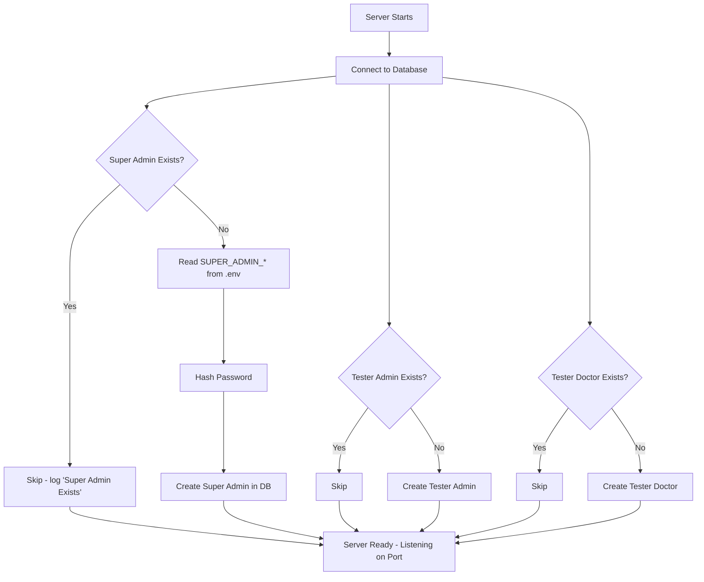

# Seeding Super Admin (and Tester Users) on Server Start

## 1. Why do we need seeding?

When a project is brand new, the database has **no users at all** — no
Admin, no Super Admin. But normally an Admin/Super Admin is the one who
creates other Admins. So the question is:

> If no Super Admin exists yet, who creates the very first one?

**Answer:** the server itself does it automatically, the first time it
starts. This is called **seeding**.

Same idea is used to auto-create test accounts for development, like:
- 1 Tester Admin
- 1 Tester Doctor

So developers can log in and test the app immediately, without manually
creating accounts every time the database is reset.

### Core rule

- On every server start → check "does a Super Admin already exist?"
  - ✅ Yes → do nothing (skip)
  - ❌ No → create one automatically from `.env` values

Same check-then-create logic is repeated for Tester Admin and Tester
Doctor.

---

## 2. Flowchart



---

## 3. Step 1 — Add credentials to `.env`

```env
SUPER_ADMIN_NAME=Super Admin 1
SUPER_ADMIN_EMAIL=superadmin@gmail.com
SUPER_ADMIN_PASSWORD=Super@admin12345

TESTER_ADMIN_NAME=Tester Admin 1
TESTER_ADMIN_EMAIL=testeradmin@gmail.com
TESTER_ADMIN_PASSWORD=Tester@admin12345

TESTER_DOCTOR_NAME=Tester Doctor 1
TESTER_DOCTOR_EMAIL=testerdoctor@gmail.com
TESTER_DOCTOR_PASSWORD=Tester@doctor12345
```

**Why in `.env`?** So the seeded credentials are never hardcoded in code,
and can be different for local/dev/production environments.

---

## 4. Step 2 — Read them in `config/index.ts`

```ts
export default {
  // ...other config
  super_admin_name: process.env.SUPER_ADMIN_NAME!,
  super_admin_email: process.env.SUPER_ADMIN_EMAIL!,
  super_admin_password: process.env.SUPER_ADMIN_PASSWORD!,

  tester_admin_name: process.env.TESTER_ADMIN_NAME!,
  tester_admin_email: process.env.TESTER_ADMIN_EMAIL!,
  tester_admin_password: process.env.TESTER_ADMIN_PASSWORD!,

  tester_doctor_name: process.env.TESTER_DOCTOR_NAME!,
  tester_doctor_email: process.env.TESTER_DOCTOR_EMAIL!,
  tester_doctor_password: process.env.TESTER_DOCTOR_PASSWORD!,
};
```

---

## 5. Step 3 — Create `utils/seed.ts`

Each seed function follows the **same 3-step pattern**:

1. Check if the user already exists (by role or by email)
2. If not, validate env values exist, hash the password
3. Create the user in the database

```ts
import bcrypt from "bcryptjs";
import { Role } from "../../generated/prisma/enums";
import { prisma } from "../lib/prisma";
import config from "../config";

// ---------- Super Admin ----------
export const seedSuperAdmin = async () => {
  try {
    const isSuperAdminExist = await prisma.user.findFirst({
      where: { role: Role.SUPER_ADMIN },
    });

    if (isSuperAdminExist) {
      console.log("Super Admin Exists!");
      return;
    }

    const name = config.super_admin_name;
    const email = config.super_admin_email;
    const password = config.super_admin_password;

    if (!name || !email || !password) {
      throw new Error("Super Admin Name, Email, Password missing in Env File!!");
    }

    const hashedPassword = await bcrypt.hash(
      password,
      Number(config.bcrypt_salt_rounds)
    );

    const superAdmin = await prisma.user.create({
      data: {
        name,
        email,
        password: hashedPassword,
        role: Role.SUPER_ADMIN,
        needPasswordChange: false,
        emailVerified: true,
      },
    });

    console.log("Super Admin Created: ", superAdmin);
  } catch (error) {
    console.log("Error seeding Super Admin: ", error);

    await prisma.user.delete({
      where: { email: config.super_admin_email },
    });
  }
};

// ---------- Tester Admin ----------
export const seedTesterAdmin = async () => {
  try {
    const isTesterAdminExist = await prisma.user.findUnique({
      where: { email: config.tester_admin_email },
    });

    if (isTesterAdminExist) {
      console.log("Tester Admin Already Exists!");
      return;
    }

    const name = config.tester_admin_name;
    const email = config.tester_admin_email;
    const password = config.tester_admin_password;

    if (!name || !email || !password) {
      throw new Error("Tester Admin Name, Email, Password missing in Env File!!!");
    }

    const hashedPassword = await bcrypt.hash(
      password,
      Number(config.bcrypt_salt_rounds)
    );

    const testerAdmin = await prisma.user.create({
      data: {
        name,
        email,
        password: hashedPassword,
        role: Role.ADMIN,
        needPasswordChange: false,
        emailVerified: true,
      },
    });

    console.log("Tester Admin Created: ", testerAdmin);
  } catch (error) {
    console.log("Error seeding Tester Admin: ", error);

    await prisma.user.delete({
      where: { email: config.tester_admin_email },
    });
  }
};

// ---------- Tester Doctor ----------
export const seedTesterDoctor = async () => {
  try {
    const isTesterDoctorExist = await prisma.user.findUnique({
      where: { email: config.tester_doctor_email },
    });

    if (isTesterDoctorExist) {
      console.log("Tester Doctor Already Exists!");
      return;
    }

    const name = config.tester_doctor_name;
    const email = config.tester_doctor_email;
    const password = config.tester_doctor_password; // ⚠️ see note below

    if (!name || !email || !password) {
      throw new Error("Tester Doctor Name, Email, Password missing in Env File!!!");
    }

    const hashedPassword = await bcrypt.hash(
      password,
      Number(config.bcrypt_salt_rounds)
    );

    const testerDoctor = await prisma.user.create({
      data: {
        name,
        email,
        password: hashedPassword,
        role: Role.DOCTOR,
        needPasswordChange: false,
        emailVerified: true,
      },
    });

    console.log("Tester Doctor Created: ", testerDoctor);
  } catch (error) {
    console.log("Error seeding Tester Doctor: ", error);

    await prisma.user.delete({
      where: { email: config.tester_doctor_email },
    });
  }
};
```

> ⚠️ **Bug to remember:** in the draft version, `seedTesterDoctor` read
> `config.tester_admin_password` by mistake instead of
> `config.tester_doctor_password`. Fixed above — always double check you're
> reading the right env variable for the right role, copy-paste is risky
> here.

---

## 6. Step 4 — Call seed functions right after DB connects

Usually placed in `server.ts` / `app.ts` entry file, right after
`prisma.$connect()`:

```ts
const main = async () => {
  try {
    await prisma.$connect();
    console.log("Connected to the database successfully.");

    await seedSuperAdmin();
    await seedTesterAdmin();
    await seedTesterDoctor();

    app.listen(config.port, () => {
      console.log(`Server is running on port ${config.port}`);
    });
  } catch (error) {
    console.log(error);
  }
};

main();
```

**Order matters here:** seeding must run **after** DB connection is
confirmed, and **before** the server starts listening — so by the time the
app is ready to accept requests, the Super Admin already exists.

---

## 7. Sample Output (first run)

```
Connected to the database successfully.
Super Admin Created:  {
  id: '77eb4d7f-8b8e-4100-8833-8e55c40fccf3',
  name: 'Super Admin 1',
  email: 'superadmin@gmail.com',
  password: '$2b$10$1BZ8czPtI5NCbwqs0ajkx...',
  role: 'SUPER_ADMIN',
  status: 'ACTIVE',
  needPasswordChange: false,
  emailVerified: true,
  ...
}
Server is running on port 5000
```

On the **next** restart, since the Super Admin already exists, you'll just
see:

```
Super Admin Exists!
Tester Admin Already Exists!
Tester Doctor Already Exists!
Server is running on port 5000
```

---

## Quick Reference

| Step | What it does |
|---|---|
| 1 | Store seed credentials in `.env` (never hardcode) |
| 2 | Load them via `config/index.ts` |
| 3 | Write `seedX()` functions: check exists → hash password → create |
| 4 | Call all `seedX()` functions once, right after `prisma.$connect()` |
| Result | First run creates the accounts; every later run just skips |

## Key Takeaways (for future me 🙂)

1. Seeding solves the **"chicken and egg" problem** — you need an Admin to
   create Admins, but the first one has to come from somewhere.
2. Always **check existence first** (`findFirst` / `findUnique`) before
   creating — otherwise you'd create duplicates on every restart.
3. Keep seed credentials in `.env`, not in code.
4. Same pattern can be reused for any role you want to auto-seed (Admin,
   Doctor, Manager, etc.) — just copy the function and change the `Role`.
5. Run seeding **after DB connects**, **before** `app.listen()`.
6. Double-check each function reads its **own** env variables — a
   copy-paste mistake (like using the Admin's password for the Doctor) is
   an easy bug to introduce.
