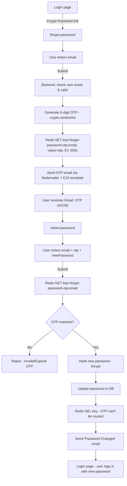

# Forgot Password System — OTP + Redis + Nodemailer (EJS Templates)

## Table of Contents

1. [Forget Password / Reset Password — Overview](#1-forget-password--reset-password--overview)
2. [OTP (One Time Password)](#2-otp-one-time-password)
3. [crypto.randomInt(min, max)](#3-cryptorandomintmin-max)
4. [Redis](#4-redis)
5. [In-Memory DB](#5-in-memory-db)
6. [Temporary Data Storing](#6-temporary-data-storing)
7. [Fast Data Retrieval](#7-fast-data-retrieval)
8. [OTP Verify](#8-otp-verify)
9. [Password Change](#9-password-change)
10. [Gmail & Nodemailer](#10-gmail--nodemailer)
11. [Google App Password](#11-google-app-password)
12. [2-Step Verification](#12-2-step-verification)
13. [Transporter — Send Email](#13-transporter--send-email)
14. [HTML → View Engine → EJS](#14-html--view-engine--ejs)
15. [HTML Tag → Dynamic Value → `<%= otp %>`](#15-html-tag--dynamic-value--%3D-otp-%3D)
16. [Template File](#16-template-file)
17. [ejs.renderFile(templatePath, templateData)](#17-ejsrenderfiletemplatepath-templatedata)
18. [Full Flowchart](#18-full-flowchart)
19. [Full Implementation (step by step)](#19-full-implementation-step-by-step)
20. [Quick Reference](#20-quick-reference)

---

## 1. Forget Password / Reset Password — Overview

When a user forgets their password, we can't just "show" them the old
password (it's hashed, we can't reverse it). Instead, the flow is:

1. User clicks **"Forgot Password"** → enters email
2. Backend generates an **OTP** (One Time Password) and emails it
3. User enters **email + OTP + new password**
4. Backend verifies OTP → updates password → sends confirmation email

This is different from `/change-password` (where a **logged-in** user
already knows their old password and just wants to update it).

| Route | User state | Needs |
|---|---|---|
| `/forgot-password` | Not logged in | email only → sends OTP |
| `/reset-password` | Not logged in | email + otp + newPassword |
| `/change-password` | Logged in | oldPassword + newPassword |

---

## 2. OTP (One Time Password)

A short-lived, random code (usually 6 digits) sent to the user's email to
**prove they own that email address** before letting them reset the
password.

Key properties:
- Random (can't be guessed)
- Short (usually 6 digits)
- **Expires quickly** (e.g. 5 minutes) — this is why we don't store it in
  the main SQL database; we store it somewhere that supports auto-expiry:
  **Redis**.

---

## 3. `crypto.randomInt(min, max)`

Node.js's built-in `crypto` module can generate cryptographically secure
random integers — safer than `Math.random()` for security-sensitive values
like OTPs.

```ts
import crypto from "crypto";

crypto.randomInt([min, ] max [, callback]);
```

| Parameter | Meaning |
|---|---|
| `min` | Optional, inclusive lower bound. Default `0` |
| `max` | Required, **exclusive** upper bound |
| `callback` | Optional — if given, runs async; otherwise runs sync |

```ts
crypto.randomInt(1, 10);       // random int from 1 to 9 (10 excluded)
crypto.randomInt(1, 15);       // random int from 1 to 14
```

### Generating a 6-digit OTP

We want a number strictly between `100000` (smallest 6-digit number) and
`999999` (largest 6-digit number), so `max` must be `1000000` (exclusive):

```ts
const otp = crypto.randomInt(100000, 1000000);
// always a 6-digit number, e.g. 493827
```

---

## 4. Redis

Docs: https://redis.io/

Redis is an **in-memory data store**, commonly used for **caching** and
temporary data (sessions, OTPs, rate limits, etc).

### Why Redis for OTP?

| SQL / NoSQL (Postgres, Mongo) | Redis |
|---|---|
| Like a **Hard Drive / SSD** — data written to disk | Like **RAM** — data lives in memory |
| Slower reads/writes | Very fast reads/writes |
| No built-in auto-expiry per record | **Built-in TTL (auto-expire) support** |
| Good for permanent data | Good for **temporary** data |

**In one line:** `SQL/NoSQL == Hard Drive/SSD`, `Redis == in-memory Database (RAM)`.

Since an OTP is only valid for 5 minutes, it makes no sense to store it
permanently in Postgres/Mongo — Redis stores it **and automatically deletes
it** once the time expires. No manual cleanup needed.

---

## 5. In-Memory DB

"In-memory" means the data is stored directly in **RAM**, not written to
disk. That's why Redis is extremely fast — RAM reads/writes are much faster
than disk I/O. The trade-off: data is not meant to be permanent (though
Redis does support persistence options if needed).

---

## 6. Temporary Data Storing

Redis stores data as simple **key → value** pairs, same idea as browser
`localStorage`:

```
localStorage:
"otp" : "123456"
"user" : JSON.stringify({ name: "patient", role: "PATIENT" })

Redis (same idea):
key   : "forget-password-otp:patient1@gmail.com"
value : "123456"
```

Every key can have an **expiration time (TTL)**. Once expired, Redis
deletes it automatically — perfect for OTPs, temporary tokens, etc.

---

## 7. Fast Data Retrieval

Because Redis lives in RAM, `GET`/`SET` operations are extremely fast
(microseconds) compared to a disk-based database. This matters for OTP
verification — the check needs to happen instantly when the user submits
their code.

---

## 8. OTP Verify

When the user submits the reset-password form (email + otp + newPassword):

1. Build the same Redis key used when OTP was created:
   `forget-password-otp:<email>`
2. `GET` the value from Redis
3. Compare:
   - If key doesn't exist → OTP **expired or never sent** → reject
   - If value ≠ submitted OTP → **wrong OTP** → reject
   - If match → proceed to change password

---

## 9. Password Change

Once OTP is verified:

1. Hash the new password with `bcrypt`
2. Update the `password` field in the database
3. **Delete** the OTP key from Redis (`DEL`) — it must not be reusable
4. Send a "Password Changed" confirmation email

---

## 10. Gmail & Nodemailer

Docs: https://nodemailer.com/

**Nodemailer** is a Node.js library used to send emails (e.g. OTP mail,
confirmation mail) through an SMTP provider — here, Gmail.

```bash
npm i nodemailer
npm i -D @types/nodemailer
```

Gmail won't allow login with your normal account password from an external
app for security reasons — that's why we need an **App Password**.

---

## 11. Google App Password

An **App Password** is a special 16-character password Google generates,
used only for third-party apps (like our Node.js backend) to send email
through Gmail's SMTP — without exposing your real Google password.

### Steps to create one:

1. Go to Google Account → **Security**
2. Turn on **2-Step Verification** (required — App Passwords only appear
   after this is enabled)
3. Search **"App Passwords"**
4. Enter a name (e.g. your project name) → **Create**
5. Copy the generated password → paste into `.env`

---

## 12. 2-Step Verification

2-Step Verification (2FA) must be turned ON for your Google account before
you can generate an App Password. It adds a second layer of login security
(password + phone/authenticator code), and Google requires it as a
prerequisite for issuing App Passwords to third-party apps.

---

## 13. Transporter — Send Email

In Nodemailer, a **transporter** is the configured connection that actually
sends the email (like a mail "sender client").

```ts
// lib/nodemailer.ts
import nodemailer from "nodemailer";
import config from "../config";

export const transporter = nodemailer.createTransport({
  service: "gmail",
  auth: {
    user: config.smtp_user,
    pass: config.smtp_password,
  },
});
```

Verify the connection once, when the server starts:

```ts
// server.ts
await transporter.verify();
console.log("NodeMailer connected successfully");
```

Sending an email later just needs:

```ts
await transporter.sendMail({
  from: config.email_sender,
  to: user.email,
  subject: "Forgot Password",
  html, // rendered HTML string (see EJS section)
});
```

---

## 14. HTML → View Engine → EJS

We don't want to hardcode ugly `<h1>OTP: ${otp}</h1>` strings in our
service file. Instead, we use a **template engine** to write clean `.html`-like
files with placeholders, and fill them with real data at runtime.

**EJS** (Embedded JavaScript templates) = a view engine that lets you embed
JS expressions directly inside HTML.

```bash
npm i ejs
```

Docs: https://www.npmjs.com/package/ejs

---

## 15. HTML Tag → Dynamic Value → `<%= otp %>`

Inside an `.ejs` file, `<%= variableName %>` prints a dynamic value directly
into the HTML output:

```html
<h1>Your OTP is: <%= otp %></h1>
```

If `otp = 493827`, the rendered HTML becomes:

```html
<h1>Your OTP is: 493827</h1>
```

---

## 16. Template File

Create a folder to hold reusable HTML email templates, e.g.
`src/app/templates/`. Each file is a normal HTML page with `<%= %>`
placeholders for dynamic data (name, otp, expiry time, etc).

Two templates used in this flow:
- `forgot-password.ejs` → sends the OTP
- `reset-password-success.ejs` → confirms password was changed

(Full code in [Section 19](#19-full-implementation-step-by-step).)

---

## 17. `ejs.renderFile(templatePath, templateData)`

This function reads the `.ejs` file from disk, injects the given data
object into it, and returns the final **HTML string** — ready to be sent
as an email body.

```ts
import ejs from "ejs";
import path from "path";

const templatePath = path.join(process.cwd(), "src/app/templates/forgot-password.ejs");
const templateData = { name: user.name, otp, expirationMinutes: 5 };

const html = await ejs.renderFile(templatePath, templateData);
// html is now a complete HTML string with values filled in
```

---

## 18. Full Flowchart



**Note:** `/change-password` is a separate, simpler route — for an
**already logged-in** user who knows their `oldPassword` and just wants to
set a `newPassword`. It doesn't need OTP/Redis at all.

---

## 19. Full Implementation (step by step)

### Step 1 — `.env`

```env
# Redis
REDIS_USER=default
REDIS_PASSWORD=your_redis_password
REDIS_HOST=redis-xxxxx.c456.us-east-1-4.ec2.cloud.redislabs.com
REDIS_PORT=13528

# Gmail / Nodemailer
SMTP_USER=your_gmail_address@gmail.com
EMAIL_SENDER=your_gmail_address@gmail.com
SMTP_PASSWORD=your_16_char_google_app_password
```

### Step 2 — `config/index.ts`

```ts
export default {
  // ...other config
  redis_user: process.env.REDIS_USER!,
  redis_password: process.env.REDIS_PASSWORD!,
  redis_host: process.env.REDIS_HOST!,
  redis_port: process.env.REDIS_PORT!,

  smtp_user: process.env.SMTP_USER!,
  smtp_password: process.env.SMTP_PASSWORD!,
  email_sender: process.env.EMAIL_SENDER!,
};
```

### Step 3 — Set up Redis client: `lib/redis.ts`

```ts
import { createClient } from "redis";
import config from "../config";

export const redisClient = createClient({
  username: config.redis_user,
  password: config.redis_password,
  socket: {
    host: config.redis_host,
    port: Number(config.redis_port),
  },
});
```

Connect it in `server.ts`, right after DB connection:

```ts
await redisClient.connect();
console.log("Redis Connected Successfully");
```

Basic Redis `SET` with expiry (`EX` = seconds):

```ts
await redisClient.set("forget-password-otp:patient1@gmail.com", "123456", {
  expiration: { type: "EX", value: 60 }, // auto-deletes after 60s
});
```

Redis command docs: https://redis.io/docs/latest/commands/set/

### Step 4 — Set up Nodemailer: `lib/nodemailer.ts`

```ts
import nodemailer from "nodemailer";
import config from "../config";

export const transporter = nodemailer.createTransport({
  service: "gmail",
  auth: {
    user: config.smtp_user,
    pass: config.smtp_password,
  },
});
```

Verify in `server.ts`:

```ts
await transporter.verify();
console.log("NodeMailer connected successfully");
```

### Step 5 — Email templates: `src/app/templates/`

**`forgot-password.ejs`**

```html
<!DOCTYPE html>
<html lang="en">
  <head>
    <meta charset="UTF-8" />
    <title>Forgot Password</title>
    <style>
      body { font-family: Arial, sans-serif; background: #f7f7f7; color: #333; }
      .container { max-width: 500px; margin: 40px auto; background: #fff; padding: 30px; border-radius: 8px; box-shadow: 0 2px 8px rgba(0,0,0,0.08); }
      .otp { display: inline-block; padding: 12px 24px; background: #f0f4ff; color: #007bff; font-size: 28px; font-weight: bold; letter-spacing: 8px; border-radius: 4px; margin-top: 20px; }
      .footer { margin-top: 30px; font-size: 12px; color: #888; }
    </style>
  </head>
  <body>
    <div class="container">
      <h2>Password Reset Request</h2>
      <p>Hello <%= name %>, we received a request to reset your password.</p>
      <p>Use the OTP below to reset your password:</p>
      <div class="otp"><%= otp %></div>
      <p>This OTP will expire in <%= expirationMinutes %> minutes. If you did not request a password reset, please ignore this email.</p>
      <div class="footer">&copy; PH Healthcare System. All rights reserved.</div>
    </div>
  </body>
</html>
```

**`reset-password-success.ejs`**

```html
<!DOCTYPE html>
<html lang="en">
  <head>
    <meta charset="UTF-8" />
    <title>Password Reset Successful</title>
    <style>
      body { font-family: Arial, sans-serif; background: #f7f7f7; color: #333; }
      .container { max-width: 500px; margin: 40px auto; background: #fff; padding: 30px; border-radius: 8px; box-shadow: 0 2px 8px rgba(0,0,0,0.08); }
      .icon { display: inline-flex; align-items: center; justify-content: center; width: 48px; height: 48px; border-radius: 50%; background: #e6f7ec; color: #17a34a; font-size: 26px; font-weight: bold; }
      .footer { margin-top: 30px; font-size: 12px; color: #888; }
    </style>
  </head>
  <body>
    <div class="container">
      <div class="icon">&#10003;</div>
      <h2>Password Reset Successful</h2>
      <p>Hello <%= name %>, your password has been changed successfully.</p>
      <p>You can now log in to your PH Healthcare System account using your new password.</p>
      <p>If you did not make this change, please contact support immediately.</p>
      <div class="footer">&copy; PH Healthcare System. All rights reserved.</div>
    </div>
  </body>
</html>
```

### Step 6 — Interfaces: `auth/auth.interface.ts`

```ts
export interface IForgotPasswordPayload {
  email: string;
}

export interface IResetPasswordPayload {
  email: string;
  newPassword: string;
  otp: string;
}
```

### Step 7 — Validation: `auth/auth.validation.ts`

```ts
import z from "zod";

const ForgetPasswordZodSchema = z.object({
  email: z.email(),
});

const ResetPasswordZodSchema = z.object({
  email: z.email(),
  newPassword: z
    .string()
    .min(8)
    .regex(/[A-Z]/, "Password must contain at least one uppercase letter.")
    .regex(/[a-z]/, "Password must contain at least one lowercase letter.")
    .regex(/[0-9]/, "Password must contain at least one number.")
    .regex(/[^A-Za-z0-9]/, "Password must contain at least one special character."),
  otp: z.string().length(6),
});

export const userValidation = {
  // ...other schemas
  ForgetPasswordZodSchema,
  ResetPasswordZodSchema,
};
```

> ⚠️ Note: keep the field name consistent everywhere. The interface uses
> `newPassword` (camelCase) — make sure the Zod schema field is also
> `newPassword`, not `newpassword`, or validated data won't line up with
> the service layer.

### Step 8 — Service logic: `auth/auth.service.ts`

```ts
import crypto from "crypto";
import path from "path";
import ejs from "ejs";
import bcrypt from "bcryptjs";
import { redisClient } from "../../lib/redis";
import { transporter } from "../../lib/nodemailer";
import { prisma } from "../../lib/prisma";
import config from "../../config";
import { IForgotPasswordPayload, IResetPasswordPayload } from "./auth.interface";

const forgotPassword = async (payload: IForgotPasswordPayload) => {
  const { email } = payload;

  const isUserExists = await prisma.user.findUnique({ where: { email } });

  if (!isUserExists) throw new Error("User does not exist!");
  if (isUserExists.status === "BLOCKED") throw new Error("User is blocked");
  if (isUserExists.isDeleted || isUserExists.status === "DELETED")
    throw new Error("User is deleted");
  if (isUserExists.googleId && isUserExists.authProvider === "GOOGLE")
    throw new Error("User has account with Google");
  if (!isUserExists.emailVerified) throw new Error("User not verified");

  // 1. Generate OTP
  const otp = crypto.randomInt(100000, 1000000);

  // 2. Store OTP in Redis with 5-minute expiry
  const key = `forget-password-otp:${isUserExists.email}`;
  const expirationSeconds = 5 * 60;

  await redisClient.set(key, otp, {
    expiration: { type: "EX", value: expirationSeconds },
  });

  // 3. Render email template
  const templatePath = path.join(process.cwd(), "src/app/templates/forgot-password.ejs");
  const templateData = {
    name: isUserExists.name,
    otp,
    expirationMinutes: expirationSeconds / 60,
  };
  const html = await ejs.renderFile(templatePath, templateData);

  // 4. Send email
  await transporter.sendMail({
    from: config.email_sender,
    to: isUserExists.email,
    subject: "Forgot Password",
    html,
  });
};

const resetPassword = async (payload: IResetPasswordPayload) => {
  const { email, otp, newPassword } = payload;

  const isUserExists = await prisma.user.findUnique({ where: { email } });

  if (!isUserExists) throw new Error("User does not exist!");
  if (isUserExists.status === "BLOCKED") throw new Error("User is blocked");
  if (isUserExists.isDeleted || isUserExists.status === "DELETED")
    throw new Error("User is deleted");
  if (isUserExists.googleId && isUserExists.authProvider === "GOOGLE")
    throw new Error("User has account with Google");
  if (!isUserExists.emailVerified) throw new Error("User not verified");

  // 1. Get OTP from Redis
  const key = `forget-password-otp:${isUserExists.email}`;
  const redisOtp = await redisClient.get(key);

  if (!redisOtp) throw new Error("Invalid OTP"); // expired or never sent
  if (redisOtp !== otp) throw new Error("OTP does not match");

  // 2. Hash and update new password
  const hashedNewPassword = await bcrypt.hash(newPassword, Number(config.bcrypt_salt_rounds));

  await prisma.user.update({
    where: { email: isUserExists.email },
    data: { password: hashedNewPassword },
  });

  // 3. Delete OTP so it can't be reused
  await redisClient.del([key]);

  // 4. Send confirmation email
  const templatePath = path.join(
    process.cwd(),
    "src/app/templates/reset-password-success.ejs"
  );
  const templateData = { name: isUserExists.name };
  const html = await ejs.renderFile(templatePath, templateData);

  await transporter.sendMail({
    from: config.email_sender,
    to: isUserExists.email,
    subject: "Password changed",
    html,
  });
};

export const AuthService = {
  // ...other methods
  forgotPassword,
  resetPassword,
};
```

### Step 9 — Controller: `auth/auth.controller.ts`

```ts
const forgotPassword = catchAsync(async (req: Request, res: Response) => {
  const payload = req.body;

  await AuthService.forgotPassword(payload);

  sendResponse(res, {
    statusCode: httpStatus.OK,
    success: true,
    message: `OTP sent to email: ${payload.email}`,
    data: null,
  });
});

const resetPassword = catchAsync(async (req: Request, res: Response) => {
  const payload = req.body;

  await AuthService.resetPassword(payload);

  sendResponse(res, {
    statusCode: httpStatus.OK,
    success: true,
    message: "Password changed successfully",
    data: null,
  });
});

export const AuthController = {
  // ...other methods
  forgotPassword,
  resetPassword,
};
```

### Step 10 — Routes: `auth/auth.route.ts`

```ts
router.post(
  "/forgot-password",
  validateRequest(userValidation.ForgetPasswordZodSchema),
  AuthController.forgotPassword
);

router.post(
  "/reset-password",
  validateRequest(userValidation.ResetPasswordZodSchema),
  AuthController.resetPassword
);
```

---

## 20. Quick Reference

| Concept | One-line summary |
|---|---|
| OTP | Random 6-digit code proving email ownership |
| `crypto.randomInt(min, max)` | Secure random int, `max` is exclusive |
| Redis | In-memory DB, great for temporary/fast-expiring data |
| `SET key value EX seconds` | Store with auto-expiry |
| `GET key` | Retrieve value (null if expired/missing) |
| `DEL key` | Remove key (do this after successful reset, so OTP can't be reused) |
| Nodemailer | Sends actual emails via SMTP (Gmail here) |
| App Password | Special Gmail password for apps, needs 2FA enabled first |
| Transporter | Configured Nodemailer sender object |
| EJS | View engine — HTML + embedded JS (`<%= value %>`) |
| `ejs.renderFile(path, data)` | Fills a template file with data → returns HTML string |

### Mental model, end-to-end

```
User forgets password
   → generate OTP (crypto)
   → save OTP in Redis (auto-expires in 5 min)
   → render EJS template with OTP
   → send via Nodemailer (Gmail)
   → user submits email+otp+newPassword
   → compare against Redis value
   → match → hash & update password in DB → delete Redis key → send confirmation email
   → no match / expired → reject
```
