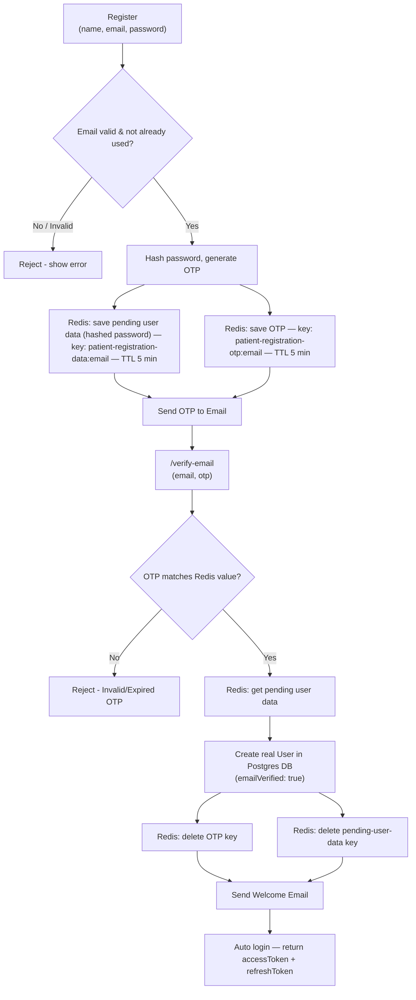

# User Registration with Email Verification (OTP) + Welcome Email — Using Redis

## Table of Contents

1. [Overview](#1-overview)
2. [Why Redis Here?](#2-why-redis-here)
3. [Quick Redis Setup](#3-quick-redis-setup)
4. [The Flow (Diagram)](#4-the-flow-diagram)
5. [Step-by-step Implementation](#5-step-by-step-implementation)
6. [Email Templates](#6-email-templates)
7. [Quick Reference](#7-quick-reference)

---

## 1. Overview

Instead of creating the user in the real database (Postgres) **immediately**
on registration, we:

1. Temporarily hold the user's data (with hashed password) + an OTP in
   **Redis**.
2. Email the OTP to the user.
3. Only when the user submits the correct OTP on `/verify-email`, do we
   **actually create the row in Postgres** — and send a welcome email.

This way, unverified/fake emails never pollute the real database — Redis
just discards them automatically after a few minutes if never verified.

---

## 2. Why Redis Here?

- We need somewhere to **temporarily** hold "pending registration" data
  (user info + OTP) that should auto-expire if the user never verifies.
- `SQL/NoSQL == Hard Drive/SSD` (permanent storage) vs `Redis == in-memory
  Database (RAM)` (fast, temporary storage).
- Redis is mainly used for **caching** and short-lived data like this.
- Built-in **TTL (expiry)** means no manual cleanup job needed — an
  abandoned registration just disappears from Redis on its own.

---

## 3. Quick Redis Setup

Docs: https://redis.io/

1. Create a free Redis Cloud account (Google sign-in works) → free tier
   gives ~30MB, enough for OTPs/cache.
2. Create a database with a project-specific name.
3. Copy the connection details (host, port, username, password) into `.env`.

```env
REDIS_USER=default
REDIS_PASSWORD=your_redis_password
REDIS_HOST=redis-xxxxx.c456.us-east-1-4.ec2.cloud.redislabs.com
REDIS_PORT=13528

SMTP_USER=your_gmail_address@gmail.com
EMAIL_SENDER=your_gmail_address@gmail.com
SMTP_PASSWORD=your_google_app_password
```

`config/index.ts`:

```ts
export default {
  redis_user: process.env.REDIS_USER!,
  redis_password: process.env.REDIS_PASSWORD!,
  redis_host: process.env.REDIS_HOST!,
  redis_port: process.env.REDIS_PORT!,
  smtp_user: process.env.SMTP_USER!,
  smtp_password: process.env.SMTP_PASSWORD!,
  email_sender: process.env.EMAIL_SENDER!,
};
```

`lib/redis.ts`:

```ts
import { createClient } from "redis";
import config from "../config";

export const redisClient = createClient({
  username: config.redis_user,
  password: config.redis_password,
  socket: {
    host: config.redis_host,
    port: Number(config.redis_port),
  },
});
```

Connect once, in `server.ts`, right after DB connects:

```ts
await redisClient.connect();
console.log("Redis Connected Successfully");
```

```
Connected to the database successfully.
Redis Connected Successfully
```

That's it for setup — same Redis client is reused everywhere via `import { redisClient } from "../lib/redis"`.

---

## 4. The Flow (Diagram)



**In plain words (matching the whiteboard steps):**

1. `Email verify -> OTP`
2. `/register` → account data + OTP saved **in Redis only** (not DB yet),
   password already hashed → OTP emailed to user
3. `/verify-email` → OTP checked against Redis
   - OTP matches → pending Redis data is moved into the real Postgres DB
     (`emailVerified: true`) → both Redis keys deleted manually → welcome
     email sent → user is auto logged in (tokens returned)
4. `login` → normal login now works since the user officially exists in DB

> **Note on the "invalid email" branch:** on the whiteboard, an alternate
> design was sketched where an unverified user is created **directly in
> Postgres** with `emailVerified: false`, to be updated later. The actual
> code below uses a cleaner version of that idea: **nothing touches
> Postgres until the OTP is verified** — everything pending lives in Redis
> only, and gets created in Postgres in one shot after verification. This
> avoids ever having "fake"/unverified rows sitting in your real database.

---

## 5. Step-by-step Implementation

### Step 1 — Interfaces: `auth/auth.interface.ts`

```ts
export interface IRegisterPatientPayload {
  name: string;
  email: string;
  password: string;
  patient: {
    contactNumber?: string;
  };
}

export interface IVerifyEmailPayload {
  email: string;
  otp: string;
}

export interface IGoogleLoginPayload {
  idToken: string;
}
```

### Step 2 — Validation: `auth/auth.validation.ts`

```ts
import z from "zod";

const PatientEmailVerifyZodSchema = z.object({
  email: z.email("Not a valid email!"),
  otp: z.string().length(6),
});

export const userValidation = {
  // ...other schemas (PatientRegistrationZodSchema, etc.)
  PatientEmailVerifyZodSchema,
};
```

### Step 3 — Service: `auth/auth.service.ts`

**`registerPatient`** — nothing goes to Postgres yet. Everything pending
lives in Redis with a 5-minute TTL.

```ts
import crypto from "crypto";
import path from "path";
import ejs from "ejs";
import bcrypt from "bcryptjs";
import { redisClient } from "../../lib/redis";
import { transporter } from "../../lib/nodemailer";
import { prisma } from "../../lib/prisma";
import config from "../../config";
import { Role, UserStatus } from "../../../generated/prisma/enums";
import { IRegisterPatientPayload, IVerifyEmailPayload } from "./auth.interface";

const registerPatient = async (payload: IRegisterPatientPayload) => {
  const { name, password, patient: patientData } = payload;
  const email = payload.email.trim().toLowerCase();

  const isUserExists = await prisma.user.findUnique({ where: { email } });

  if (isUserExists) {
    throw new Error("User with this email already exists");
  }

  const expirationSeconds = 5 * 60;

  // 1. Generate OTP and store it in Redis
  const otpKey = `patient-registration-otp:${email}`;
  const otpValue = crypto.randomInt(100000, 1000000);

  await redisClient.set(otpKey, otpValue, {
    expiration: { type: "EX", value: expirationSeconds },
  });

  // 2. Hash password and store the FULL pending user data in Redis (not DB yet)
  const hashedPassword = await bcrypt.hash(password, 8);

  const patientRegistrationKey = `patient-registration-data:${email}`;
  const redisUserDataPayload = {
    name,
    email,
    password: hashedPassword,
    patient: patientData,
  };

  await redisClient.set(
    patientRegistrationKey,
    JSON.stringify(redisUserDataPayload),
    { expiration: { type: "EX", value: expirationSeconds } }
  );

  // 3. Send OTP email
  const templatePath = path.join(
    process.cwd(),
    "src/app/templates/registration-user-otp.ejs"
  );
  const templateData = { name, email, otpvalue: otpValue, expirationSeconds };
  const html = await ejs.renderFile(templatePath, templateData);

  await transporter.sendMail({
    from: config.email_sender,
    to: email,
    subject: "Verify your email",
    html,
  });
};
```

**`verifyPatientEmail`** — checks the OTP, then (and only then) creates
the real user in Postgres, cleans up Redis, and sends the welcome email.

```ts
const verifyPatientEmail = async (payload: IVerifyEmailPayload) => {
  const otp = payload.otp;
  const email = payload.email.trim().toLowerCase();

  const isUserExist = await prisma.user.findUnique({ where: { email } });

  if (isUserExist?.status === "BLOCKED") throw new Error("User is Blocked");
  if (isUserExist?.emailVerified) throw new Error("Email already verified");
  if (isUserExist?.isDeleted || isUserExist?.status === "DELETED")
    throw new Error("User is Deleted");

  // 1. Verify OTP against Redis
  const otpKey = `patient-registration-otp:${email}`;
  const redisOtp = await redisClient.get(otpKey);

  if (!redisOtp) throw new Error("Invalid OTP"); // expired or never sent
  if (redisOtp !== otp) throw new Error("OTP does not match");

  await redisClient.del(otpKey); // one-time use — delete immediately after match

  // 2. Pull the pending user data from Redis
  const patientRegistrationKey = `patient-registration-data:${email}`;
  const redisPatientData = await redisClient.get(patientRegistrationKey);

  if (!redisPatientData) throw new Error("Registration data not found or expired");

  const patientPayload: IRegisterPatientPayload = JSON.parse(redisPatientData);

  // 3. NOW create the real user in Postgres
  const createdUser = await prisma.user.create({
    data: {
      name: patientPayload.name,
      email: patientPayload.email,
      password: patientPayload.password, // already hashed
      role: Role.PATIENT,
      status: UserStatus.ACTIVE,
      emailVerified: true,
      patient: {
        create: {
          name: patientPayload.name,
          email: patientPayload.email,
          contactNumber: patientPayload?.patient?.contactNumber || "",
        },
      },
    },
    omit: { password: true },
    include: { patient: true },
  });

  // 4. Clean up Redis — pending data no longer needed
  await redisClient.del(patientRegistrationKey);

  // 5. Send welcome email
  const templatePath = path.join(
    process.cwd(),
    "src/app/templates/patient-welcome-email.ejs"
  );
  const templateData = { name: createdUser.name };
  const html = await ejs.renderFile(templatePath, templateData);

  await transporter.sendMail({
    from: config.email_sender,
    to: email,
    subject: "Welcome To PH Healthcare System",
    html,
  });

  // 6. Auto login — issue tokens immediately
  const { patient, ...user } = createdUser;
  const jwtPayload = {
    userId: user.id,
    name: user.name,
    email: user.email,
    role: user.role,
  };

  const accessToken = jwtUtils.createToken(
    jwtPayload,
    config.jwt_access_secret,
    config.jwt_access_expires_in as SignOptions
  );

  const refreshToken = jwtUtils.createToken(
    jwtPayload,
    config.jwt_refresh_secret,
    config.jwt_refresh_expires_in as SignOptions
  );

  return { user, patient, accessToken, refreshToken };
};

export const AuthService = {
  registerPatient,
  verifyPatientEmail,
};
```

### Step 4 — Controller: `auth/auth.controller.ts`

```ts
const registerPatient = catchAsync(async (req: Request, res: Response) => {
  const payload = req.body;

  await AuthService.registerPatient(payload);
  // no tokens yet — user isn't created until OTP is verified

  sendResponse(res, {
    statusCode: httpStatus.CREATED,
    success: true,
    message: "Verification OTP sent",
    data: null,
  });
});

const verifyPatientEmail = catchAsync(async (req: Request, res: Response) => {
  const payload = req.body;

  const result = await AuthService.verifyPatientEmail(payload);
  const { accessToken, refreshToken, user, patient } = result;

  res.cookie("accessToken", accessToken, {
    httpOnly: true,
    secure: false,
    sameSite: "none",
    maxAge: 1000 * 60 * 60 * 24, // 1 day
  });
  res.cookie("refreshToken", refreshToken, {
    httpOnly: true,
    secure: false,
    sameSite: "none",
    maxAge: 1000 * 60 * 60 * 24 * 7, // 7 days
  });

  sendResponse(res, {
    statusCode: httpStatus.CREATED,
    success: true,
    message: "Email verified successfully",
    data: { accessToken, refreshToken, user, patient },
  });
});

export const AuthController = {
  registerPatient,
  verifyPatientEmail,
};
```

### Step 5 — Routes: `auth/auth.route.ts`

```ts
router.post(
  "/register",
  validateRequest(userValidation.PatientRegistrationZodSchema),
  AuthController.registerPatient
);

router.post(
  "/verify-email",
  validateRequest(userValidation.PatientEmailVerifyZodSchema),
  AuthController.verifyPatientEmail
);
```

---

## 6. Email Templates

`src/app/templates/registration-user-otp.ejs`

```html
<!DOCTYPE html>
<html lang="en">
  <head>
    <meta charset="UTF-8" />
    <title>Email Verification</title>
    <style>
      body { font-family: Arial, sans-serif; background: #f7f7f7; color: #333; }
      .container { max-width: 500px; margin: 40px auto; background: #fff; padding: 30px; border-radius: 8px; box-shadow: 0 2px 8px rgba(0,0,0,0.08); }
      .otp { display: inline-block; padding: 12px 24px; background: #f0f4ff; color: #007bff; font-size: 28px; font-weight: bold; letter-spacing: 8px; border-radius: 4px; margin-top: 20px; }
      .footer { margin-top: 30px; font-size: 12px; color: #888; }
    </style>
  </head>
  <body>
    <div class="container">
      <h2>Email Verification Request</h2>
      <p>Hello <%= name %>, we received a request to verify your email for <%= email %>.</p>
      <p>Use the OTP below to verify your email:</p>
      <div class="otp"><%= otpvalue %></div>
      <p>This OTP will expire in <%= expirationSeconds / 60 %> minutes. If you did not request this, please ignore this email.</p>
      <div class="footer">&copy; PH Healthcare System. All rights reserved.</div>
    </div>
  </body>
</html>
```

`src/app/templates/patient-welcome-email.ejs`

```html
<!DOCTYPE html>
<html lang="en">
  <head>
    <meta charset="UTF-8" />
    <title>Welcome</title>
    <style>
      body { font-family: Arial, sans-serif; background: #f7f7f7; color: #333; }
      .container { max-width: 500px; margin: 40px auto; background: #fff; padding: 30px; border-radius: 8px; box-shadow: 0 2px 8px rgba(0,0,0,0.08); }
      .footer { margin-top: 30px; font-size: 12px; color: #888; }
    </style>
  </head>
  <body>
    <div class="container">
      <h2>Welcome to PH Healthcare System, <%= name %>!</h2>
      <p>Thanks for joining PH Healthcare System. Your account has been created successfully.</p>
      <p>You can now book appointments, consult with doctors, and manage your health records all in one place.</p>
      <div class="footer">&copy; PH Healthcare System. All rights reserved.</div>
    </div>
  </body>
</html>
```

> ⚠️ Small fix from the draft: the OTP template printed
> `expirationSeconds` directly next to the word "minutes" (e.g. "expires
> in 300 minutes" — wrong). Since `expirationSeconds = 300`, the template
> should divide by 60 (`expirationSeconds / 60`) to actually show
> **5 minutes**. Also, the welcome email's `subject` in the draft service
> code said `"Password changed"` for the OTP mail — fixed to `"Verify
> your email"` above, since that's the email actually being sent at that
> step.

---

## 7. Quick Reference

| Step | Where data lives | Key pattern |
|---|---|---|
| Register submitted | Redis only (TTL 5 min) | `patient-registration-otp:<email>`, `patient-registration-data:<email>` |
| OTP verified | Postgres (`emailVerified: true`) | Redis keys deleted right after |
| OTP expired / never verified | Auto-deleted by Redis, nothing ever hits Postgres | — |

### Mental model, end-to-end

```
User submits register form (name, email, password)
   → check email not already used
   → hash password
   → generate OTP
   → save { user data (hashed pw) } + { otp } in Redis, both expire in 5 min
   → email OTP to user
   → NOTHING created in Postgres yet

User submits /verify-email (email, otp)
   → compare submitted otp with Redis value
   → match → read pending user data from Redis
            → create real user row in Postgres (emailVerified: true)
            → delete both Redis keys
            → send welcome email
            → issue accessToken + refreshToken (auto login)
   → no match / expired → reject, nothing created
```

### Key Takeaways

1. Redis holds the **entire pending registration** (not just the OTP) —
   so an unverified signup never touches the real database.
2. Both the OTP key and the pending-data key share the **same TTL**, so
   they expire together — no orphaned data.
3. Always **manually delete** both Redis keys right after successful
   verification — TTL alone isn't enough, since the user could try to
   reuse the same OTP again before it expires.
4. Verification success = the perfect moment to also **auto-login** the
   user (issue tokens immediately) and send a **welcome email** — good UX,
   one less step for the user.
