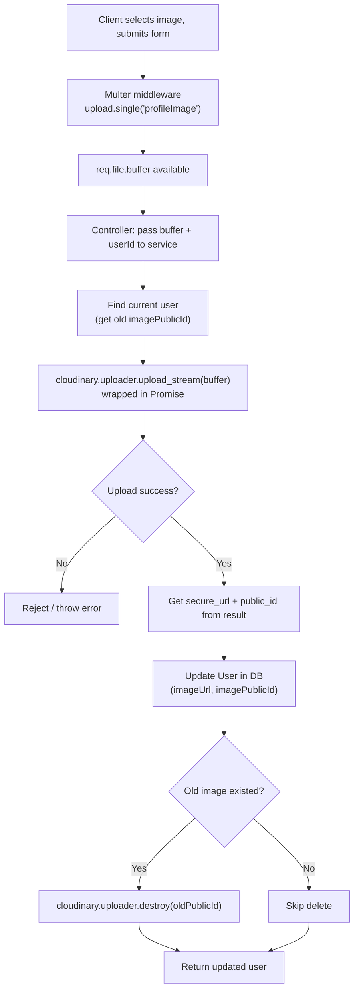

# File Upload — Multer + Cloudinary (Profile Image Upload)

## Table of Contents

1. [Why Multer & Cloudinary?](#1-why-multer--cloudinary)
2. [Install Packages](#2-install-packages)
3. [Multer → Middleware → Form Data → File Handling](#3-multer--middleware--form-data--file-handling)
4. [Multer Setup → Storage → Memory Storage (RAM)](#4-multer-setup--storage--memory-storage-ram)
5. [upload.single(fieldName) vs upload.array](#5-uploadsinglefieldname-vs-uploadarray)
6. [Cloudinary Configuration](#6-cloudinary-configuration)
7. [Cloudinary's upload_stream(Buffer)](#7-cloudinarys-upload_streambuffer)
8. [upload_stream → Callback Pattern → Promise → async/await](#8-upload_stream--callback-pattern--promise--asyncawait)
9. [secure_url, public_id → Store in DB](#9-secure_url-public_id--store-in-db)
10. [Delete Previous Image from Cloudinary](#10-delete-previous-image-from-cloudinary)
11. [destroyer() / destroy() with async/await](#11-destroyer--destroy-with-asyncawait)
12. [Full Flowchart](#12-full-flowchart)
13. [Full Implementation (step by step)](#13-full-implementation-step-by-step)
14. [Quick Reference](#14-quick-reference)

---

## 1. Why Multer & Cloudinary?

When a user uploads a file (like a profile picture) through a form, Express
by default **cannot read file data** — `req.body` only understands text
fields (JSON, urlencoded). Uploaded files arrive as `multipart/form-data`,
which needs special parsing.

| Tool | Job |
|---|---|
| **Multer** | Middleware that parses `multipart/form-data` requests and gives you access to the uploaded file (as a buffer or on disk) |
| **Cloudinary** | Cloud storage service for images/videos — actually **stores** the file and gives back a permanent URL |

**Why not just save files on your own server?**
- Server disk storage doesn't scale, isn't backed up, and is lost on
  redeploys (especially on platforms like Render/Vercel/Heroku with
  ephemeral file systems).
- Cloudinary gives you a CDN URL, automatic image optimization, and easy
  delete/replace via `public_id` — without managing storage yourself.

**In short:** Multer reads the file **out of the request**, Cloudinary
**stores it permanently** and gives back a URL to save in your database.

---

## 2. Install Packages

```bash
npm i multer
npm i -D @types/multer

npm i cloudinary   # has built-in TypeScript support, no extra @types needed
```

---

## 3. Multer → Middleware → Form Data → File Handling

Multer works as an **Express middleware**. You attach it to a specific
route, and it runs **before** your controller — parsing the incoming
`multipart/form-data` request and attaching the file to `req.file` (or
`req.files` for multiple).


Without Multer, `req.file` would simply be `undefined` — Express has no
built-in way to parse file uploads.

---

## 4. Multer Setup → Storage → Memory Storage (RAM)

Multer supports different **storage engines** — where the uploaded file
temporarily lives while your code processes it.

| Storage type | Where file lives | When to use |
|---|---|---|
| `diskStorage` | Written to a folder on your server's disk | You want to keep local files |
| `memoryStorage` | Kept as a `Buffer` in RAM (`req.file.buffer`) | You're forwarding the file elsewhere (e.g. Cloudinary) and don't need to save it locally |

Since we're uploading straight to Cloudinary, we use **memory storage** —
no need to ever write the file to our own disk.

```ts
// lib/multer.ts
import multer from "multer";

const storage = multer.memoryStorage();

export const upload = multer({ storage: storage });
```

---

## 5. `upload.single(fieldName)` vs `upload.array`

| Method | Use case | Result |
|---|---|---|
| `upload.single("fieldName")` | One file per request | `req.file` (singular) |
| `upload.array("fieldName", maxCount)` | Multiple files, same field name | `req.files` (array) |
| `upload.fields([{ name, maxCount }, ...])` | Multiple files, different field names | `req.files` (object keyed by field name) |

For a profile picture (one image), we use `upload.single()`:

```ts
router.patch(
  "/profile-image",
  auth(Role.SUPER_ADMIN, Role.ADMIN, Role.DOCTOR, Role.PATIENT),
  upload.single("profileImage"), // "profileImage" must match the form field name
  UserController.uploadProfileImage
);
```

The frontend must send the file under a form field named exactly
`"profileImage"` for this to work.

---

## 6. Cloudinary Configuration

1. Create a free Cloudinary account.
2. On the dashboard home, copy: **Cloud Name**, **API Key**, **API Secret**.
3. Put them in `.env` — double-check you paste each value into the
   **correct** field (easy to mix up key/secret by accident).

```env
CLOUDINARY_CLOUD_NAME=your_cloud_name
CLOUDINARY_API_KEY=your_api_key
CLOUDINARY_API_SECRET=your_api_secret
```

`config/index.ts`:

```ts
export default {
  cloudinary_cloud_name: process.env.CLOUDINARY_CLOUD_NAME!,
  cloudinary_api_key: process.env.CLOUDINARY_API_KEY!,
  cloudinary_api_secret: process.env.CLOUDINARY_API_SECRET!,
};
```

`lib/cloudinary.ts`:

```ts
import { v2 as Cloudinary } from "cloudinary";
import config from "../config";

Cloudinary.config({
  cloud_name: config.cloudinary_cloud_name,
  api_key: config.cloudinary_api_key,
  api_secret: config.cloudinary_api_secret,
});

export const cloudinary = Cloudinary;
```

---

## 7. Cloudinary's `upload_stream(Buffer)`

Since Multer's memory storage gives us the file as a **Buffer** (not a
file path), we can't use Cloudinary's normal `upload()` (which expects a
file path or base64 string). Instead, we use **`upload_stream`**, which
accepts a readable stream and lets us **pipe the buffer directly** into
it — no temporary file needed anywhere.

```ts
cloudinary.uploader.upload_stream(
  { resource_type: "auto" }, // auto-detects image/video/raw
  (error, result) => {
    // callback runs when upload finishes
  }
).end(buffer); // .end(buffer) pushes our buffer into the stream
```

`resource_type: "auto"` lets Cloudinary automatically figure out if it's
an image, video, or another file type.

---

## 8. `upload_stream` → Callback Pattern → Promise → async/await

`upload_stream` is **callback-based** (older Node.js style), which doesn't
play nicely with `async/await`. To use it cleanly inside an `async`
function, we **wrap it in a Promise**:

```ts
const cloudinaryResult = await new Promise<UploadApiResponse>((resolve, reject) => {
  cloudinary.uploader
    .upload_stream({ resource_type: "auto" }, (error, result) => {
      if (error) return reject(error);
      if (!result) return reject(new Error("No result returned from Cloudinary"));
      resolve(result);
    })
    .end(buffer);
});
```

Now we can simply `await cloudinaryResult` and continue like any other
async operation — this is the standard pattern for converting **any**
callback-based API into something `async/await`-friendly.


---

## 9. `secure_url`, `public_id` → Store in DB

Once the upload succeeds, Cloudinary's result object gives us two
important fields:

| Field | Purpose |
|---|---|
| `secure_url` | HTTPS URL of the uploaded image — save this and show it in your UI |
| `public_id` | Cloudinary's internal identifier for the file — needed later to **delete** or **replace** it |

```ts
const updatedUser = await prisma.user.update({
  where: { id: userId },
  data: {
    imageUrl: cloudinaryResult.secure_url,
    imagePublicId: cloudinaryResult.public_id,
  },
  omit: { password: true },
});
```

**Why store `public_id` too, not just the URL?** Without it, you have no
clean way to tell Cloudinary "delete this specific file" later — the URL
alone isn't a reliable lookup key for deletion.

---

## 10. Delete Previous Image from Cloudinary

When a user uploads a **new** profile picture, the old one should be
removed from Cloudinary — otherwise you accumulate unused files forever
(wasted storage, and eventually hits your plan's limit).

**Order of operations matters:**

1. Look up the user's **current** `imagePublicId` **before** uploading the
   new one.
2. Upload the new image, update the DB with the new URL/public_id.
3. **Only after** the new image is safely saved, delete the old one from
   Cloudinary.

```ts
const currentUser = await prisma.user.findUnique({
  where: { id: userId },
  select: { imagePublicId: true, imageUrl: true },
});

// ... upload new image, update DB ...

if (currentUser?.imagePublicId && currentUser.imageUrl) {
  await cloudinary.uploader.destroy(currentUser.imagePublicId);
}
```

**Why delete last, not first?** If the new upload fails partway through,
you still want the user's old picture intact — deleting the old one
*before* confirming the new one succeeded risks leaving the user with **no
image at all**.

---

## 11. `destroy()` with async/await

Cloudinary's delete method is called `destroy()` (not `delete`), and it
returns a Promise natively — so it works directly with `await`, no manual
wrapping needed (unlike `upload_stream`):

```ts
await cloudinary.uploader.destroy(publicId);
```

It takes the `public_id` (not the URL) and removes that exact file from
Cloudinary's storage.

---

## 12. Full Flowchart



---

## 13. Full Implementation (step by step)

### Step 1 — Prisma model: add image fields

```prisma
model User {
  id                 String       @id @default(uuid())
  name               String
  email              String
  password           String?
  googleId           String?      @unique
  authProvider       AuthProvider @default(CREDENTIAL)
  emailVerified      Boolean      @default(false)
  role               Role         @default(PATIENT)
  status             UserStatus   @default(ACTIVE)
  needPasswordChange Boolean      @default(false)
  imageUrl           String       @default("")
  imagePublicId      String       @default("")
  isDeleted          Boolean      @default(false)
  deletedAt          DateTime?
  createdAt          DateTime     @default(now())
  updatedAt          DateTime     @updatedAt
  patient            Patient?

  @@unique([email])
  @@map("users")
}
```

> ⚠️ **Fix from the draft:** the schema had the field named
> `image_PublicId`, but every place in the service/controller code
> references `imagePublicId` (camelCase, no underscore). Prisma field
> names must match exactly — using `image_PublicId` in the schema would
> break every `cloudinaryResult.public_id` / `currentUser.imagePublicId`
> reference in the code. Renamed to `imagePublicId` above so schema and
> code agree.

### Step 2 — `lib/multer.ts`

```ts
import multer from "multer";

const storage = multer.memoryStorage();

export const upload = multer({ storage: storage });
```

### Step 3 — `lib/cloudinary.ts`

```ts
import { v2 as Cloudinary } from "cloudinary";
import config from "../config";

Cloudinary.config({
  cloud_name: config.cloudinary_cloud_name,
  api_key: config.cloudinary_api_key,
  api_secret: config.cloudinary_api_secret,
});

export const cloudinary = Cloudinary;
```

### Step 4 — Project structure for this feature

```
app/
 ├── lib/
 │    ├── multer.ts
 │    └── cloudinary.ts
 └── module/
      └── user/
           ├── user.controller.ts
           ├── user.route.ts
           └── user.service.ts
```

### Step 5 — Route: `user/user.route.ts`

```ts
import { Router } from "express";
import { Role } from "../../../generated/prisma/enums";
import { upload } from "../../lib/multer";
import { auth } from "../../middleware/checkAuth";
import { UserController } from "./user.controller";

const router = Router();

router.patch(
  "/profile-image",
  auth(Role.SUPER_ADMIN, Role.ADMIN, Role.DOCTOR, Role.PATIENT),
  upload.single("profileImage"),
  UserController.uploadProfileImage
);

export const UserRoutes = router;
```

### Step 6 — Controller: `user/user.controller.ts`

```ts
import { Request, Response } from "express";
import httpStatus from "http-status";
import { catchAsync } from "../../utils/catchAsync";
import { sendResponse } from "../../utils/sendResponse";
import { UserServices } from "./user.service";

const uploadProfileImage = catchAsync(async (req: Request, res: Response) => {
  if (!req.file) {
    throw new Error("No file provided.");
  }

  const userId = req.user?.userId;

  const result = await UserServices.uploadProfileImage(req.file.buffer, userId!);

  sendResponse(res, {
    statusCode: httpStatus.OK,
    success: true,
    message: "Profile image updated successfully",
    data: result,
  });
});

export const UserController = {
  uploadProfileImage,
};
```

> ⚠️ Fix from the draft: the response message said `"New tokens generated
> successfully"` — leftover text copy-pasted from an auth endpoint.
> Changed to `"Profile image updated successfully"` to match what this
> endpoint actually does.

### Step 7 — Service: `user/user.service.ts`

```ts
import { UploadApiResponse } from "cloudinary";
import { cloudinary } from "../../lib/cloudinary";
import { prisma } from "../../lib/prisma";

const uploadProfileImage = async (buffer: Buffer, userId: string) => {
  // 1. Get the user's CURRENT image info, before uploading the new one
  const currentUser = await prisma.user.findUnique({
    where: { id: userId },
    select: {
      imagePublicId: true,
      imageUrl: true,
    },
  });

  // 2. Upload new image to Cloudinary (callback API wrapped in a Promise)
  const cloudinaryResult = await new Promise<UploadApiResponse>((resolve, reject) => {
    cloudinary.uploader
      .upload_stream({ resource_type: "auto" }, (error, result) => {
        if (error) return reject(error);
        if (!result) return reject(new Error("No result returned from Cloudinary"));
        resolve(result);
      })
      .end(buffer);
  });

  // 3. Save new image URL + public ID in the database
  const updatedUser = await prisma.user.update({
    where: { id: userId },
    data: {
      imageUrl: cloudinaryResult.secure_url,
      imagePublicId: cloudinaryResult.public_id,
    },
    omit: { password: true },
  });

  // 4. Delete the OLD image from Cloudinary — only after the new one is saved
  if (currentUser?.imagePublicId && currentUser.imageUrl) {
    await cloudinary.uploader.destroy(currentUser.imagePublicId);
  }

  return updatedUser;
};

export const UserServices = {
  uploadProfileImage,
};
```

---

## 14. Quick Reference

| Concept | One-line summary |
|---|---|
| Multer | Middleware that parses `multipart/form-data`, gives you `req.file` |
| `memoryStorage()` | Keeps file as `Buffer` in RAM — no local disk writes |
| `upload.single(field)` | One file, field name must match frontend form |
| Cloudinary config | `cloud_name`, `api_key`, `api_secret` — from dashboard |
| `upload_stream()` | Cloudinary's way to accept a Buffer directly (no file path needed) |
| Wrap in Promise | Turns Cloudinary's callback API into something `await`-able |
| `secure_url` | Public HTTPS URL — save & display this |
| `public_id` | Internal ID — needed to delete/replace the file later |
| `cloudinary.uploader.destroy(publicId)` | Deletes a file, returns a native Promise |
| Order of ops | Get old public_id → upload new → save to DB → **then** delete old |

### Mental model, end-to-end

```
Client submits form (field: "profileImage")
   → Multer middleware parses it → req.file.buffer (RAM)
   → Controller passes buffer + userId to service
   → Service: look up user's current imagePublicId
   → Service: upload_stream(buffer) to Cloudinary → { secure_url, public_id }
   → Service: update User row (imageUrl, imagePublicId)
   → Service: if an old imagePublicId existed → destroy() it on Cloudinary
   → Return updated user (without password)
```
