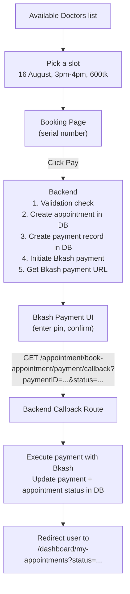
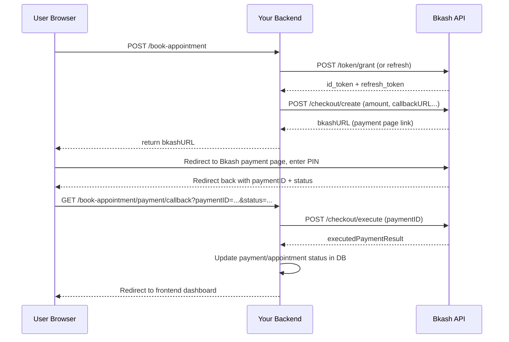
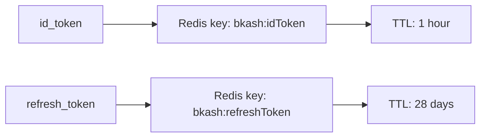
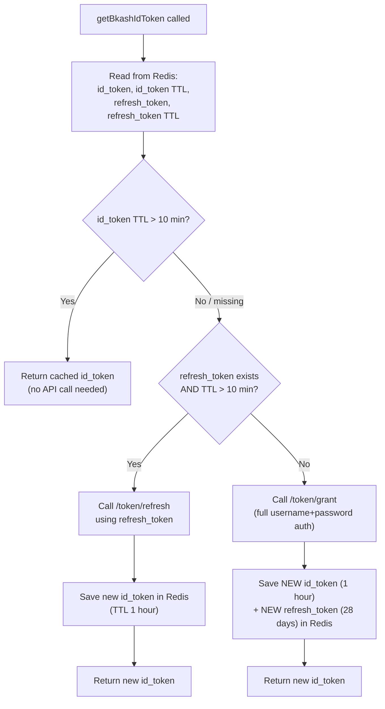

# Bkash Payment Integration — Appointment Booking & Payment Workflow

## Table of Contents

1. [Workflow on Appointment Booking and Payment with Bkash](#1-workflow-on-appointment-booking-and-payment-with-bkash)
2. [Bkash Payment Workflow with Backend and Webhook](#2-bkash-payment-workflow-with-backend-and-webhook)
3. [How Bkash Payment Creation and Execution Happen](#3-how-bkash-payment-creation-and-execution-happen)
4. [Setting Up Bkash in Project](#4-setting-up-bkash-in-project)
5. [Setting Bkash ID Token in Redis](#5-setting-bkash-id-token-in-redis)
6. [Handling Bkash Refresh Token Expiration](#6-handling-bkash-refresh-token-expiration)
7. [Creating Payment for Getting Bkash Payment URL](#7-creating-payment-for-getting-bkash-payment-url)
8. [Testing Bkash Payment URL & How the Callback URL Works](#8-testing-bkash-payment-url--how-the-callback-url-works)
9. [Executing Payment in the Callback URL to Get Transaction ID](#9-executing-payment-in-the-callback-url-to-get-transaction-id)
10. [Handling Payment Status & Redirecting to Frontend](#10-handling-payment-status--redirecting-to-frontend)
11. [Full Code, File by File](#11-full-code-file-by-file)
12. [Quick Reference](#12-quick-reference)

---

## 1. Workflow on Appointment Booking and Payment with Bkash

This is the **full user journey**, end to end — from picking a doctor to
landing back on the dashboard after paying.



**In plain words:**

1. User browses doctors → picks an available time slot.
2. Booking page shows the slot + price → user clicks **Pay**.
3. Backend does its own checks first (slot still free? appointment
   allowed?), saves an `appointment` row and a `payment` row, **then**
   asks Bkash to create a payment and get back a **payment URL**.
4. User is sent to Bkash's own hosted payment page (enter PIN, confirm).
5. Bkash redirects the browser back to **our callback URL** with a
   `paymentID` and a `status` (success/failure/cancel) as query params.
6. Our backend **executes** that payment with Bkash (confirms it really
   went through), updates the DB, then **redirects the browser** to the
   frontend dashboard with a status flag.

> **Note:** Bkash's "callback URL" here works like a **webhook** — Bkash
> calls this URL directly to hand control back to your backend, similar
> to how Stripe uses a webhook to notify your server of payment events.
> The difference: here it's a **redirect** the user's browser makes (a
> `GET` request), not a server-to-server POST — so your backend must
> finish by **redirecting the browser** onward to the frontend.

---

## 2. Bkash Payment Workflow with Backend and Webhook

Two separate HTTP flows are involved:

| Flow | Direction | Purpose |
|---|---|---|
| **Create Payment** | Your backend → Bkash API | Ask Bkash to start a payment, get a `bkashURL` to redirect the user to |
| **Callback (webhook-like)** | Bkash → your backend (via user's browser redirect) | Bkash tells you the payment result; you must **execute** it to finalize |



---

## 3. How Bkash Payment Creation and Execution Happen

Two separate Bkash API calls, at two different times:

| Call | When | Purpose |
|---|---|---|
| **Create** (`/checkout/create`) | Right when user clicks "Pay" | Registers the intended payment with Bkash, returns a `bkashURL` to redirect to |
| **Execute** (`/checkout/execute`) | After user completes payment on Bkash's page, in the callback | Confirms/finalizes the payment, returns transaction details (like `trxID`) |

**Why two steps and not one?** Because the actual payment (PIN entry,
confirmation) happens on **Bkash's own UI**, outside your app. Your
backend can't know the result until Bkash sends the user back — so
"create" just sets things up, and "execute" is what actually confirms
money moved.

---

## 4. Setting Up Bkash in Project

### Project Structure

```
app/
 ├── config/
 │    └── index.ts
 ├── lib/
 │    ├── bkash.ts
 │    ├── cloudinary.ts
 │    ├── googleAuth.ts
 │    ├── multer.ts
 │    ├── nodemailer.ts
 │    ├── prisma.ts
 │    └── redis.ts
 ├── middleware/
 ├── module/
 │    ├── appointment/
 │    │    ├── appointment.controller.ts
 │    │    ├── appointment.route.ts
 │    │    └── appointment.service.ts
 │    ├── auth/
 │    └── user/
 ├── templates/
 ├── utils/
 │    ├── catchAsync.ts
 │    ├── jwt.ts
 │    ├── seed.ts
 │    └── sendResponse.ts
 ├── app.ts
 └── server.ts
.env
```

### `.env`

```env
BKASH_BASE_URL=https://tokenized.sandbox.bka.sh/v1.2.0-beta
BKASH_USERNAME=sandboxTokenizedUser02
BKASH_PASSWORD=sandboxTokenizedUser02@12345
BKASH_APP_KEY=4f6o0cjiki2rfm34kfdadl1eqq
BKASH_APP_SECRET=2is7hdktrekvrbljjh44ll3d9l1dtjo4pasmjvs5vl5qr3fug4b
BKASH_CALLBACK_URL=http://localhost:5000/api/v1
FRONTEND_URL=http://localhost:3000
```

> These are Bkash's **public sandbox test credentials** (same ones Bkash
> publishes in their own sandbox docs for developers to test with) — not
> a real merchant account. For a real project, swap these for your own
> live/sandbox credentials issued by Bkash, and never commit `.env` to
> version control.

### `config/index.ts`

```ts
export default {
  bkash_base_url: process.env.BKASH_BASE_URL!,
  bkash_username: process.env.BKASH_USERNAME!,
  bkash_password: process.env.BKASH_PASSWORD!,
  bkash_app_key: process.env.BKASH_APP_KEY!,
  bkash_app_secret: process.env.BKASH_APP_SECRET!,
  bkash_callback_url: process.env.BKASH_CALLBACK_URL!,
  frontend_url: process.env.FRONTEND_URL!,
};
```

Bkash (like most payment gateways) authenticates every API call using an
**`id_token`**, which you get by calling their `/token/grant` endpoint
with your `app_key`, `app_secret`, `username`, and `password`.

---

## 5. Setting Bkash ID Token in Redis

Bkash's `id_token` is only valid for a limited time, and requesting a new
one every single API call would be wasteful and slow. So, same idea as
OTPs earlier — we cache it in **Redis** with a TTL matching its real
lifetime.



- `id_token` → stored in Redis for **1 hour**
- `refresh_token` → stored in Redis for **28 days**

Both tokens come back together the **first time** you call `/token/grant`.
After that, as long as the `refresh_token` is still valid, you never need
to call `/token/grant` again — you just call the cheaper `/token/refresh`
endpoint to get a new `id_token`.

---

## 6. Handling Bkash Refresh Token Expiration

This is the core logic inside `getBkashIdToken()` — deciding **which**
Bkash API call to make (if any), based on what's currently cached in
Redis.



**Why this order of checks matters:**

1. **Fast path first** — if the cached `id_token` still has plenty of life
   left (`TTL > 600` seconds = 10 minutes), just reuse it. No network call
   at all.
2. **Medium path** — if the `id_token` is about to expire (or gone) but
   the `refresh_token` is still healthy, use the cheaper `/token/refresh`
   call instead of a full re-login.
3. **Slow path (fallback)** — if even the `refresh_token` is missing or
   about to expire, do a full `/token/grant` (equivalent to logging in
   from scratch), and cache both tokens fresh.

This 3-tier fallback means your backend almost never has to do a full
Bkash login — it happens once every ~28 days at most, everything else is
cheap cache hits or refreshes.

> ⚠️ **Bug to watch for:** in the code, `bkashIdTokenTTL <= 600` is
> checked as part of the "refresh" branch condition, but **after** that
> block, there's a separate `if (bkashIdTokenTTL > 600) return
> bkashIdToken;` check. If `bkashIdTokenTTL` is `-2` (Redis's code for "key
> doesn't exist") this still correctly falls through to the full
> `/token/grant` call at the bottom — but it's worth tracing this logic
> carefully if you extend it, since TTL edge cases (`-1` = no expiry, `-2`
> = key missing) can silently change behavior.

---

## 7. Creating Payment for Getting Bkash Payment URL

Once you have a valid `id_token`, creating a payment is a single POST
request to Bkash's `/checkout/create` endpoint.

```ts
const bkashCreatePaymentResponse = await fetch(
  `${config.bkash_base_url}/tokenized/checkout/create`,
  {
    method: "POST",
    headers: {
      "Content-Type": "application/json",
      Accept: "application/json",
      Authorization: bkashIdToken,
      "X-App-Key": config.bkash_app_key,
    },
    body: JSON.stringify({
      mode: "0011", // checkout mode (tokenized checkout)
      payerReference: "0123456789", // user email or phone
      callbackURL: `${config.bkash_callback_url}/appointment/book-appointment/payment/callback`,
      amount: "1200",
      currency: "BDT",
      intent: "sale",
      merchantInvoiceNumber: "Inv4", // should be a unique appointment/invoice id
    }),
  }
);
```

The response includes a `bkashURL` — this is what you send back to the
frontend so it can redirect the user to Bkash's payment page.

> ⚠️ In a real project, `amount`, `payerReference`, and
> `merchantInvoiceNumber` should come from your **actual appointment
> data** (the doctor's fee, the logged-in user's phone/email, and a real
> unique appointment ID) — not hardcoded values like `"1200"` and
> `"Inv4"`. The draft code hardcodes these for testing; wire them to
> `req.body` / the created appointment record before going live.

---

## 8. Testing Bkash Payment URL & How the Callback URL Works

**To test:**
1. Call `bookAppointment` → get back `bkashURL` from the response.
2. Open that URL in a browser → Bkash's **sandbox** payment page loads.
3. Use Bkash's sandbox test credentials (test number + test PIN) to
   simulate a payment.
4. After confirming (or cancelling) on Bkash's page, Bkash **redirects
   the browser** to your `callbackURL` — with `paymentID` and `status` as
   query parameters.

```
GET /appointment/book-appointment/payment/callback?paymentID=TR0011abcd&status=success
```

**Important:** the callback route must be a `GET` route (since it's a
browser redirect, not a server-to-server call), and it must be reachable
publicly from Bkash's sandbox (use a tunneling tool like `ngrok` during
local development, since `localhost` isn't reachable from Bkash's
servers).

---

## 9. Executing Payment in the Callback URL to Get Transaction ID

Getting redirected to the callback URL only tells you the user
**attempted** the flow with a given `status` — it does **not** by itself
confirm money actually moved. You must call `/checkout/execute` to get
the final, authoritative result (including the real `trxID`).

```ts
const executedPaymentResponse = await fetch(
  `${config.bkash_base_url}/tokenized/checkout/execute`,
  {
    method: "POST",
    headers: {
      "Content-Type": "application/json",
      Accept: "application/json",
      Authorization: bkashIdToken,
      "X-App-Key": config.bkash_app_key,
    },
    body: JSON.stringify({ paymentID: paymentId }),
  }
);

const executedPaymentResult = await executedPaymentResponse.json();
```

This is the step where you'd also **update your database** — mark the
`payment` row as paid/failed, store the returned `trxID`, and update the
`appointment` status accordingly (this part is marked with `// business
logic` / left as a TODO in the draft code — see note below).

> ⚠️ **Missing in the draft code:** `bookAppointmentCallback` currently
> only calls `/checkout/execute` and redirects — it never actually
> **writes the result to the database** (updating `payment` status,
> `appointment` status, or saving the `trxID`). This is the most
> important step to fill in before this goes to production: without it,
> a successful Bkash payment never gets reflected in your own DB.

---

## 10. Handling Payment Status & Redirecting to Frontend

The `status` query param tells you what happened, and each case should
redirect the user to a **different frontend URL** (or at least a
different query flag) so the UI can show the right message:

```ts
if (status === "success") {
  return {
    executedPaymentResult,
    redirectUrl: `${config.frontend_url}/dashboard/my-appointments?status=success`,
  };
}
if (status === "failure") {
  return {
    executedPaymentResult,
    redirectUrl: `${config.frontend_url}/dashboard/my-appointments?status=failure`,
  };
}
if (status === "cancel") {
  return {
    executedPaymentResult,
    redirectUrl: `${config.frontend_url}/dashboard/my-appointments?status=cancel`,
  };
}

// fallback — unknown status
return {
  executedPaymentResult,
  redirectUrl: `${config.frontend_url}/dashboard/my-appointments`,
};
```

The controller then does an actual HTTP redirect (not a JSON response,
since the client here is the user's **browser**, not an API consumer):

```ts
res.redirect(redirectUrl);
```

> ⚠️ Small typo caught from the draft: `"failue"` → corrected to
> `"failure"` in the redirect URL above, so the frontend's `?status=`
> check matches consistently.

---

## 11. Full Code, File by File

### `lib/bkash.ts`

```ts
import config from "../config";
import { redisClient } from "./redis";

export const getBkashIdToken = async () => {
  try {
    const IdTokenKey = "bkash:idToken";
    const RefreshTokenKey = "bkash:refreshToken";

    let bkashIdToken = await redisClient.get(IdTokenKey);
    const bkashIdTokenTTL = await redisClient.ttl(IdTokenKey);

    const bkashRefreshToken = await redisClient.get(RefreshTokenKey);
    const bkashRefreshTokenTTL = await redisClient.ttl(RefreshTokenKey);

    // bkash id token remaining time is less than or equal 10 minutes, or expired
    // bkash refresh token must exist
    // bkash refresh token remaining time is more than 10 minutes
    if (
      (bkashIdTokenTTL <= 600 || !bkashIdToken) &&
      bkashRefreshToken &&
      bkashRefreshTokenTTL > 600
    ) {
      const refreshTokenResponse = await fetch(
        `${config.bkash_base_url}/tokenized/checkout/token/refresh`,
        {
          method: "POST",
          headers: {
            "Content-Type": "application/json",
            Accept: "application/json",
            username: config.bkash_username,
            password: config.bkash_password,
          },
          body: JSON.stringify({
            app_key: config.bkash_app_key,
            app_secret: config.bkash_app_secret,
            refresh_token: bkashRefreshToken,
          }),
        }
      );
      if (!refreshTokenResponse.ok) {
        throw new Error("Bkash Access Token Grant Failed");
      }

      const bkashRefreshTokenResult = await refreshTokenResponse.json();

      bkashIdToken = bkashRefreshTokenResult.id_token as string;

      await redisClient.set(IdTokenKey, bkashIdToken, {
        expiration: {
          type: "EX",
          value: 60 * 60,
        },
      });

      return bkashIdToken;
    }

    if (bkashIdTokenTTL > 600) {
      return bkashIdToken;
    }

    const response = await fetch(
      `${config.bkash_base_url}/tokenized/checkout/token/grant`,
      {
        method: "POST",
        headers: {
          "Content-Type": "application/json",
          Accept: "application/json",
          username: config.bkash_username,
          password: config.bkash_password,
        },
        body: JSON.stringify({
          app_key: config.bkash_app_key,
          app_secret: config.bkash_app_secret,
        }),
      }
    );

    if (!response.ok) {
      throw new Error("Bkash Access Token Grant Failed");
    }

    const result = await response.json();

    // bkash id token set
    await redisClient.set(IdTokenKey, result.id_token, {
      expiration: {
        type: "EX",
        value: 60 * 60, // 1 hour
      },
    });

    // bkash refresh token set
    await redisClient.set(RefreshTokenKey, result.refresh_token, {
      expiration: {
        type: "EX",
        value: 60 * 60 * 24 * 28, // 28 days
      },
    });

    bkashIdToken = result.id_token;

    return bkashIdToken;
  } catch (error: any) {
    throw new Error(error.message);
  }
};
```

### `appointment/appointment.route.ts`

```ts
import { Router } from "express";
import { AppointmentController } from "./appointment.controller";

const router = Router();

router.post("/book-appointment", AppointmentController.bookAppointment);

// book appointment callback url
router.get(
  "/book-appointment/payment/callback",
  AppointmentController.bookAppointmentCallback
);

export const AppointementRoutes = router;
```

### `appointment/appointment.controller.ts`

```ts
import { Request, Response } from "express";
import httpStatus from "http-status";
import { catchAsync } from "../../utils/catchAsync";
import { sendResponse } from "../../utils/sendResponse";
import { AppointmentServices } from "./appointment.service";

const bookAppointment = catchAsync(async (req: Request, res: Response) => {
  const result = await AppointmentServices.bookAppointment();
  sendResponse(res, {
    statusCode: httpStatus.OK,
    success: true,
    message: "Bkash payment URL generated successfully",
    data: result,
  });
});

const bookAppointmentCallback = catchAsync(async (req: Request, res: Response) => {
  console.log(req.query, "req.query");
  const { executedPaymentResult, redirectUrl } =
    await AppointmentServices.bookAppointmentCallback(req.query);

  console.log({ executedPaymentResult }, "callback controller");

  res.redirect(redirectUrl);
});

export const AppointmentController = {
  bookAppointment,
  bookAppointmentCallback,
};
```

> ⚠️ Small copy-paste fix: the draft's `bookAppointment` response message
> said `"User profile fetched successfully"` — corrected above to
> `"Bkash payment URL generated successfully"` to match what this
> endpoint actually returns.

### `appointment/appointment.service.ts`

```ts
import config from "../../config";
import { getBkashIdToken } from "../../lib/bkash";

const bookAppointment = async () => {
  // TODO: business logic — validate slot, create appointment row,
  // create a pending payment row, THEN initiate Bkash payment below.

  const bkashIdToken = await getBkashIdToken();

  if (!bkashIdToken) {
    throw new Error("No Bkash Access Token Found!");
  }

  console.log({ bkashIdToken });

  const bkashCreatePaymentResponse = await fetch(
    `${config.bkash_base_url}/tokenized/checkout/create`,
    {
      method: "POST",
      headers: {
        "Content-Type": "application/json",
        Accept: "application/json",
        Authorization: bkashIdToken,
        "X-App-Key": config.bkash_app_key,
      },
      body: JSON.stringify({
        mode: "0011",
        payerReference: "0123456789", // user email or phone number
        callbackURL: `${config.bkash_callback_url}/appointment/book-appointment/payment/callback`,
        amount: "1200",
        currency: "BDT",
        intent: "sale",
        merchantInvoiceNumber: "Inv4", // appointment id
      }),
    }
  );

  const bkashCreatePaymentResult = await bkashCreatePaymentResponse.json();

  console.log({ bkashCreatePaymentResult });

  return bkashCreatePaymentResult;
};

const bookAppointmentCallback = async (query: Record<string, any>) => {
  const paymentId = query.paymentID;

  if (!paymentId) {
    throw new Error("Payment Id Missing");
  }

  const status = query.status;

  if (!status) {
    throw new Error("Payment Status is Missing");
  }

  const bkashIdToken = await getBkashIdToken();

  if (!bkashIdToken) {
    throw new Error("No Bkash Access Token Found!");
  }

  const executedPaymentResponse = await fetch(
    `${config.bkash_base_url}/tokenized/checkout/execute`,
    {
      method: "POST",
      headers: {
        "Content-Type": "application/json",
        Accept: "application/json",
        Authorization: bkashIdToken,
        "X-App-Key": config.bkash_app_key,
      },
      body: JSON.stringify({
        paymentID: paymentId,
      }),
    }
  );

  const executedPaymentResult = await executedPaymentResponse.json();

  // TODO: update `payment` row (status, trxID) and `appointment` row
  // in the database here, based on executedPaymentResult, before redirecting.

  if (status === "success") {
    return {
      executedPaymentResult,
      redirectUrl: `${config.frontend_url}/dashboard/my-appointments?status=success`,
    };
  }
  if (status === "failure") {
    return {
      executedPaymentResult,
      redirectUrl: `${config.frontend_url}/dashboard/my-appointments?status=failure`,
    };
  }
  if (status === "cancel") {
    return {
      executedPaymentResult,
      redirectUrl: `${config.frontend_url}/dashboard/my-appointments?status=cancel`,
    };
  }

  return {
    executedPaymentResult,
    redirectUrl: `${config.frontend_url}/dashboard/my-appointments`,
  };
};

export const AppointmentServices = {
  bookAppointment,
  bookAppointmentCallback,
};
```

---

## 12. Quick Reference

| Concept | One-line summary |
|---|---|
| `/token/grant` | Full login — gets both `id_token` (1hr) and `refresh_token` (28 days) |
| `/token/refresh` | Cheaper re-auth using `refresh_token` — only gets a new `id_token` |
| Redis TTL check | `> 10 min` left → reuse; `≤ 10 min` → refresh/re-grant |
| `/checkout/create` | Starts a payment, returns `bkashURL` to redirect the user to |
| `/checkout/execute` | Confirms the payment after user completes it on Bkash's page |
| Callback URL | Bkash redirects the **browser** here with `paymentID` + `status` — must be `GET`, must be publicly reachable |
| `res.redirect(redirectUrl)` | Final step — sends the browser onward to the frontend, not a JSON response |

### Mental model, end-to-end

```
User clicks "Pay"
   → Backend: getBkashIdToken() (cache-first: Redis → refresh → full grant)
   → Backend: POST /checkout/create → get bkashURL
   → Frontend redirects user to bkashURL
   → User completes payment on Bkash's hosted page
   → Bkash redirects browser to OUR callback URL (GET, with paymentID + status)
   → Backend: POST /checkout/execute (confirm payment) → get final result
   → Backend: (should) update payment/appointment rows in DB
   → Backend: res.redirect() to frontend dashboard with a status flag
```

### Things to finish before production

1. Fill in the `// TODO` business logic in `bookAppointment` — validate
   the requested slot, create the `appointment` and `payment` DB rows
   **before** calling Bkash.
2. Fill in the `// TODO` in `bookAppointmentCallback` — actually persist
   `executedPaymentResult` (status, `trxID`) to your DB.
3. Replace hardcoded `amount`, `payerReference`, and
   `merchantInvoiceNumber` with real values from the appointment/user.
4. Use `ngrok` (or similar) for local testing, since Bkash's servers need
   a publicly reachable callback URL.
