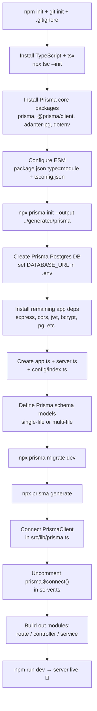

# Express + TypeScript + Prisma — Backend Setup Notes

Personal reference notes for scaffolding a Node.js backend with **TypeScript**, **Express**, **Prisma ORM**, and **Prisma Postgres**.

> ⚠️ **Security note:** never commit a real `DATABASE_URL` (or any secret) to GitHub. Keep actual values in a local `.env` (which is git-ignored) and commit only a `.env.example` with placeholder values.

---

## Table of Contents

- [1. Overview](#1-overview)
- [2. Initialize the Project](#2-initialize-the-project)
- [3. Initialize TypeScript](#3-initialize-typescript)
- [4. Install Prisma Core Packages](#4-install-prisma-core-packages)
- [5. Configure ESM Support](#5-configure-esm-support)
- [6. Initialize Prisma ORM](#6-initialize-prisma-orm)
- [7. Create the Prisma Postgres Database](#7-create-the-prisma-postgres-database)
- [8. Install All Project Dependencies](#8-install-all-project-dependencies)
- [9. Set Up the Express App and Server](#9-set-up-the-express-app-and-server)
- [10. Add NPM Scripts](#10-add-npm-scripts)
- [11. Configure Environment Variables](#12-configure-environment-variables)
- [12. Connect Prisma Client to the App](#11-connect-prisma-client-to-the-app)
- [13. Define Prisma Models](#13-define-prisma-models)
- [14. Run Migrations and Generate the Client](#14-run-migrations-and-generate-the-client)
- [15. Modular Folder Structure (Route / Controller / Service)](#15-modular-folder-structure-route--controller--service)
- [16. Final Project Structure](#16-final-project-structure)
- [17. Overall Setup Flow Diagram](#17-overall-setup-flow-diagram)

---

## 1. Overview

Stack covered in this note:

| Tool | Purpose |
|---|---|
| **TypeScript** | Static typing for Node.js |
| **Express** | HTTP server / routing |
| **Prisma ORM** | Type-safe database client & migrations |
| **Prisma Postgres** | Hosted Postgres database |
| **tsx** | Fast TS execution + watch mode for dev |

---

## 2. Initialize the Project

```bash
npm init
```

Then initialize Git and add a `.gitignore`:

```bash
git init
```

Put all the standard ignore entries in `.gitignore` (at minimum):

```
node_modules
dist
.env
generated
```

> Reference: Prisma Docs → **Getting Started → Prisma Postgres → Quickstart → Prisma ORM**.

---

## 3. Initialize TypeScript

Install TypeScript and the dev runner, then generate `tsconfig.json`:

```bash
npm install typescript tsx @types/node --save-dev
npx tsc --init
```

This creates `package.json`, `package-lock.json`, and `tsconfig.json`. Double-check these were generated correctly before moving on.

---

## 4. Install Prisma Core Packages

```bash
npm install prisma @types/node --save-dev
npm install @prisma/client @prisma/adapter-pg dotenv
```

| Package | What it does |
|---|---|
| `prisma` | CLI for `prisma init`, `prisma migrate`, `prisma generate` |
| `@prisma/client` | Prisma Client library for querying the database |
| `@prisma/adapter-pg` | node-postgres driver adapter connecting Prisma Client to Postgres |
| `dotenv` | Loads environment variables from `.env` |

---

## 5. Configure ESM Support

**`package.json`** — make sure `"type"` is set to `"module"`:

```json
{
  "type": "module"
}
```

**`tsconfig.json`** — use an ESM-compatible config. Final version used for this project:

```json
{
  "compilerOptions": {
    "outDir": "./dist",
    "module": "ESNext",
    "moduleResolution": "bundler",
    "target": "ES2023",
    "types": ["node"],
    "sourceMap": true,
    "declaration": true,
    "declarationMap": true,
    "noUncheckedIndexedAccess": true,
    "strict": true,
    "isolatedModules": true,
    "noUncheckedSideEffectImports": true,
    "moduleDetection": "force",
    "skipLibCheck": true
  },
  // "include": ["src/**/*"],
  "exclude": ["node_modules", "dist"]
}
```

This extends Prisma's recommended minimal bundler/ESM config with stricter project-wide options (`outDir`, `declaration`, `noUncheckedIndexedAccess`, etc.).

---

## 6. Initialize Prisma ORM

```bash
npx prisma init --output ../generated/prisma --no-skills
```

This single command:

- Creates a `prisma/` directory with a `schema.prisma` file (datasource + models go here)
- Creates a `.env` file in the project root
- Sets up the Prisma Client to generate into `generated/prisma/`
- Creates a `prisma.config.ts` file

**Generated `prisma.config.ts`:**

```typescript
import "dotenv/config";
import { defineConfig, env } from "prisma/config";

export default defineConfig({
  schema: "prisma/schema.prisma",
  migrations: {
    path: "prisma/migrations",
  },
  datasource: {
    url: env("DATABASE_URL"),
  },
});
```

**Generated `prisma/schema.prisma`:**

```prisma
generator client {
  provider = "prisma-client"
  output   = "../generated/prisma"
}

datasource db {
  provider = "postgresql"
}
```

> `prisma init` creates scaffolding with a placeholder `DATABASE_URL`. Replace it with a real connection string in the next step.

---

## 7. Create the Prisma Postgres Database

**Option A — via CLI:**

```bash
npx create-db
```

**Option B — via the Prisma dashboard:**

1. Go to the Prisma dashboard and create a new project
2. Skip the "deploy" step for now
3. Click **Open Connect Setup**
4. Copy the connection string
5. Paste it into `.env`:

```bash
DATABASE_URL="YOUR_CONNECTION_STRING_HERE"
```

✅ Prisma is now wired up. Next: install the rest of the app dependencies.

---

## 8. Install All Project Dependencies

**Dependencies (all at once):**

```bash
npm install @prisma/adapter-pg @prisma/client bcryptjs cookie-parser cors dotenv express http-status jsonwebtoken pg
```

**Dev Dependencies (all at once):**

```bash
npm install -D @types/cookie-parser @types/cors @types/express @types/jsonwebtoken @types/node @types/pg prisma tsx typescript
```

> **Why separate `@types/*` packages?** On npm, a package tagged **`T`** ships its own TypeScript types. A package tagged **`DT`** does *not* — its types live in a separate `@types/<package>` package, which you install with `-D` (dev dependency).

| Package | Type |
|---|---|
| `@prisma/adapter-pg` | dependency |
| `@prisma/client` | dependency |
| `bcryptjs` | dependency |
| `cookie-parser` | dependency |
| `cors` | dependency |
| `dotenv` | dependency |
| `express` | dependency |
| `http-status` | dependency |
| `jsonwebtoken` | dependency |
| `pg` | dependency |
| `@types/cookie-parser` | dev dependency |
| `@types/cors` | dev dependency |
| `@types/express` | dev dependency |
| `@types/jsonwebtoken` | dev dependency |
| `@types/node` | dev dependency |
| `@types/pg` | dev dependency |
| `prisma` | dev dependency |
| `tsx` | dev dependency |
| `typescript` | dev dependency |

---

## 9. Set Up the Express App and Server

Create a `src/` directory with `app.ts` and `server.ts`.

**`src/app.ts`:**

```typescript
import cookieParser from "cookie-parser";
import cors from "cors";
import express, { Application, Request, Response } from "express";
import config from "./config";
import { userRoutes } from "./modules/user/user.route";

const app: Application = express();

app.use(
  cors({
    origin: config.app_url,
    credentials: true,
  })
);

// Middleware
app.use(express.json());
app.use(express.urlencoded({ extended: true }));
app.use(cookieParser());

// API
app.get("/", (req: Request, res: Response) => {
  res.send("Hello, World!");
});

app.use("/api/users", userRoutes);

export default app;
```

**`src/server.ts`:**

```typescript
import "dotenv/config";
import app from "./app";
import config from "./config";
import { prisma } from "./lib/prisma";

const PORT = config.port;

async function main() {
  try {
    // await prisma.$connect();
    // console.log("Connected to the database successfully.");
    app.listen(PORT, () => {
      console.log(`Server is running on port ${PORT}`);
    });
  } catch (error) {
    console.error("Error starting the server:", error);
    // await prisma.$disconnect();
    process.exit(1);
  }
}

main();
```

> The `main()` function is async so it can connect to the database **before** the server starts. If the DB connection fails, the server never boots and the process exits cleanly instead of running with a broken connection.
>
> The `$connect` / `$disconnect` lines are commented out for now — there's no database/table to connect to yet (see [Section 14](#14-run-migrations-and-generate-the-client)).

---

## 10. Add NPM Scripts

In `package.json`:

```json
{
  "scripts": {
    "dev": "tsx watch src/server.ts",
    "build": "tsc",
    "start": "node dist/server.js"
  }
}
```

| Script | Purpose |
|---|---|
| `dev` | Runs the server with `tsx watch` — auto-restarts on file changes |
| `build` | Compiles TypeScript to JavaScript into `dist/` via `tsc` |
| `start` | Runs the compiled JS — used in production |

---


## 11. Configure Environment Variables

**`.env`:**

```bash
PORT=5000
APP_URL=http://localhost:5000
DATABASE_URL="postgres://<your-prisma-postgres-connection-string>"
BCRYPT_SALT_ROUNDS=10
JWT_ACCESS_SECRET='accesssecret'
JWT_REFRESH_SECRET='refreshtoken'
JWT_ACCESS_EXPIRES_IN='1d'
JWT_REFRESH_EXPIRES_IN='7d'
```

> Replace `JWT_*` placeholder values with strong random secrets in real use — don't ship these example strings to production.

**`src/config/index.ts`:**

```typescript
import dotenv from "dotenv";
import path from "path";

dotenv.config({ path: path.join(process.cwd(), ".env") });

export default {
  port: process.env.PORT,
  database_url: process.env.DATABASE_URL,
  app_url: process.env.APP_URL,
  bcrypt_salt_rounds: process.env.BCRYPT_SALT_ROUNDS,
  jwt_access_secret: process.env.JWT_ACCESS_SECRET,
  jwt_refresh_secret: process.env.JWT_REFRESH_SECRET,
  jwt_access_expires_in: process.env.JWT_ACCESS_EXPIRES_IN,
  jwt_refresh_expires_in: process.env.JWT_REFRESH_EXPIRES_IN,
};
```

**Why `path.join(process.cwd(), ".env")` instead of plain `dotenv.config()`?**

- `process.cwd()` returns the directory you ran `npm run dev` from (normally the project root)
- `path.join(process.cwd(), ".env")` builds an **absolute path** to `.env`, regardless of which file imports this config or how deeply nested it is
- This avoids "works on my machine but not when run from another folder" bugs that plain `dotenv.config()` (which relies on the working directory matching where `.env` lives) can cause

- **`dotenv.config({ path: ... })`** loads the variables from that `.env` file into `process.env`.

This is more reliable than calling `dotenv.config()` with no path, because that default behavior depends on the current working directory matching where `.env` actually lives. Using `process.cwd()` explicitly avoids "it works on my machine but not when run from another folder" bugs.

---

## Run the Server

```bash
npm run dev
```

This runs `tsx watch src/server.ts` (per the `dev` script), which starts the server with auto-restart on file changes. If `config/index.ts` loaded the `.env` correctly, you should see:

```
Server is running on port 5000
```


---


## 12. Connect Prisma Client to the App

Create `src/lib/prisma.ts`:

```typescript
import { PrismaPg } from "@prisma/adapter-pg";
import "dotenv/config";
import { PrismaClient } from "../../generated/prisma/client";

const connectionString = `${process.env.DATABASE_URL}`;

const adapter = new PrismaPg({ connectionString });
const prisma = new PrismaClient({ adapter });

export { prisma };
```

> ⚠️ **Expected error at this point:** the import from `../../generated/prisma/client` will fail because the Prisma Client hasn't been generated yet. That's normal — it's resolved once you:
> 1. Write the Prisma schema models ([Section 13](#13-define-prisma-models))
> 2. Run the migration ([Section 14](#14-run-migrations-and-generate-the-client))
> 3. Run `npx prisma generate` to actually create the client at `generated/prisma`

Once the client exists and migration has run, go back to `server.ts` and uncomment:

```typescript
await prisma.$connect();
console.log("Connected to the database successfully.");
// ...
await prisma.$disconnect();
```

If the connection succeeds, you'll see the success log and the server will start on its port. If Prisma can't connect (e.g. no tables/database yet), it disconnects and the server won't boot — which is exactly why models + migration need to happen first.

---


## 13. Define Prisma Models

### 13.1 Single-file schema (default)

By default, everything lives in one file: `prisma/schema.prisma`.

```prisma
generator client {
  provider = "prisma-client"
  output   = "../generated/prisma"
}

datasource db {
  provider = "postgresql"
}

model User {
  id    Int     @id @default(autoincrement())
  email String  @unique
  name  String?
  posts Post[]
}

model Post {
  id        Int     @id @default(autoincrement())
  title     String
  content   String?
  published Boolean @default(false)
  author    User    @relation(fields: [authorId], references: [id])
  authorId  Int
}
```

### 13.2 Multi-file schema (recommended for larger projects)

Prisma supports splitting models across multiple `.prisma` files inside a folder:

```
prisma/
├── migrations/
└── schema/
    ├── enums.prisma
    ├── profile.prisma
    ├── schema.prisma
    └── user.prisma
```

When switching to a multi-file schema, update `prisma.config.ts` to point at the **folder** instead of a single file:

```typescript
// before: schema: "prisma/schema.prisma"
schema: "prisma/schema", // points to the folder of .prisma files
```

**`prisma/schema/schema.prisma`:**

```prisma
generator client {
  provider = "prisma-client"
  output   = "../../generated/prisma"
}

datasource db {
  provider = "postgresql"
}
```

> Note the relative output path changes to `../../generated/prisma` since the file is now one level deeper.

**`prisma/schema/enums.prisma`:**

```prisma
enum ActiveStatus {
  ACTIVE
  BLOCKED
}

enum Role {
  USER
  AUTHOR
  ADMIN
}
```

**`prisma/schema/user.prisma`:**

```prisma
model User {
  id           String       @id @default(uuid())
  name         String       @db.VarChar(255)
  email        String       @unique
  password     String
  activeStatus ActiveStatus @default(ACTIVE)
  role         Role         @default(USER)
  createdAt    DateTime     @default(now())
  updatedAt    DateTime     @updatedAt
  profile      Profile?

  @@map("users")
}
```

**`prisma/schema/profile.prisma`:**

```prisma
model Profile {
  id           String   @id @default(uuid())
  profilePhoto String?
  bio          String?

  userId String @unique
  user   User   @relation(fields: [userId], references: [id])

  createdAt DateTime @default(now())
  updatedAt DateTime @updatedAt

  @@map("profiles")
}
```

---

## 14. Run Migrations and Generate the Client

```bash
npx prisma migrate dev
```
Creates migration files and applies them to the database.

```bash
npx prisma studio
```
Opens a visual database browser in the browser to view/edit data.

```bash
npx prisma generate
```
Generates the Prisma Client based on the schema, creating `generated/prisma/`. **This is what fixes the import error in `src/lib/prisma.ts`** — once generated, `PrismaClient` becomes a real, importable module.

After this, uncomment the `$connect` / `$disconnect` lines in `server.ts` ([Section 11](#11-connect-prisma-client-to-the-app)). You should now see a successful database connection message and the server running on its configured port.

---

## 15. Modular Folder Structure (Route / Controller / Service)

> 📝 **Working approach:** write the first feature (e.g. user registration) directly in `server.ts` to get it working end-to-end quickly, then refactor it into the modular structure below once it works. This keeps early debugging simple before introducing structure.

```
src/modules/user/
├── user.controller.ts   // handles req/res, calls service functions
├── user.interface.ts    // TypeScript types/interfaces for the module
├── user.route.ts        // Express router, defines endpoints
└── user.service.ts      // business logic, talks to Prisma/DB
```

---

## 16. Final Project Structure

```
PROJECT-PRISMA-EXPRESS-BACKEND/
├── prisma/
│   ├── migrations/
│   │   ├── 20220620090709_init/
│   │   └── migration_lock.toml
│   └── schema/
│       ├── enums.prisma
│       ├── profile.prisma
│       ├── schema.prisma
│       └── user.prisma
│
├── src/
│   ├── config/
│   │   └── index.ts
│   │
│   ├── lib/
│   │   └── prisma.ts
│   │
│   ├── modules/
│   │   └── user/
│   │       ├── user.controller.ts
│   │       ├── user.interface.ts
│   │       ├── user.route.ts
│   │       └── user.service.ts
│   │
│   ├── app.ts
│   └── server.ts
│
├── .env.example
├── .gitignore
├── package-lock.json
├── package.json
├── prisma.config.ts
└── tsconfig.json
```

---

## 17. Overall Setup Flow Diagram


