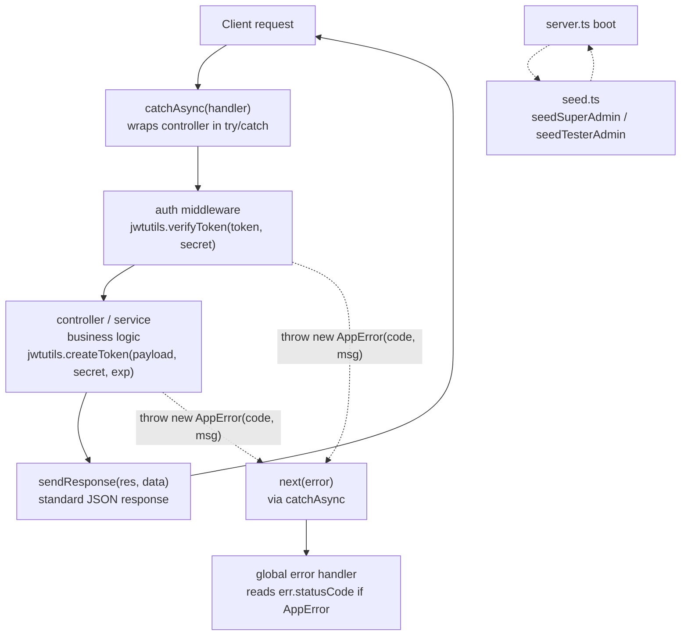

# 📦 my-project

## 🏗️ Architected Utility Flow

How `catchAsync`, `AppError`, `jwt`, `sendResponse`, and `seed` fit together in a single request lifecycle (plus the one-time seed step at boot):



**Flow explained:**
1. A request hits a route wrapped in `catchAsync`, so any thrown/rejected error is safely forwarded to Express's error handler instead of crashing the process.
2. If the route is protected, `jwt.ts`'s `verifyToken` decodes/validates the incoming token in the auth middleware.
3. The controller/service runs the actual logic — e.g. calling `jwtutils.createToken` on login/register to issue a new token.
4. On success, `sendResponse` formats and sends a consistent JSON payload back to the client.
5. On failure at any point, anything thrown as `new AppError(statusCode, message)` carries its own HTTP status code all the way to your global error handler — so a "forbidden" error can correctly respond `403`, not just a generic `500`.
6. Separately, `seed.ts` isn't part of the request lifecycle at all — it runs once, typically on server boot (`server.ts`), to make sure a Super Admin / Tester Admin account exists before the app starts serving real traffic.

---

## 📁 Folder Structure

```
my-project/
├── src/
│   ├── app/
│   │   ├── modules/
│   │   ├── middlewares/
│   │   ├── routes/
│   │   └── ...
│   ├── utils/
│   │   ├── AppError.ts
│   │   ├── catchAsync.ts
│   │   ├── jwt.ts
│   │   ├── seed.ts
│   │   ├── sendResponse.ts
│   │   └── ...
│   ├── config/
│   ├── errors/
│   └── server.ts
├── package.json
└── ...
```

---

## `utils/AppError.ts`

```ts
export class AppError extends Error {

    public statusCode : number

    constructor(statusCode : number , message : string, stack = "") {
        super(message) // throw new Error(message)

        this.statusCode = statusCode

        if(stack){
            this.stack = stack
        }else{
            Error.captureStackTrace(this, this.constructor)
        }
    }
}

//throw new AppError(404, "Not Found")
```

**Explanation:** A custom error class that carries an HTTP `statusCode` alongside the message, so your global error handler doesn't have to guess what status code to respond with. `Error.captureStackTrace` keeps the stack trace pointing at wherever `throw new AppError(...)` was actually called, not at this constructor.

**Where to call it:** Anywhere in a controller, service, or middleware that needs to fail with a specific, meaningful HTTP status — replaces plain `throw new Error("...")` calls project-wide.

```ts
if (!user) {
  throw new AppError(httpStatus.NOT_FOUND, "User not found");
}

if (user.status === "BANNED") {
  throw new AppError(httpStatus.FORBIDDEN, "User is blocked");
}
```

---

## `utils/catchAsync.ts`

```ts
import { NextFunction, Request, RequestHandler, Response } from "express";
import httpsStatus from "http-status";

export const catchAsync = (fn: RequestHandler) => {
  return async (req: Request, res: Response, next: NextFunction) => {
    try {
      await fn(req, res, next);
    } catch (error) {
      console.log(error);
      next(error);
    }
  };
};
```

**Explanation:** Wraps an async controller function so any error thrown inside it (rejected promise, thrown exception, etc.) is automatically caught and passed to Express's `next(error)`, instead of needing a `try/catch` in every controller.

**Where to call it:** Wrap every async controller function in your `controllers/*.ts` files.

```ts
router.post("/register", catchAsync(userController.registerUser));
```

---

## `utils/sendResponse.ts`

```ts
import { Response } from "express";

type TMeta = {
  page: number;
  limit: number;
  total: number;
};

type TResponseData<T> = {
  success: boolean;
  statusCode: number;
  message: string;
  data: T;
  meta?: TMeta;
};

export const sendResponse = <T>(res: Response, data: TResponseData<T>) => {
  res.status(data.statusCode).json({
    success: data.success,
    StatusCodes: data.statusCode,
    message: data.message,
    data: data.data,
    Meta: data.meta,
  });
};
```

**Explanation:** Standardizes the shape of every API response (`success`, `statusCode`, `message`, `data`, `meta`) so all endpoints return a consistent JSON structure.

**Where to call it:** At the end of every controller, after your service call succeeds.

```ts
sendResponse(res, {
  success: true,
  statusCode: 200,
  message: "User retrieved successfully",
  data: result,
});
```

---

## `utils/jwt.ts`

```ts
import jwt, { JwtPayload, SignOptions } from "jsonwebtoken";

const createToken = (
  payload: JwtPayload,
  secret: string,
  expiresIn: SignOptions,
) => {
  const token = jwt.sign(payload, secret, {
    expiresIn,
  } as SignOptions);
  return token;
};

const verifyToken = (token: string, secret: string) => {
  try {
    const verifiedToken = jwt.verify(token, secret);
    return {
      success: true,
      data: verifiedToken,
    };
  } catch (error: any) {
    console.log("Token Verification failed:", error);
    return {
      success: false,
      error: error.message,
    };
  }
};

export const jwtutils = {
  createToken,
  verifyToken,
};
```

**Explanation:** Centralizes JWT creation and verification logic — `createToken` signs a payload into a token, `verifyToken` safely checks/decodes a token without throwing.

**Where to call it:**
- `createToken` → inside your `auth.service.ts` when logging in / registering a user (to issue access & refresh tokens).
- `verifyToken` → inside your `auth` middleware to validate the token sent in request headers.

```ts
const accessToken = jwtutils.createToken(jwtPayload, config.jwt_secret, { expiresIn: "1d" });

const result = jwtutils.verifyToken(token, config.jwt_secret);
```

---

## `utils/seed.ts`

```ts
import bcrypt from "bcryptjs";
import { Role } from "../../generated/prisma/enums";
import { prisma } from "../lib/prisma";
import config from "../config";

export const seedSuperAdmon = async () => {
  try {
    const isSuperAdmonExist = await prisma.user.findFirst({
      where: {
        role: Role.SUPER_ADMIN,
      },
    });

    if (isSuperAdmonExist) {
      console.log("Super Admin Exists!");
      return
    }

    const name = config.super_admin_name;
    const email = config.super_admin_email;
    const password = config.super_admin_password;

    if(!name || !email || !password){
        throw new Error ("super Admin Name, Email, Password missiong in Env File!!")
    }

    const hashedPassword = await bcrypt.hash(
      password,
      Number(config.bcrypt_salt_rounds),
    );

    const superAdmin = await prisma.user.create({
      data: {
        name,
        email,
        password: hashedPassword,
        role: Role.SUPER_ADMIN,
        needPasswordChange: false,
        emailVerified: true,
      },
    });

    console.log("super admin Created: ", superAdmin);
  } catch (error) {
    console.log("Error seeding super Admin: ", error);

    await prisma.user.delete({
        where: {
            email: config.super_admin_email
        }
    })
  }
};

// create tester admin

export const seedTesterAdmin = async () => {
    try {
        const isTesterAdminExist = await prisma.user.findUnique({
            where: {
                email : config.tester_admin_email
            }
        });

        if (isTesterAdminExist) {
            console.log("Tester Admin Already Exists!");
            return;
        }

        const name = config.tester_admin_name
        const email = config.tester_admin_email
        const password = config.tester_admin_password

        if (!name || !email || !password) {
            throw new Error("Tester Admin Name , Email, Password Missing In Env File!!!")
        }

        const hashedPassword = await bcrypt.hash(password, Number(config.bcrypt_salt_rounds))

        const testerAdmin = await prisma.user.create({
            data: {
                name,
                email,
                password: hashedPassword,
                role: Role.ADMIN,
                needPasswordChange: false,
                emailVerified: true
            }
        })

        console.log("Tester Admin Created : ", testerAdmin);
    } catch (error) {
        console.log("Error seeding tester admin:", error);
    }
}
```

**Explanation:** Two one-time bootstrap functions that make sure a Super Admin and a Tester Admin account exist in the database, without needing to register them through the public API (which correctly refuses to let anyone self-register as an admin). Each function checks whether the account already exists first, so re-running the seed on every server restart doesn't create duplicates.

**Where to call it:** Once, at server boot — typically in `server.ts`, before (or right after) the server starts listening:

```ts
import { seedSuperAdmon, seedTesterAdmin } from "./utils/seed";

async function main() {
  await seedSuperAdmon();
  await seedTesterAdmin();

  app.listen(PORT, () => {
    console.log(`Server is running on port ${PORT}`);
  });
}

main();
```

---

## 🔧 Worth knowing about `seed.ts` as written

Not rewritten here, just flagged:

- **`seedSuperAdmon`'s `catch` block calls `prisma.user.delete(...)` unconditionally.** If the actual error was something *other* than the `create` call failing (e.g. the env-var check throwing because `name`/`email`/`password` are missing, or a database connection issue), this `delete` runs against a user that was never created — Prisma throws `RecordNotFound`, which is itself unhandled inside this `catch` block, potentially crashing the boot sequence with a confusing second error. `seedTesterAdmin`'s `catch` block (completed above, since your paste cut off mid-function) intentionally does **not** do this — just logs and returns — which is the safer pattern.
- **`Role.SUPER_ADMIN`** — confirm this value actually exists in your `Role` enum before running this; if your schema only has a subset of roles, this line won't compile.
- **`needPasswordChange` / `emailVerified`** — confirm these field names match your actual `User` model exactly (some projects use `isVerified` instead of `emailVerified`, for example) — a mismatch here would fail at compile time, not silently.
