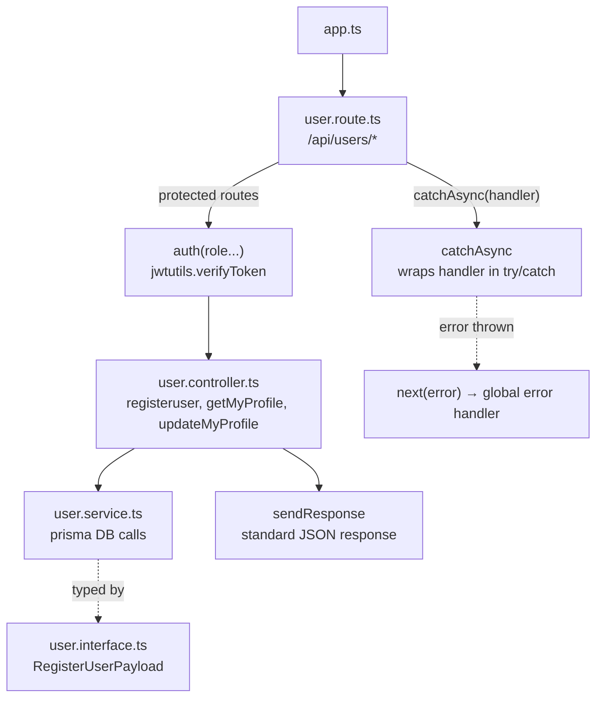
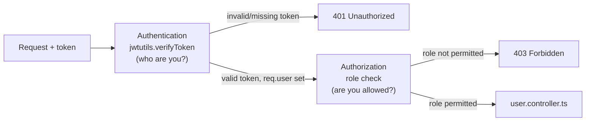

# 📦 PROJECT-PRISMA-PRESS

## 🏗️ Architected User Module Flow

How `app.ts`, `user.route.ts`, `auth` middleware, `user.controller.ts`, `user.service.ts`, and `user.interface.ts` fit together:



**Flow explained:**
1. `app.ts` mounts the user router at `/api/users`.
2. `user.route.ts` defines the endpoints (`/register`, `/me`, `/my-profile`) and wires each one through `catchAsync`, and through `auth(...)` for protected routes.
3. `auth` middleware uses `jwtutils.verifyToken` to check the token before letting the request continue.
4. `user.controller.ts` receives the validated request, calls the matching function in `user.service.ts`.
5. `user.service.ts` talks to the database via Prisma, using types from `user.interface.ts` for the payload shape.
6. The controller sends the result back with `sendResponse` for a consistent response format.
7. Any error thrown anywhere in this chain is caught by `catchAsync` and forwarded to the global error handler.

---

## 📁 Folder Structure

```
PROJECT-PRISMA-PRESS/
├── dist/
├── generated/
├── node_modules/
├── prisma/
├── src/
│   ├── config/
│   ├── lib/
│   ├── middlewares/
│   ├── modules/
│   │   ├── auth/
│   │   ├── comments/
│   │   ├── post/
│   │   ├── subscription/
│   │   ├── users/
│   │   │   ├── user.controller.ts
│   │   │   ├── user.interface.ts
│   │   │   ├── user.route.ts
│   │   │   └── user.service.ts
│   │   └── ...
│   ├── utils/
│   ├── app.ts
│   └── server.ts
├── .env
├── .env.example
├── package.json
├── prisma.config.ts
└── tsconfig.json
```

---

## `app.ts`

```ts
app.use("/api/users", userRouter);
```

**Explanation:** Mounts the whole `userRouter` (all routes defined in `user.route.ts`) under the `/api/users` base path.

---

## `user.route.ts`

```ts
import { NextFunction, Request, Response, Router } from "express";
import { prisma } from "../../lib/prisma";
import config from "../../config";
import httpsStatus from "http-status";
import bcrypt from "bcryptjs";
import { userController } from "./user.controller";
import { jwtutils } from "../../utils/jwt";
import { Role } from "../../../generated/prisma/enums";
import { catchAsync } from "../../utils/catchAsync";
import { JwtPayload } from "jsonwebtoken";
import { auth } from "../../middlewares/auth";

const router = Router();

router.post("/register", userController.registeruser);
router.get("/me", auth(Role.ADMIN, Role.AUTHOR, Role.USER), userController.getMyProfile);
router.put("/my-profile", auth(Role.ADMIN, Role.AUTHOR, Role.USER), userController.updateMyProfile);

export const userRouter = router;
```

**Explanation:** Declares the three user endpoints and attaches the `auth` middleware (role-gated) to the ones that need a logged-in user. `registeruser` is public since it's how new accounts are created.

**Where to call it:** Imported and mounted in `app.ts` as shown above.

---

## `user.controller.ts`

```ts
import { NextFunction, Request, RequestHandler, Response } from "express";
import { prisma } from "../../lib/prisma";
import bcrypt from "bcryptjs";
import config from "../../config";
import httpsStatus from "http-status";
import { userService } from "./user.service";
import { catchAsync } from "../../utils/catchAsync";
import { sendResponse } from "../../utils/sendResponse";
import jwt from "jsonwebtoken";
import { jwtutils } from "../../utils/jwt";

const registeruser = catchAsync(
  async (req: Request, res: Response, next: NextFunction) => {
    const payload = req.body;
    const user = await userService.registerUserIntoDB(payload);

    sendResponse(res, {
      success: true,
      statusCode: httpsStatus.CREATED,
      message: "User registered succesfully",
      data: { user },
    });
  },
);

const getMyProfile = catchAsync(
  async (req: Request, res: Response, next: NextFunction) => {
    const profile = await userService.getMyProfileFromDB(req.user?.id as string);
    res.send({
      success: true,
      StatusCodes: httpsStatus.OK,
      message: "User Profile fetched successfully",
      data: { profile },
    });
  },
);

const updateMyProfile = catchAsync(
  async (req: Request, res: Response, next: NextFunction) => {
    const userId = req.user?.id as string;
    const payload = req.body;

    const updatedProfile = await userService.updateMyProfileDB(userId, payload);

    sendResponse(res, {
      success: true,
      statusCode: httpsStatus.OK,
      message: "user Profile Updated succesfully",
      data: { updatedProfile },
    });
  },
);

export const userController = {
  registeruser,
  getMyProfile,
  updateMyProfile,
};
```

**Explanation:** Holds the request handlers for each route. Each function is wrapped in `catchAsync`, pulls what it needs off `req`, calls the matching `user.service.ts` function, and returns the result through `sendResponse` (or `res.send` for `getMyProfile`, which could be aligned to `sendResponse` too for consistency).

**Where to call it:** Referenced directly from `user.route.ts` (`userController.registeruser`, etc.).

---

## `user.service.ts`

```ts
import bcrypt from "bcryptjs";
import config from "../../config";
import { prisma } from "../../lib/prisma";
import { RegisterUserPayload } from "./user.interface";

const registerUserIntoDB = async (payload: RegisterUserPayload) => {
  const { name, email, password, profilePhoto } = payload;
  const isuserExist = await prisma.user.findUnique({ where: { email } });

  if (isuserExist) {
    throw new Error("User with this eamil alredy exists");
  }

  const hashPassword = await bcrypt.hash(password, Number(config.bcrypt_salt_rounds));

  const createduser = await prisma.user.create({
    data: {
      name,
      email,
      password: hashPassword,
      profile: { create: { profilePhoto } },
    },
  });

  const user = await prisma.user.findUnique({
    where: { id: createduser.id, email: createduser.email || email },
    omit: { password: true },
    include: { profile: true },
  });

  return user;
};

const getMyProfileFromDB = async (userId: string) => {
  const user = await prisma.user.findUniqueOrThrow({
    where: { id: userId },
    omit: { password: true },
    include: { profile: true },
  });
  return user;
};

const updateMyProfileDB = async (userId: string, payload: any) => {
  const { name, email, profilePhoto, bio } = payload;
  const updatedUser = await prisma.user.update({
    where: { id: userId },
    data: {
      name,
      email,
      profile: { update: { profilePhoto, bio } },
    },
    omit: { password: true },
    include: { profile: true },
  });

  return updatedUser;
};

export const userService = {
  registerUserIntoDB,
  getMyProfileFromDB,
  updateMyProfileDB,
};
```

**Explanation:** All database access lives here (via Prisma) — hashing the password, checking for existing users, creating/fetching/updating records. Keeps the controller free of DB logic.

**Where to call it:** Called only from `user.controller.ts` (`userService.registerUserIntoDB`, `userService.getMyProfileFromDB`, `userService.updateMyProfileDB`).

---

## `user.interface.ts`

```ts
export interface RegisterUserPayload {
  name: string;
  email: string;
  password: string;
  profilePhoto?: string;
}
```

**Explanation:** Defines the shape of the data expected when registering a user, giving type safety to `req.body` in the service layer.

**Where to call it:** Imported into `user.service.ts` to type the `payload` argument of `registerUserIntoDB`.

---

## 🔐 Why we need auth (and why it's middleware)

**Why authentication?** Some routes (`/me`, `/my-profile`) need to know *who* is making the request. Without it, anyone could read or edit any user's profile.

**Why authorization?** Even a logged-in user shouldn't be able to do everything — authorization checks *what that specific user/role is allowed to do* (e.g. only `ADMIN`/`AUTHOR`/`USER` roles listed in `auth(...)` can hit that route).

**Why as middleware, not inside every controller?**
- Runs **before** the controller — bad requests never reach your business logic.
- **Reusable** — one `auth()` function, attached to any route that needs it, instead of copy-pasting token checks into every controller.
- **Centralized** — change the rules (e.g. add a new role) in one file (`middlewares/auth.ts`) instead of hunting through every route.
- Keeps controllers focused only on business logic, not security checks.



In `user.route.ts`, this is exactly what `auth(Role.ADMIN, Role.AUTHOR, Role.USER)` does: it authenticates the token first, then authorizes the request only if the user's role is in the allowed list — before `userController.getMyProfile` or `updateMyProfile` ever runs.
