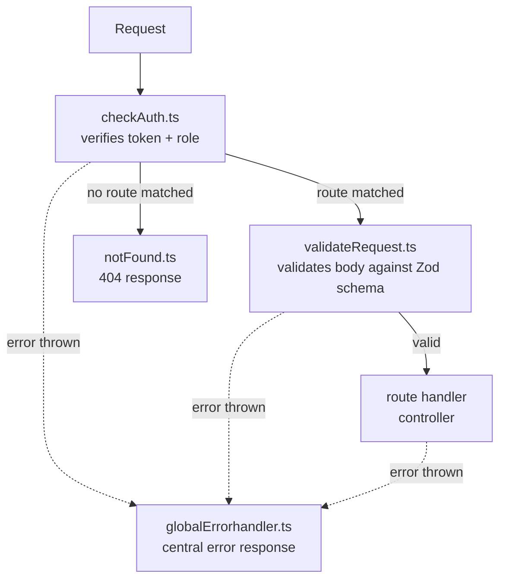

# 📦 PROJECT-PRISMA-PRESS

## 🏗️ Architected Middleware Flow

How `checkAuth.ts`, `validateRequest.ts`, `globalErrorhandler.ts`, and `notFound.ts` fit into the request pipeline:



**Flow explained:**
1. Every protected request first passes through `checkAuth.ts`, which checks the token and role before letting it continue.
2. If the route also expects a request body (create/update endpoints), it next passes through `validateRequest.ts`, which parses `req.body` against a Zod schema before the controller ever sees it.
3. Once both checks pass, the request reaches the controller/route handler.
4. If no route matches at all, Express falls through to `notFound.ts`, which sends a clean 404.
5. If anything throws an error anywhere in the chain (auth, validation, controller, service), it's caught (via `catchAsync`, or Express 5's built-in sync-throw forwarding) and sent to `globalErrorhandler.ts`, which sends one consistent error response shape.

**Why `validateRequest` runs after `checkAuth`, not before:** there's no point spending effort validating a request body from someone who isn't even authenticated to hit that endpoint in the first place — rejecting on auth failure first is cheaper and stops unauthenticated traffic sooner.

---

## 📁 Folder Structure

```
PROJECT-PRISMA-PRESS/
├── dist/
├── generated/
├── node_modules/
├── prisma/
├── src/
│   ├── config/
│   ├── lib/
│   ├── middlewares/
│   │   ├── checkAuth.ts
│   │   ├── globalErrorhandler.ts
│   │   ├── notFound.ts
│   │   └── validateRequest.ts
│   ├── modules/
│   │   └── ...
│   ├── utils/
│   ├── app.ts
│   └── server.ts
├── .env
├── .env.example
├── package.json
├── prisma.config.ts
└── tsconfig.json
```

---

## `checkAuth.ts`

```ts
import { NextFunction, Request, Response } from "express";
import { Role } from "../../generated/prisma/enums";
import { catchAsync } from "../utils/catchAsync";
import { jwtutils } from "../utils/jwt";
import { JwtPayload } from "jsonwebtoken";
import { prisma } from "../lib/prisma";
import config from "../config";

declare global {
  namespace Express {
    interface Request {
      user?: {
        email: string;
        name: string;
        id: string;
        role: Role;
      };
    }
  }
}

export const auth = (...requiredRoles: Role[]) => {
  return catchAsync(async (req: Request, res: Response, next: NextFunction) => {
    const token = req.cookies.accessToken
      ? req.cookies.accessToken
      : req.headers.authorization?.startsWith("Bearer")
        ? req.headers.authorization?.split(" ")[1]
        : req.headers.authorization;

    if (!token) {
      throw new Error("you are not logged in. Please log in to access");
    }

    const verifiedToken = jwtutils.verifyToken(token, config.jwt_access_secret);
    if (!verifiedToken.success) {
      throw new Error(verifiedToken.error);
    }

    const { email, name, id, role } = verifiedToken.data as JwtPayload;

    if (requiredRoles.length && !requiredRoles.includes(role)) {
      throw new Error("Forbidden. You don't have permission to access this resource");
    }

    const user = await prisma.user.findUnique({
      where: { id, email, name, role },
    });

    if (!user) {
      throw new Error("user not found. Plese log in again.");
    }

    if (user.activeStatus === "BLOCKED") {
      throw new Error("your Account has been blocked.plase contct support");
    }

    req.user = { email, name, id, role };
    next();
  });
};
```

**Explanation:** A middleware factory — `auth(...requiredRoles)` returns a middleware that reads the token (cookie or `Bearer` header), verifies it, checks the user's role against `requiredRoles`, confirms the user still exists and isn't blocked, then attaches `req.user` for downstream handlers to use.

**Where to call it:** In route files, on any endpoint that needs protection, e.g. `router.get("/me", auth(Role.ADMIN, Role.AUTHOR, Role.USER), userController.getMyProfile)`.

---

## `validateRequest.ts`

```ts
import type { NextFunction, Request, Response } from "express";
import httpStatus from "http-status";
import type z from "zod";
import { AppError } from "../utils/AppError";
import { catchAsync } from "../utils/catchAsync";

export const validateRequest = (zodSchema: z.ZodObject) => {
    return catchAsync((req: Request, res: Response, next: NextFunction) => {
        // const payload = req.body ? req.body : {}
        const payload = req.body ?? {};

        const result = zodSchema.safeParse(payload);

        if (!result.success) {
            console.log(result.error);
            console.log(result.error.issues);

            throw new AppError(httpStatus.BAD_REQUEST, result.error.issues[0].message);
        }

        req.body = result.data;

        next();
    });
};
```

**Explanation:** A middleware factory — `validateRequest(zodSchema)` returns a middleware that parses `req.body` against whatever Zod schema you pass in. On success, `req.body` is replaced with the *parsed* result (not the raw input), so anything downstream (controller, service) can trust it's already the right shape and types. On failure, it throws an `AppError` with a `400` status, routed straight into `globalErrorhandler.ts` — same centralized error response shape as every other error in the app.

**Where to call it:** In route files, right after `auth(...)` (if the route is protected) and right before the controller, on any endpoint that accepts a body:

```ts
router.post(
  "/services",
  auth(Role.TECHNICIAN),
  validateRequest(ServiceValidation.CreateServiceZodSchema),
  ServiceController.createService,
);
```

---

## `globalErrorhandler.ts`

```ts
import type { NextFunction, Request, Response } from "express";
import httpStatus from "http-status";
import { Prisma } from "../../generated/prisma/client";
import config from "../config";
import { AppError } from "../utils/AppError";

export const globalErrorHandler = async (
	err: any,
	_req: Request,
	res: Response,
	_next: NextFunction,
) => {
	if (config.node_env === "development") {
		console.log("Error from Global Error Handler", err);
	}

	let statusCode: number = httpStatus.INTERNAL_SERVER_ERROR;
	let errorMessage = err.message || "Internal Server Error";
	const errorName = err.name || "Internal Server Error";
	// let errorDetails = err.stack

	if (err instanceof Prisma.PrismaClientValidationError) {
		statusCode = httpStatus.BAD_REQUEST;
		errorMessage = "You have provided incorrect field type or missing fields";
	} else if (err instanceof Prisma.PrismaClientKnownRequestError) {
		if (err.code === "P2002") {
			(statusCode = httpStatus.BAD_REQUEST),
				(errorMessage = "Duplicate Key Error");
		} else if (err.code === "P2003") {
			(statusCode = httpStatus.BAD_REQUEST),
				(errorMessage = "Foreign key constraint failed");
		} else if (err.code === "P2025") {
			(statusCode = httpStatus.BAD_REQUEST),
				(errorMessage =
					"An operation failed because it depends on one or more records that were required but not found.");
		}
	} else if (err instanceof Prisma.PrismaClientInitializationError) {
		if (err.errorCode === "P1000") {
			statusCode = httpStatus.UNAUTHORIZED;
			errorMessage =
				"Authentication failed against database server. Please Check Your Credentials";
		} else if (err.errorCode === "P1001") {
			statusCode = httpStatus.BAD_REQUEST;
			errorMessage = "Can't reach database server";
		}
	} else if (err instanceof Prisma.PrismaClientUnknownRequestError) {
		statusCode = httpStatus.INTERNAL_SERVER_ERROR;
		errorMessage = "Error occurred during query execution";
	} else if( err instanceof AppError){
		errorMessage = err.message
		statusCode = err.statusCode

	} else if (err instanceof Error) {
		errorMessage = err.message;
	}

	res.status(statusCode).json({
		success: false,
		statusCode: statusCode || httpStatus.INTERNAL_SERVER_ERROR,
		name:
			config.node_env === "development" ? errorName : "Internal Server Error",
		message:
			config.node_env === "development"
				? errorMessage
				: "Internal Server Error",
		error: config.node_env === "development" ? err : undefined,
		stack: config.node_env === "development" ? err.stack : undefined,
	});
};

```

**Explanation:** The last stop for any error `next(error)`'d from `catchAsync`. It inspects the error type — especially Prisma-specific errors (duplicate key, foreign key, DB connection, etc.) and now `AppError` (thrown by both `checkAuth.ts` and `validateRequest.ts`) — and maps each to a meaningful status code and message, so the client always gets a predictable JSON error shape instead of a raw stack trace.

**Where to call it:** Registered once in `app.ts`, **after** all routes, as the final Express error-handling middleware: `app.use(globalErrorHandler)`.

---

## `notFound.ts`

```ts
import { Request, Response } from "express";

export const notFound = (req: Request, res: Response) => {
  res.status(404).json({
    message: "Rout not fount",
    path: req.originalUrl,
    date: Date(),
  });
};
```

**Explanation:** Catches any request that doesn't match a defined route and returns a clean 404 response with the requested path and timestamp, instead of Express's default HTML error page.

**Where to call it:** Registered in `app.ts`, after all your routers but before `globalErrorHandler`: `app.use(notFound)`.

---

## ✅ Full middleware order in `app.ts`

Putting all four files together, in the order they actually need to be registered:

```ts
// 1. All your route mounts first
app.use("/api/users", userRoutes);
app.use("/api/services", serviceRoutes);
// ...every other router

// 2. Catches anything that didn't match a route above
app.use(notFound);

// 3. Catches every thrown/forwarded error from anywhere above — always last
app.use(globalErrorHandler);
```

`checkAuth.ts` and `validateRequest.ts` aren't registered globally in `app.ts` at all — they're applied **per-route**, inside each router file, only on the endpoints that actually need them.

---

## 🔧 Worth knowing about `validateRequest.ts` as written

Not rewritten here, just flagged, same as the code above:

- **`z.ZodObject` needs a type parameter to compile correctly** in most Zod versions and to preserve type inference on `result.data` — worth confirming this compiles cleanly for you (`npx tsc --noEmit`), and if not, switching to a generic: `<T extends z.ZodTypeAny>(zodSchema: T)`.
- **Only the first validation issue is surfaced** (`result.error.issues[0].message`) — if a request fails on two different fields at once (e.g. missing `role` *and* a weak password), the client only sees one error, fixes it, resubmits, and is then surprised by a second one. Returning every issue joined together is friendlier UX if you want to revisit this later.
