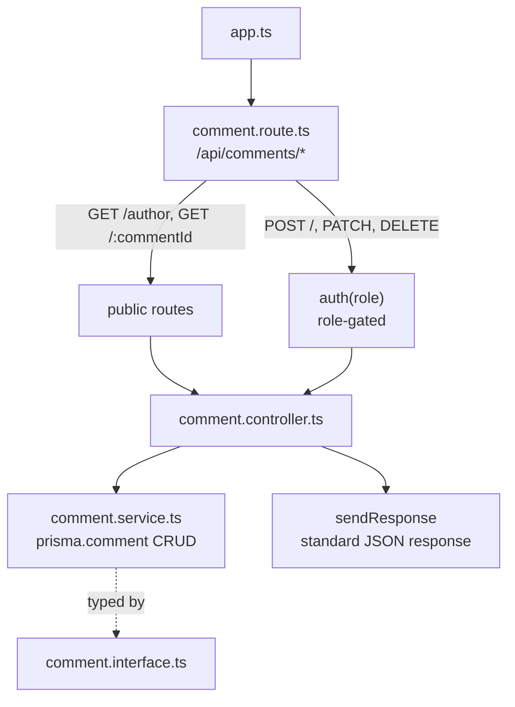

# 📦 PROJECT-PRISMA-PRESS

## 🏗️ Architected Comments Module Flow

How `app.ts`, `comment.route.ts`, `auth` middleware, `comment.controller.ts`, `comment.service.ts`, and `comment.interface.ts` fit together:



**Flow explained:**
1. `app.ts` mounts the comment router at `/api/comments`.
2. `comment.route.ts` splits routes into public reads (`GET /author`, `GET /:commentId`) and protected writes (`POST /`, `PATCH /:commentId`, `PATCH /:commentId/moderate`, `DELETE /:commentId`) guarded by `auth(...)`.
3. `comment.controller.ts` pulls `req.body`, `req.params`, and `req.user` as needed, and calls the matching function in `comment.service.ts`.
4. `comment.service.ts` does the actual Prisma queries, typed by the payload shapes in `comment.interface.ts`.
5. The controller sends the result back through `sendResponse` for a consistent response format.

---

## 📁 Folder Structure

```
PROJECT-PRISMA-PRESS/
├── dist/
├── generated/
├── node_modules/
├── prisma/
├── src/
│   ├── config/
│   ├── lib/
│   ├── middlewares/
│   ├── modules/
│   │   ├── auth/
│   │   ├── comments/
│   │   │   ├── comment.controller.ts
│   │   │   ├── comment.interface.ts
│   │   │   ├── comment.route.ts
│   │   │   └── comment.service.ts
│   │   ├── post/
│   │   ├── subscription/
│   │   ├── users/
│   │   └── ...
│   ├── utils/
│   ├── app.ts
│   └── server.ts
├── .env
├── .env.example
├── package.json
├── prisma.config.ts
└── tsconfig.json
```

---

## `app.ts`

```ts
app.use("/api/comments", commentRoutes);
```

**Explanation:** Mounts the comment router under the `/api/comments` base path. *(Note: your snippet used `userRouter` here — should be `commentRoutes`, the export from `comment.route.ts`.)*

---

## `comment.route.ts`

```ts
import { Router } from "express";
import { CommentController } from "./comment.controller";
import { auth } from "../../middlewares/auth";
import { Role } from "../../../generated/prisma/enums";

const router = Router();

router.post("/", auth(Role.ADMIN, Role.AUTHOR, Role.USER), CommentController.createCommand);
router.get("/author", CommentController.GetCommandByAuthId);
router.get("/:commentId", CommentController.GetCommanByID);
router.patch("/:commentId", auth(Role.ADMIN, Role.AUTHOR, Role.USER), CommentController.updateCommand);
router.patch("/:commentId/moderate", auth(Role.ADMIN), CommentController.UpdateByModerate);
router.delete("/:commentId", auth(Role.ADMIN, Role.AUTHOR, Role.USER), CommentController.deletCommand);

export const commentRoutes = router;
```

**Explanation:** Defines all comment endpoints. Reads are public; creating, updating, and deleting require any logged-in role; moderating a comment is restricted to `ADMIN` only.

**Where to call it:** Imported and mounted in `app.ts` as `commentRoutes`.

---

## `comment.controller.ts`

```ts
import { NextFunction, Request, Response } from "express";
import { catchAsync } from "../../utils/catchAsync";
import { sendResponse } from "../../utils/sendResponse";
import { CommentServise } from "./comment.service";
import httpsStatus from "http-status";

const createCommand = catchAsync(async (req: Request, res: Response, next: NextFunction) => {
  const payload = req.body;
  const userId = req.user?.id;
  const result = await CommentServise.createCommand(payload, userId as string);

  sendResponse(res, {
    success: true,
    statusCode: httpsStatus.OK,
    message: "post Creted successfully",
    data: { result },
  });
});

const updateCommand = catchAsync(async (req: Request, res: Response, next: NextFunction) => {
  const payload = req.body;
  const commentId = req.params.commentId;
  if (!commentId) {
    throw new Error("commend Id not fund");
  }
  const result = await CommentServise.updateCommand(payload, commentId as string);
  sendResponse(res, {
    success: true,
    statusCode: httpsStatus.OK,
    message: "post Creted successfully",
    data: { result },
  });
});

const UpdateByModerate = catchAsync(async (req: Request, res: Response, next: NextFunction) => {
  const isAdmin = req.user?.role === "ADMIN";
  const payload = req.body;
  const commentId = req.params.commentId;
  if (!commentId) {
    throw new Error("commend Id not fund");
  }
  const result = await CommentServise.UpdateByModerate(payload, commentId as string, isAdmin);
  sendResponse(res, {
    success: true,
    statusCode: httpsStatus.OK,
    message: "post Creted successfully",
    data: { result },
  });
});

const deletCommand = catchAsync(async (req: Request, res: Response, next: NextFunction) => {
  const commandId = req.params.commentId;
  const result = await CommentServise.deletCommand(commandId as string);

  sendResponse(res, {
    success: true,
    statusCode: httpsStatus.OK,
    message: "post Creted successfully",
    data: { result },
  });
});

const GetCommanByID = catchAsync(async (req: Request, res: Response, next: NextFunction) => {
  const commandId = req.params.commendId;
  const result = await CommentServise.GetCommanByID(commandId as string);
  sendResponse(res, {
    success: true,
    statusCode: httpsStatus.OK,
    message: " command show successfully",
    data: { result },
  });
});

const GetCommandByAuthId = catchAsync(async (req: Request, res: Response, next: NextFunction) => {
  const authorId = req.user?.id;
  const result = await CommentServise.GetCommandByAuthId(authorId as string);
  sendResponse(res, {
    success: true,
    statusCode: httpsStatus.OK,
    message: "Author all comand show successfully",
    data: { result },
  });
});

export const CommentController = {
  UpdateByModerate,
  createCommand,
  updateCommand,
  deletCommand,
  GetCommanByID,
  GetCommandByAuthId,
};
```

**Explanation:** One handler per endpoint, each wrapped in `catchAsync`. They read `req.body` / `req.params` / `req.user`, delegate to `comment.service.ts`, and respond via `sendResponse`. `UpdateByModerate` additionally computes `isAdmin` from `req.user?.role` and passes it down as a permission flag.

**Where to call it:** Referenced directly from `comment.route.ts` (`CommentController.createCommand`, etc.).

⚠️ Small bug to note: `GetCommanByID` reads `req.params.commendId`, but the route defines the param as `:commentId` — this will always be `undefined`. Should be `req.params.commentId`.

---

## `comment.interface.ts`

```ts
import { commentStatus } from "../../../generated/prisma/enums";

export interface ICommentPayload {
  content: string;
  postId: string;
}

export interface IpaylodUpadetComment {
  content?: string;
  postId?: string;
}
```

**Explanation:** Types for creating a comment (`ICommentPayload`, both fields required) and updating one (`IpaylodUpadetComment`, both fields optional).

**Where to call it:** Imported into `comment.service.ts` to type the `payload` parameters.

---

## `comment.service.ts`

```ts
import { prisma } from "../../lib/prisma";
import { ICommentPayload, IpaylodUpadetComment } from "./comment.interface";

const createCommand = async (payload: ICommentPayload, userId: string) => {
  await prisma.post.findFirstOrThrow({ where: { id: payload.postId } });
  const result = await prisma.comment.create({
    data: { ...payload, authorId: userId },
    include: { author: { omit: { password: true } } },
  });
  return result;
};

const GetCommanByID = async (commentId: string) => {
  const result = await prisma.comment.findFirstOrThrow({
    where: { id: commentId },
    include: { author: { omit: { password: true } }, post: true },
  });
  return result;
};

const GetCommandByAuthId = async (authorId: string) => {
  const result = await prisma.comment.findMany({
    where: { authorId },
    orderBy: { createdAt: "desc" },
    include: { post: { select: { id: true, title: true, views: true } } },
  });
  return result;
};

const updateCommand = async (payload: IpaylodUpadetComment, commentId: string) => {
  const result = await prisma.comment.update({
    where: { id: commentId },
    data: { ...payload },
    include: { author: { omit: { password: true } }, post: true },
  });
  return result;
};

const UpdateByModerate = async (payload: IpaylodUpadetComment, commentId: string, role: boolean) => {
  if (!role) {
    throw new Error("You do not have acces to update the command");
  }
  const result = await prisma.comment.update({
    where: { id: commentId },
    data: { ...payload },
    include: { author: { omit: { password: true } }, post: true },
  });
  return result;
};

const deletCommand = async (commandId: string) => {
  const result = await prisma.comment.delete({
    where: { id: commandId },
    include: { author: { omit: { password: true } }, post: true },
  });
  return result;
};

export const CommentServise = {
  UpdateByModerate,
  createCommand,
  updateCommand,
  deletCommand,
  GetCommanByID,
  GetCommandByAuthId,
};
```

**Explanation:** All Prisma queries for comments live here — verifying the parent post exists before creating a comment, fetching by id/author, updating, moderating (gated by the `role` boolean passed in from the controller), and deleting.

**Where to call it:** Called only from `comment.controller.ts` (`CommentServise.createCommand`, `CommentServise.updateCommand`, etc.).
