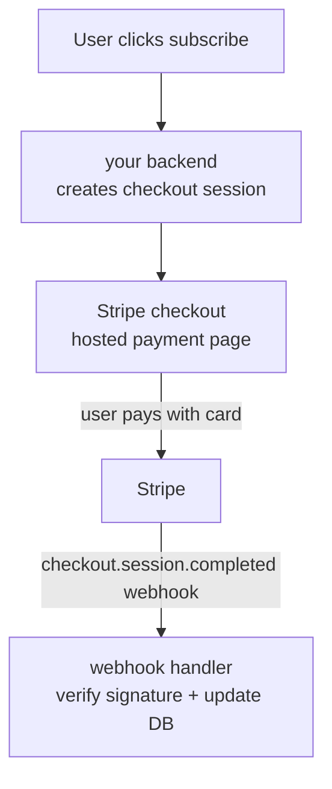
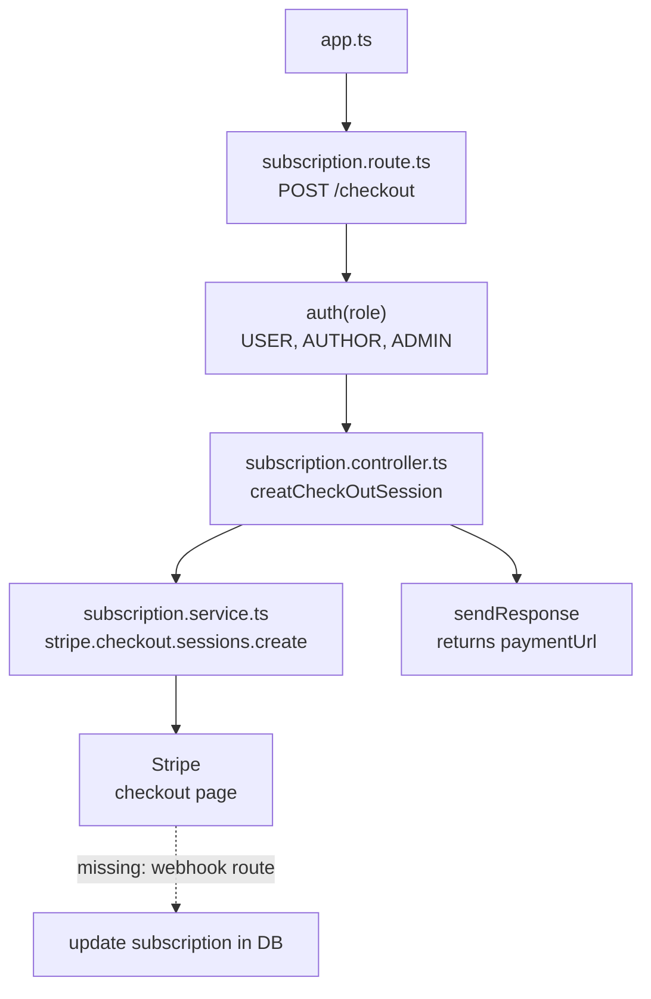

# 📦 PROJECT-PRISMA-PRESS

## 💳 Stripe basics — why and how

**Why developers use Stripe:** it handles payment infrastructure so you don't have to — securely storing card data, staying PCI-compliant, talking to banks, handling currencies and taxes. You just call its API.

**What it provides:**
- **Checkout** — a hosted, pre-built payment page (`stripe.checkout.sessions.create`)
- **Customers** — an object representing a paying user, so payment methods/invoices/subscriptions attach to one identity
- **Billing/Subscriptions** — recurring charges, proration, trials, upgrades handled by Stripe instead of your own cron jobs
- **Webhooks** — Stripe notifying *your* server when something happens (payment succeeded, renewal, failed card), since your server has no other way to know in real time

**How it helps with payments:** your server never touches raw card numbers — it redirects the user to Stripe's hosted checkout, Stripe handles the actual charge, and your server only ever sees a session id / webhook event, not card details.

**Why webhooks matter:** a successful redirect to your `success_url` isn't proof of payment (it can be spoofed by just visiting the URL). The webhook, verified with a signing secret, is the trustworthy signal that money actually moved.



**Small example — webhook handler:**

```ts
app.post("/webhook", express.raw({ type: "application/json" }), (req, res) => {
  const event = stripe.webhooks.constructEvent(
    req.body,
    req.headers["stripe-signature"] as string,
    config.stripe_webhook_secret,
  );

  if (event.type === "checkout.session.completed") {
    const session = event.data.object;
    // session.metadata.userId → mark that user as subscribed in your DB
  }

  res.json({ received: true });
});
```

> ⚠️ Your current module creates the checkout session and redirects the user, but there's no webhook route yet catching `checkout.session.completed` to actually flip the user's subscription to active in the database. Worth adding a `subscription.webhook.ts` (or a route in `subscription.route.ts`) for this.

---

## 🏗️ Architected Subscription Module Flow



**Flow explained:**
1. `app.ts` mounts the subscription router at `/api/subscription`.
2. `subscription.route.ts` protects the `/checkout` endpoint with `auth(...)` — any logged-in role can start checkout.
3. `subscription.controller.ts` grabs `req.user?.id` and calls the service.
4. `subscription.service.ts` finds (or creates) the user's Stripe customer, opens a Prisma transaction, and creates a Stripe checkout session, returning its `url`.
5. The controller sends that URL back to the client via `sendResponse`, so the frontend can redirect the user to Stripe.
6. *(Missing piece: a webhook endpoint to catch `checkout.session.completed` and persist the subscription as active.)*

---

## 📁 Folder Structure

```
PROJECT-PRISMA-PRESS/
├── dist/
├── generated/
├── node_modules/
├── prisma/
├── src/
│   ├── config/
│   ├── lib/
│   │   ├── prisma.ts
│   │   └── stripe.ts
│   ├── middlewares/
│   ├── modules/
│   │   ├── auth/
│   │   ├── comments/
│   │   ├── post/
│   │   ├── subscription/
│   │   │   ├── subscription.controller.ts
│   │   │   ├── subscription.route.ts
│   │   │   └── subscription.service.ts
│   │   ├── users/
│   │   └── ...
│   ├── utils/
│   ├── app.ts
│   └── server.ts
├── .env
├── .env.example
├── package.json
├── prisma.config.ts
└── tsconfig.json
```

---


A step-by-step guide to implementing a Stripe subscription system (checkout, webhooks, premium access) into any Node.js + Prisma + Express backend.

---

## Table of Contents

1. [How the System Works — Big Picture](#1-how-the-system-works--big-picture)
2. [Planning the Subscription Feature](#2-planning-the-subscription-feature)
3. [Setting Up Stripe — Dashboard & Product](#3-setting-up-stripe--dashboard--product)
4. [Project Folder Structure](#4-project-folder-structure)
5. [Prisma Model — Subscription Schema](#5-prisma-model--subscription-schema)
6. [Setting Up Stripe in the Project](#6-setting-up-stripe-in-the-project)
7. [Environment Variables](#7-environment-variables)
8. [Creating the Checkout Session — Route, Controller, Service](#8-creating-the-checkout-session--route-controller-service)
9. [How Stripe Webhooks Work](#9-how-stripe-webhooks-work)
10. [Installing & Configuring the Stripe CLI Locally](#10-installing--configuring-the-stripe-cli-locally)
11. [Setting Up the Webhook Endpoint](#11-setting-up-the-webhook-endpoint)
12. [Why the Webhook Must Be Registered Before `express.json()`](#12-why-the-webhook-must-be-registered-before-expressjson)
13. [Testing the Full Flow Locally](#13-testing-the-full-flow-locally)
14. [Key Gotchas & Common Mistakes](#14-key-gotchas--common-mistakes)
15. [Summary Cheat Sheet](#15-summary-cheat-sheet)

---

## 1. How the System Works — Big Picture

Before writing any code, understand the complete flow. This is the most important mental model.

```
User (Frontend)
      │
      │  Clicks "Subscribe / Pay"
      ▼
Your Backend API
  POST /subscription/checkout
      │
      │  Creates a Stripe Checkout Session
      ▼
Stripe returns a hosted payment URL
      │
      ▼
Frontend redirects user → Stripe's hosted checkout page
  (Card info, payment details entered here — Stripe handles everything)
      │
      │  Payment succeeds / fails / is cancelled
      ▼
Stripe redirects user back to your:
  ✅ success_url  (e.g. /premium?success=true)
  ❌ cancel_url   (e.g. /payment?success=false)
      │
      │  (In parallel, Stripe also sends a POST request to your server)
      ▼
Your Backend Webhook Endpoint
  POST /subscription/webhook
      │
      │  Verifies the event is genuinely from Stripe
      │  Reads the event type (e.g. checkout.session.completed)
      ▼
Business Logic — Save subscription to DB, mark user as premium, etc.
      │
      ▼
User now has isPremium: true → can access premium content
```

> 💡 **Key insight:** Stripe *redirecting* the user back to your success URL does **not** mean the payment succeeded — anyone can visit that URL. The only trustworthy confirmation is the **webhook event** that Stripe sends to your server. Always activate premium access from the webhook, not from the redirect.

---

## 2. Planning the Subscription Feature

Before coding, decide:

| Question | Decision |
|---|---|
| What does subscribing unlock? | Premium posts/blogs/news with `isPremium: true` |
| How long is one subscription period? | Monthly (managed by Stripe) |
| What does the DB need to store? | `stripeCustomerId`, `stripeSubscriptionId`, `status`, `currentPeriodEnd` |
| What events must the webhook handle? | `checkout.session.completed`, `customer.subscription.deleted`, `invoice.paid` |

---

## 3. Setting Up Stripe — Dashboard & Product

### Step 1 — Create a Stripe account
Go to [stripe.com](https://stripe.com) and sign up.

### Step 2 — Create a Product & Price

1. In your Stripe Dashboard, go to **Products → Add Product**.
2. Set the name (e.g. "Premium Membership"), price (e.g. $9.99/month), and billing period (Monthly).
3. After saving, click into the price — copy the **Price ID** (starts with `price_...`).

### Step 3 — Store the Price ID in your `.env` file

```env
STRIPE_PRODUCT_PRICE_ID=price_xxxxxxxxxxxxxxxx
```

### Step 4 — Get your Stripe API Secret Key

In your Stripe Dashboard → **Developers → API Keys** → copy the **Secret key** (starts with `sk_test_...`).

```env
STRIPE_SECRET_KEY=sk_test_xxxxxxxxxxxxxxxx
```

> ⚠️ Never commit `.env` to Git. Always add it to `.gitignore`.

---

## 4. Project Folder Structure

```
src/
│
├── app.ts                          ← Register middleware & routes (webhook goes HERE)
├── server.ts
│
├── lib/
│   ├── prisma.ts                   ← PrismaClient singleton
│   └── stripe.ts                   ← Stripe client singleton
│
├── config/
│   └── index.ts                    ← All env variable exports
│
├── modules/
│   └── subscription/
│       ├── subscription.controller.ts
│       ├── subscription.route.ts
│       └── subscription.service.ts
│
└── middlewares/
```

---

## 5. Prisma Model — Subscription Schema

### 5.1 Add the model to your Prisma schema

```prisma
enum SubscriptionStatus {
    ACTIVE
    INACTIVE
    CANCELLED
}

model Subscription {
    id                String             @id @default(uuid())
    userId            String             @unique
    user              User               @relation(fields: [userId], references: [id], onDelete: Cascade)
    currentPeriodEnd  DateTime?
    status            SubscriptionStatus @default(ACTIVE)

    // Stripe IDs
    stripeCustomerId      String  @unique
    stripeSubscriptionId  String? @unique

    createdAt DateTime @default(now())
    updatedAt DateTime @updatedAt

    @@map("subscriptions")
}
```

> Note: Add `subscription Subscription?` to your `User` model as well so the `include: { subscription: true }` query works.

### 5.2 Run migrations

```bash
npx prisma migrate dev --name add_subscription_model
npx prisma generate
```

---

## 6. Setting Up Stripe in the Project

### 6.1 Install Stripe

```bash
npm install stripe
```

### 6.2 Create a Stripe client singleton

`src/lib/stripe.ts`

```ts
import Stripe from "stripe";
import { config } from "../config";

export const stripe = new Stripe(config.stripe_secret_key, {
  apiVersion: "2024-06-20",
});
```

### 6.3 Export config values

`src/config/index.ts`

```ts
export const config = {
  stripe_secret_key: process.env.STRIPE_SECRET_KEY as string,
  stripe_product_price_id: process.env.STRIPE_PRODUCT_PRICE_ID as string,
  stripe_webhook_secret: process.env.STRIPE_WEBHOOK_SECRET as string,
  app_url: process.env.APP_URL as string,
};
```

---

## 7. Environment Variables

Your complete `.env` for the subscription feature:

```env
# Stripe
STRIPE_SECRET_KEY=sk_test_xxxxxxxxxxxxxxxx
STRIPE_PRODUCT_PRICE_ID=price_xxxxxxxxxxxxxxxx
STRIPE_WEBHOOK_SECRET=whsec_xxxxxxxxxxxxxxxx   # You get this after running stripe listen (Step 10)

# Frontend URL (for redirect after payment)
APP_URL=http://localhost:3000
```

---

## 8. Creating the Checkout Session — Route, Controller, Service

This is what gets triggered when a user clicks "Subscribe".

### 8.1 Route

`src/modules/subscription/subscription.route.ts`

```ts
import express from "express";
import { subscriptionController } from "./subscription.controller";
import { auth } from "../../middlewares/auth";
import { Role } from "@prisma/client";

const router = express.Router();

router.post(
  "/checkout",
  auth(Role.USER, Role.AUTHOR, Role.ADMIN),
  subscriptionController.createCheckoutSession
);

export const subscriptionRoutes = router;
```

### 8.2 Register in `app.ts`

```ts
// In app.ts
app.use("/api/subscription", subscriptionRoutes);
```

### 8.3 Controller

`src/modules/subscription/subscription.controller.ts`

```ts
import { Request, Response, NextFunction } from "express";
import httpStatus from "http-status";
import { catchAsync } from "../../utils/catchAsync";
import { sendResponse } from "../../utils/sendResponse";
import { subscriptionService } from "./subscription.service";

const createCheckoutSession = catchAsync(
  async (req: Request, res: Response, next: NextFunction) => {
    const userId = req.user?.id;

    const result = await subscriptionService.createCheckoutSession(
      userId as string
    );

    sendResponse(res, {
      success: true,
      statusCode: httpStatus.OK,
      message: "Checkout session created successfully",
      data: result,
    });
  }
);

export const subscriptionController = {
  createCheckoutSession,
};
```

### 8.4 Service — The Core Logic

`src/modules/subscription/subscription.service.ts`

The full flow inside the service:

```
createCheckoutSession(userId)
        │
        ▼
Find user from DB (include subscription)
        │
        ▼
Does user already have a Stripe Customer ID?
        │
 ┌──────┴───────────┐
 │                  │
No                 Yes
 │                  │
Create new          Use existing
Stripe Customer     stripeCustomerId
 │                  │
 └──────────┬───────┘
            ▼
  Save stripeCustomerId to DB (if new)
            │
            ▼
  Create Stripe Checkout Session
            │
            ▼
  Return session.url to frontend
```

```ts
import { prisma } from "../../lib/prisma";
import { stripe } from "../../lib/stripe";
import { config } from "../../config";

const createCheckoutSession = async (userId: string) => {
  const result = await prisma.$transaction(async (tx) => {
    // 1. Find the user and their existing subscription (if any)
    const user = await tx.user.findUniqueOrThrow({
      where: { id: userId },
      include: { subscription: true },
    });

    // 2. Reuse existing Stripe Customer ID or create a new one
    let stripeCustomerId = user.subscription?.stripeCustomerId;

    if (!stripeCustomerId) {
      // New subscriber — create a customer on Stripe
      const customer = await stripe.customers.create({
        email: user.email,
        name: user.name,
        metadata: { userId: user.id },
      });

      stripeCustomerId = customer.id;

      // ✅ IMPORTANT: Save the new Stripe Customer ID to DB immediately
      // Without this, the same user will create a duplicate Stripe customer
      // every time they try to subscribe.
      await tx.subscription.upsert({
        where: { userId: user.id },
        update: { stripeCustomerId },
        create: {
          userId: user.id,
          stripeCustomerId,
          currentPeriodEnd: new Date(), // placeholder until webhook confirms
        },
      });
    }

    // 3. Create the Stripe Checkout Session
    const session = await stripe.checkout.sessions.create({
      customer: stripeCustomerId,
      line_items: [
        {
          price: config.stripe_product_price_id,
          quantity: 1,
        },
      ],
      mode: "subscription",
      payment_method_types: ["card"],
      success_url: `${config.app_url}/premium?success=true`,
      cancel_url: `${config.app_url}/payment?success=false`,
      metadata: { userId: user.id },
    });

    return session.url;
  });

  return { paymentUrl: result };
};

export const subscriptionService = {
  createCheckoutSession,
};
```

**What the frontend does with the response:**

```
Backend response:
{
  "paymentUrl": "https://checkout.stripe.com/c/pay/xxxx"
}

Frontend:
window.location.href = response.data.paymentUrl;
// User is now on Stripe's secure checkout page
```

---

## 9. How Stripe Webhooks Work

### Why do we need a webhook?

When a user pays on Stripe's checkout page, Stripe redirects them to your `success_url`. But that redirect is **not a reliable signal** — someone could type it in the URL bar manually. 

The **webhook** is how Stripe *calls your server directly* (server-to-server) to say: "Payment confirmed. Here are the details." This is the only reliable way to know a payment succeeded and to update your database.

```
                    ┌─────────────────────────────────────┐
                    │         STRIPE SERVERS               │
                    │                                      │
  User pays ───────►│  Payment processed                   │
                    │       │                              │
                    │       ├──► Redirects user to         │
                    │       │    your success_url          │
                    │       │                              │
                    │       └──► POST /your-webhook-url    │──► Your Backend
                    │            (with event payload)      │    (updates DB)
                    └─────────────────────────────────────┘
```

### What events should you handle?

| Event | When it fires | What to do in your code |
|---|---|---|
| `checkout.session.completed` | User completed checkout and payment succeeded | Save subscription to DB, set `isPremium: true` |
| `invoice.paid` | Monthly renewal payment succeeds | Extend `currentPeriodEnd` in DB |
| `customer.subscription.deleted` | User cancels or payment fails repeatedly | Set status to `CANCELLED`, remove premium access |

---

## 10. Installing & Configuring the Stripe CLI Locally

The Stripe CLI lets you **forward** Stripe's webhook events to your local machine for testing — because Stripe's servers can't reach `localhost` from the internet.

### Step 1 — Install Stripe CLI

```bash
npm install -g @stripe/cli
```

### Step 2 — Log in to your Stripe account

```bash
stripe login
```

This opens your browser. Confirm, and you're authenticated.

### Step 3 — Add a script to `package.json`

```json
{
  "scripts": {
    "dev": "ts-node-dev src/server.ts",
    "stripe:webhook": "stripe listen --forward-to localhost:5000/api/subscription/webhook"
  }
}
```

> Change `localhost:5000` to match your actual server port, and make sure the path matches your webhook route exactly.

### Step 4 — Run the webhook listener

```bash
npm run stripe:webhook
```

You will see output like:

```
> Ready! You are using Stripe API Version [2026-06-24].
> Your webhook signing secret is whsec_b3160882d990bf32719f0...  (^C to quit)
```

**Copy the `whsec_...` value** — this is your `STRIPE_WEBHOOK_SECRET`. Paste it into your `.env`:

```env
STRIPE_WEBHOOK_SECRET=whsec_b3160882d990bf32719f0...
```

---

## 11. Setting Up the Webhook Endpoint

### 11.1 Where does the webhook code go?

The webhook is an HTTP route, so it belongs in the **route/app layer**, NOT inside a service file.

There are two valid approaches:

**Option A — Directly in `app.ts`** (simpler, fine for smaller projects)

```ts
// app.ts — register webhook BEFORE express.json()
app.post(
  "/api/subscription/webhook",
  express.raw({ type: "application/json" }),  // ← must use raw body
  webhookHandler
);

app.use(express.json());  // ← regular JSON parsing for all other routes
```

**Option B — In `subscription.route.ts`** (cleaner, recommended for larger projects)

```ts
// subscription.route.ts
router.post(
  "/webhook",
  express.raw({ type: "application/json" }),
  subscriptionController.handleWebhook
);
```

### 11.2 The Webhook Handler Code

Place this in `app.ts` (Option A) or in your controller/route (Option B):

```ts
import Stripe from "stripe";
import { stripe } from "./lib/stripe";
import { config } from "./config";

const endpointSecret = config.stripe_webhook_secret;

app.post(
  "/api/subscription/webhook",
  express.raw({ type: "application/json" }),  // Raw body required for signature verification
  async (request, response) => {
    console.log("🔥 Webhook received");

    let event: Stripe.Event;

    // 1. Verify the event came from Stripe (not a fake request)
    const signature = request.headers["stripe-signature"] as string;

    try {
      event = stripe.webhooks.constructEvent(
        request.body,       // raw Buffer (NOT parsed JSON)
        signature,          // from request headers
        endpointSecret      // from .env
      );
    } catch (err: any) {
      console.error(`⚠️  Webhook signature verification failed: ${err.message}`);
      return response.status(400).json({ message: err.message });
    }

    // 2. Handle the event
    switch (event.type) {
      case "checkout.session.completed": {
        const session = event.data.object as Stripe.Checkout.Session;
        const userId = session.metadata?.userId;
        const subscriptionId = session.subscription as string;

        if (userId && subscriptionId) {
          // Fetch the subscription from Stripe to get period end date
          const subscription = await stripe.subscriptions.retrieve(subscriptionId);

          await prisma.subscription.upsert({
            where: { userId },
            update: {
              stripeSubscriptionId: subscriptionId,
              status: "ACTIVE",
              currentPeriodEnd: new Date(subscription.current_period_end * 1000),
            },
            create: {
              userId,
              stripeCustomerId: session.customer as string,
              stripeSubscriptionId: subscriptionId,
              status: "ACTIVE",
              currentPeriodEnd: new Date(subscription.current_period_end * 1000),
            },
          });

          console.log(`✅ Subscription activated for user: ${userId}`);
        }
        break;
      }

      case "invoice.paid": {
        const invoice = event.data.object as Stripe.Invoice;
        const subscriptionId = invoice.subscription as string;

        const subscription = await stripe.subscriptions.retrieve(subscriptionId);

        await prisma.subscription.update({
          where: { stripeSubscriptionId: subscriptionId },
          data: {
            status: "ACTIVE",
            currentPeriodEnd: new Date(subscription.current_period_end * 1000),
          },
        });

        console.log(`🔄 Subscription renewed: ${subscriptionId}`);
        break;
      }

      case "customer.subscription.deleted": {
        const subscription = event.data.object as Stripe.Subscription;

        await prisma.subscription.update({
          where: { stripeSubscriptionId: subscription.id },
          data: { status: "CANCELLED" },
        });

        console.log(`❌ Subscription cancelled: ${subscription.id}`);
        break;
      }

      default:
        console.log(`Unhandled event type: ${event.type}`);
    }

    // 3. Always respond with 200 — tells Stripe you received the event
    response.sendStatus(200);
  }
);
```

---

## 12. Why the Webhook Must Be Registered Before `express.json()`

This is one of the most common mistakes when setting up Stripe webhooks.

**The problem:**

Stripe signs each webhook payload and sends a signature in the `stripe-signature` header. To verify that signature, Stripe's SDK needs the **raw request body** (as a `Buffer`).

When you use `express.json()` middleware, Express reads the raw body and **replaces it** with a parsed JavaScript object. Once it's been parsed to JSON, the raw buffer is gone — and `stripe.webhooks.constructEvent()` will fail.

```
Request arrives from Stripe
        │
        ├── Raw body (Buffer): "{\"id\":\"evt_...\",..."   ← What Stripe needs for signature
        │
        ▼
If express.json() runs first:
        │
        └── Body becomes: { id: "evt_...", ... }            ← Raw buffer is GONE
                                                              ← Signature verification FAILS ❌

✅ Correct order:

app.post("/api/subscription/webhook",
  express.raw({ type: "application/json" }),   // ← Keeps body as raw Buffer
  webhookHandler                               // ← Stripe can verify the signature ✅
);

app.use(express.json());   // ← Runs AFTER webhook route is registered
```

### Correct middleware order in `app.ts`

```ts
import express from "express";
import cookieParser from "cookie-parser";
import { stripe } from "./lib/stripe";
import { subscriptionRoutes } from "./modules/subscription/subscription.route";

const app = express();

// ✅ Step 1: Webhook route FIRST (before express.json())
app.post(
  "/api/subscription/webhook",
  express.raw({ type: "application/json" }),
  webhookHandler
);

// ✅ Step 2: Regular middleware for all other routes
app.use(express.json());
app.use(express.urlencoded({ extended: true }));
app.use(cookieParser());

// ✅ Step 3: All other routes
app.use("/api/subscription", subscriptionRoutes);
```

---

## 13. Testing the Full Flow Locally

You need **two terminals running at the same time**.

### Terminal 1 — Start your Express server

```bash
npm run dev
```

Expected output:
```
Server is running on port 5000
```

### Terminal 2 — Start the Stripe CLI webhook forwarder

```bash
npm run stripe:webhook
```

Expected output:
```
> Ready! You are using Stripe API Version [2026-06-24].
> Your webhook signing secret is whsec_xxxx  (^C to quit)
```

### Terminal 3 (or reuse Terminal 1) — Trigger a test event

```bash
stripe trigger payment_intent.succeeded
```

Expected output in Terminal 3:
```
Setting up fixture for: payment_intent
Running fixture for: payment_intent
Trigger succeeded! Check dashboard for event details.
```

Expected output in Terminal 2 (Stripe CLI):
```
2026-07-01 07:23:32  --> payment_intent.succeeded [evt_xxxx]
2026-07-01 07:23:32  <-- [200] POST http://localhost:5000/api/subscription/webhook [evt_xxxx]
```

> ✅ A `[200]` response means your webhook endpoint received and acknowledged the event correctly.
> ❌ A `[404]` means the route path doesn't match — double-check your URL.

### What you'll see in your server terminal (Terminal 1):

```
🔥 Webhook received
✅ Event verified: payment_intent.succeeded
```

---

## 14. Key Gotchas & Common Mistakes

| Mistake | Fix |
|---|---|
| Webhook returns `[404]` | Check the URL in your `stripe:webhook` script matches your actual route |
| `stripe.webhooks.constructEvent` throws an error | Make sure `express.raw()` is used for the webhook route AND registered before `express.json()` |
| New Stripe customer created every time same user subscribes | Save `stripeCustomerId` to DB immediately after creating it (see service code above) |
| Activating premium from the redirect URL (`?success=true`) | Never trust the redirect. Always activate from the webhook event |
| Stripe CLI not forwarding | Make sure the CLI is logged in (`stripe login`) and the listener is running in a separate terminal |
| `STRIPE_WEBHOOK_SECRET` is wrong | Get it from the CLI output (`whsec_...`) when you run `stripe listen`, not from the dashboard |

---

## 15. Summary Cheat Sheet

### Full flow in one glance

```
1. User clicks Subscribe
        │
2. POST /api/subscription/checkout   (your backend)
        │
3. Find or create Stripe Customer ID
        │
4. Create Stripe Checkout Session → get session.url
        │
5. Return { paymentUrl: session.url } to frontend
        │
6. Frontend redirects user to Stripe's hosted checkout page
        │
7. User enters card details and pays
        │
8. Stripe processes payment
        │
   ┌────┴──────────────────────────┐
   │                               │
   ▼                               ▼
Redirects user to             Sends POST to your
success_url or cancel_url     /webhook endpoint
(frontend nav only)           (the REAL confirmation)
                                   │
                              9. Verify signature
                                   │
                              10. Handle event type:
                                  checkout.session.completed
                                  → Save subscription to DB
                                  → status: ACTIVE
                                   │
                              11. User now has premium access
```

### Environment variables needed

```env
STRIPE_SECRET_KEY=sk_test_...
STRIPE_PRODUCT_PRICE_ID=price_...
STRIPE_WEBHOOK_SECRET=whsec_...
APP_URL=http://localhost:3000
```

### Commands to remember

```bash
# Install Stripe
npm install stripe

# Install Stripe CLI globally
npm install -g @stripe/cli

# Authenticate CLI with your Stripe account
stripe login

# Forward webhook events to local server
stripe listen --forward-to localhost:5000/api/subscription/webhook

# Trigger a test event
stripe trigger payment_intent.succeeded
stripe trigger checkout.session.completed
```

### Middleware order in `app.ts` — critical

```ts
// 1. Webhook first (needs raw body)
app.post("/api/subscription/webhook", express.raw({ type: "application/json" }), handler);

// 2. Everything else after
app.use(express.json());
app.use(express.urlencoded({ extended: true }));
app.use(cookieParser());
app.use("/api/...", yourRoutes);
```

