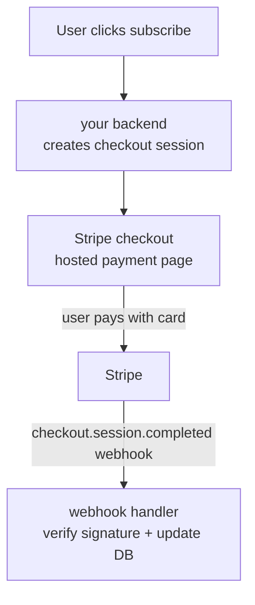
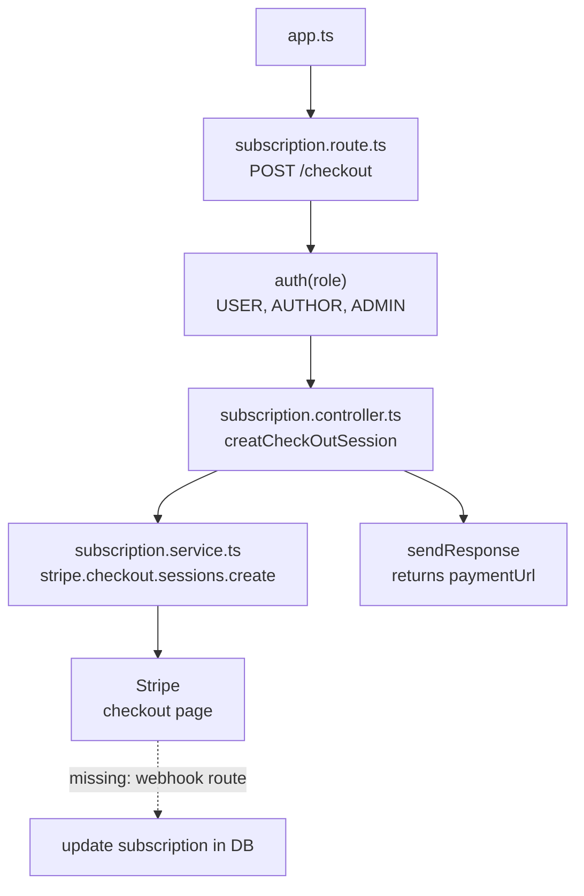

# 📦 PROJECT-PRISMA-PRESS

## 💳 Stripe basics — why and how

**Why developers use Stripe:** it handles payment infrastructure so you don't have to — securely storing card data, staying PCI-compliant, talking to banks, handling currencies and taxes. You just call its API.

**What it provides:**
- **Checkout** — a hosted, pre-built payment page (`stripe.checkout.sessions.create`)
- **Customers** — an object representing a paying user, so payment methods/invoices/subscriptions attach to one identity
- **Billing/Subscriptions** — recurring charges, proration, trials, upgrades handled by Stripe instead of your own cron jobs
- **Webhooks** — Stripe notifying *your* server when something happens (payment succeeded, renewal, failed card), since your server has no other way to know in real time

**How it helps with payments:** your server never touches raw card numbers — it redirects the user to Stripe's hosted checkout, Stripe handles the actual charge, and your server only ever sees a session id / webhook event, not card details.

**Why webhooks matter:** a successful redirect to your `success_url` isn't proof of payment (it can be spoofed by just visiting the URL). The webhook, verified with a signing secret, is the trustworthy signal that money actually moved.



**Small example — webhook handler:**

```ts
app.post("/webhook", express.raw({ type: "application/json" }), (req, res) => {
  const event = stripe.webhooks.constructEvent(
    req.body,
    req.headers["stripe-signature"] as string,
    config.stripe_webhook_secret,
  );

  if (event.type === "checkout.session.completed") {
    const session = event.data.object;
    // session.metadata.userId → mark that user as subscribed in your DB
  }

  res.json({ received: true });
});
```

> ⚠️ Your current module creates the checkout session and redirects the user, but there's no webhook route yet catching `checkout.session.completed` to actually flip the user's subscription to active in the database. Worth adding a `subscription.webhook.ts` (or a route in `subscription.route.ts`) for this.

---

## 🏗️ Architected Subscription Module Flow



**Flow explained:**
1. `app.ts` mounts the subscription router at `/api/subscription`.
2. `subscription.route.ts` protects the `/checkout` endpoint with `auth(...)` — any logged-in role can start checkout.
3. `subscription.controller.ts` grabs `req.user?.id` and calls the service.
4. `subscription.service.ts` finds (or creates) the user's Stripe customer, opens a Prisma transaction, and creates a Stripe checkout session, returning its `url`.
5. The controller sends that URL back to the client via `sendResponse`, so the frontend can redirect the user to Stripe.
6. *(Missing piece: a webhook endpoint to catch `checkout.session.completed` and persist the subscription as active.)*

---

## 📁 Folder Structure

```
PROJECT-PRISMA-PRESS/
├── dist/
├── generated/
├── node_modules/
├── prisma/
├── src/
│   ├── config/
│   ├── lib/
│   │   ├── prisma.ts
│   │   └── stripe.ts
│   ├── middlewares/
│   ├── modules/
│   │   ├── auth/
│   │   ├── comments/
│   │   ├── post/
│   │   ├── subscription/
│   │   │   ├── subscription.controller.ts
│   │   │   ├── subscription.route.ts
│   │   │   └── subscription.service.ts
│   │   ├── users/
│   │   └── ...
│   ├── utils/
│   ├── app.ts
│   └── server.ts
├── .env
├── .env.example
├── package.json
├── prisma.config.ts
└── tsconfig.json
```

---

## `app.ts`

```ts
app.use("/api/subscription", subscriptionRoutes);
```

**Explanation:** Mounts the subscription router at `/api/subscription`.

---

## `subscription.route.ts`

```ts
import { Router } from "express";
import { subscriptionController } from "./subscription.controller";
import { auth } from "../../middlewares/auth";
import { Role } from "../../../generated/prisma/enums";

const router = Router();

router.post("/checkout", auth(Role.USER, Role.AUTHOR, Role.ADMIN), subscriptionController.creatCheckOutSession);

export const subscriptionRoutes = router;
```

**Explanation:** Defines the single `/checkout` endpoint, protected so only authenticated users of any role can start a subscription checkout.

**Where to call it:** Imported and mounted in `app.ts` as `subscriptionRoutes`.

---

## `subscription.controller.ts`

```ts
import { NextFunction, Request, Response } from "express";
import { catchAsync } from "../../utils/catchAsync";
import { subscriptionService } from "./subscription.service";
import { sendResponse } from "../../utils/sendResponse";
import httpStatus from "http-status";

const creatCheckOutSession = catchAsync(async (req: Request, res: Response, next: NextFunction) => {
  const userId = req.user?.id;

  const result = await subscriptionService.creatCheckOutSession(userId as string);
  sendResponse(res, {
    success: true,
    statusCode: httpStatus.OK,
    message: "checkout compled successfully",
    data: result,
  });
});

export const subscriptionController = {
  creatCheckOutSession,
};
```

**Explanation:** Reads the logged-in user's id off `req.user` (set by `auth` middleware) and calls the service to create a Stripe checkout session, then returns the resulting payment URL.

**Where to call it:** Referenced from `subscription.route.ts` as `subscriptionController.creatCheckOutSession`.

---

## `subscription.service.ts`

```ts
import config from "../../config";
import { prisma } from "../../lib/prisma";
import { stripe } from "../../lib/stripe";

const creatCheckOutSession = async (userId: string) => {
  const transactionResult = await prisma.$transaction(async (tx) => {
    const user = await tx.user.findUniqueOrThrow({
      where: { id: userId },
      include: { subscription: true },
    });

    // for old subscriber
    let stripeCustomerId = user.subscription?.stripeCustomerId;

    // new subscriber
    if (!stripeCustomerId) {
      const customer = await stripe.customers.create({
        email: user.email,
        name: user.name,
        metadata: { userId: user.id },
      });
      stripeCustomerId = customer.id;
    }

    const session = await stripe.checkout.sessions.create({
      line_items: [{ price: config.stripe_product_id, quantity: 1 }],
      mode: "subscription",
      customer: stripeCustomerId,
      payment_method_types: ["card"],
      success_url: `${config.app_url}/premium?success=true`,
      cancel_url: `${config.app_url}/payment?success=false`,
      metadata: { userId: user.id },
    });
    return session.url;
  });
  return { paymentUrl: transactionResult };
};

export const subscriptionService = {
  creatCheckOutSession,
};
```

**Explanation:** Looks up the user (with their existing subscription record, if any). If they've never subscribed before, it creates a new Stripe `customer`. Either way, it creates a Stripe checkout `session` in `subscription` mode and returns the session's `url` — that's the link the frontend redirects the user to in order to pay.

**Where to call it:** Called only from `subscription.controller.ts` (`subscriptionService.creatCheckOutSession`).
