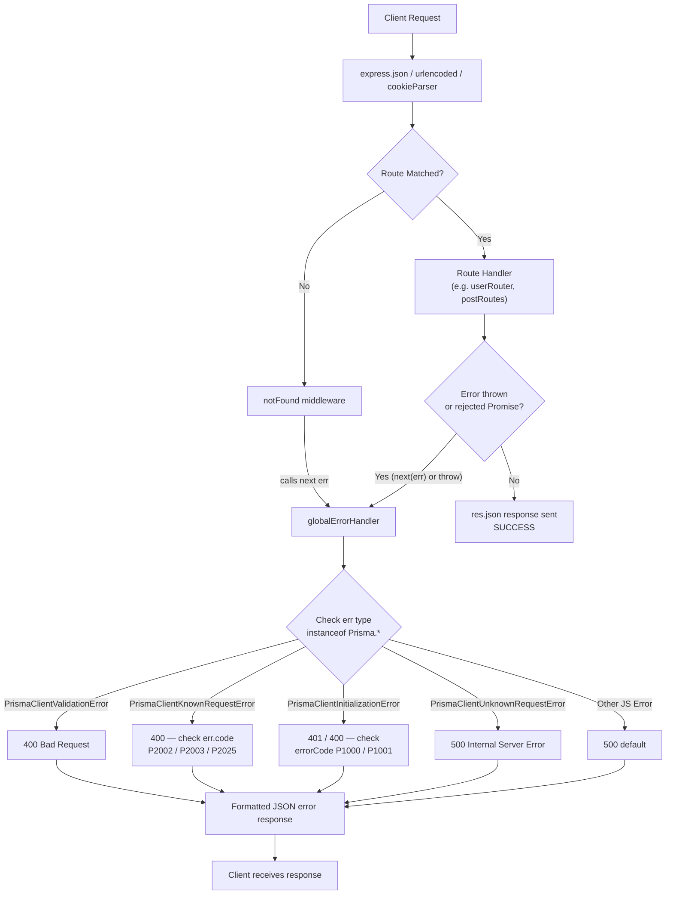
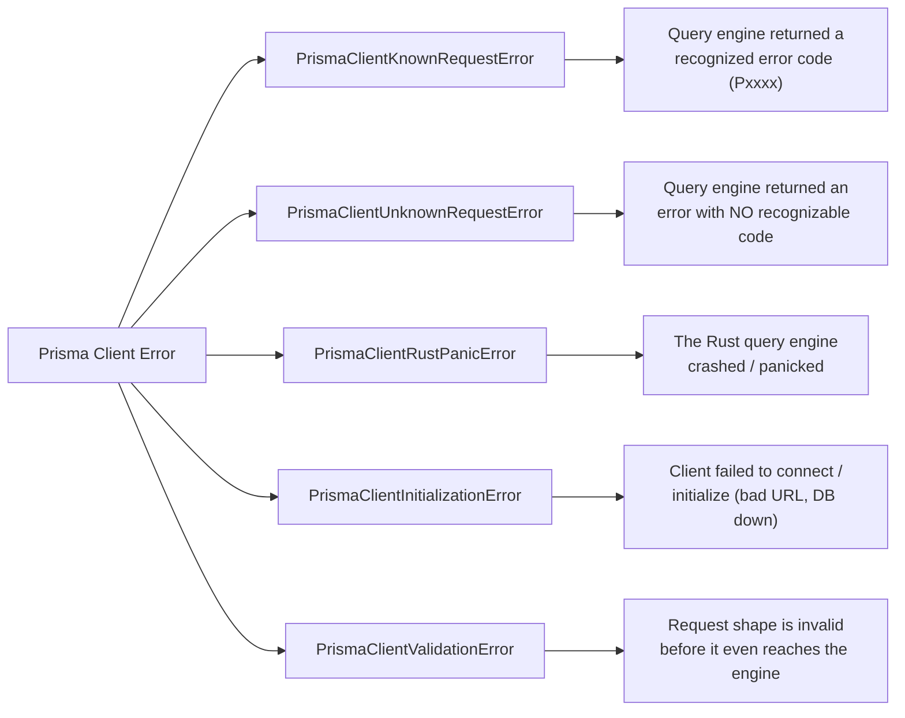
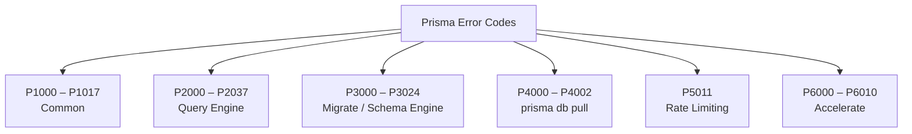

# Prisma Error Handling — Complete Notes

> Personal reference notes on catching, classifying, and globally handling Prisma + Express errors.

---

## Table of Contents

1. [Basic Error Handling with `instanceof`](#1-basic-error-handling-with-instanceof)
2. [Global Error Handler Architecture](#2-global-error-handler-architecture)
3. [Prisma Client Error Types](#3-prisma-client-error-types)
4. [Prisma Error Codes Reference](#4-prisma-error-codes-reference)
5. [Debugging Prisma](#5-debugging-prisma)

---

## 1. Basic Error Handling with `instanceof`

Prisma throws typed errors. Use `instanceof` against the `Prisma` namespace to detect *which* kind of error occurred, then branch on the `.code` for known-request errors.

**Example schema** — `email` has a `@unique` constraint:

```prisma
model User {
  id    Int     @id @default(autoincrement())
  email String  @unique
  name  String?
}
```

**Catching a duplicate-email error:**

```ts
import { PrismaPg } from "@prisma/adapter-pg";
import { PrismaClient, Prisma } from "../generated/prisma/client";

const connectionString = `${process.env.DATABASE_URL}`;
const adapter = new PrismaPg({ connectionString });
const prisma = new PrismaClient({ adapter });

try {
  await prisma.user.create({ data: { email: "alreadyexisting@mail.com" } });
} catch (e) {
  if (e instanceof Prisma.PrismaClientKnownRequestError) {
    // e.code is type-safe here
    if (e.code === "P2002") {
      console.log(
        "Unique constraint violation — a user with this email already exists"
      );
    }
  }
  throw e; // re-throw so the global handler can still process it
}
```

**Why re-throw?** Local `try/catch` blocks are good for *specific* recovery logic (e.g., a friendly message for one route). The re-thrown error still needs to reach the **global error handler** so the response shape stays consistent across the whole API. That's what section 2 covers.

---

## 2. Global Error Handler Architecture

### 2.1 The idea

Instead of writing `try/catch` + custom response formatting in every controller, Express lets you register **one** error-handling middleware at the bottom of the middleware stack. Any error thrown (or passed to `next(err)`) anywhere upstream eventually falls through to it.

### 2.2 Why placement matters

Express matches middleware **top to bottom**, in the order they're registered. An error-handling middleware is identified by having **4 parameters** `(err, req, res, next)`. Express skips it during normal request handling and only invokes it when an error is thrown or `next(err)` is called. That's why it must sit **after** every route:

```ts
app.use(express.json());
app.use(express.urlencoded({ extended: true }));
app.use(cookieParser());

app.get("/", async (req: Request, res: Response) => {
  res.send("Hello, world");
});

app.use("/api/users", userRouter);
app.use("/api/auth", authRouter);
app.use("/api/posts", postRoutes);
app.use("/api/comments", commentRoutes);
app.use("/api/subscription", subscriptionRoutes);

// 404 handler — catches unmatched routes
app.use(notFound);

// Global error handler — MUST be last
app.use(globalErrorHandler);

export default app;
```

### 2.3 Request lifecycle diagram



**Key takeaway:** the global handler is *reactive*, not called directly. It activates only when something upstream calls `next(err)` (explicitly) or an `async` handler throws and a wrapper forwards it to `next`. Express's own routing engine watches for this and jumps straight to the first 4-arg middleware it finds — skipping all normal routes in between.

> ⚠️ **Common gotcha:** if you're using `async` route handlers without a wrapper like `express-async-handler` or a `try/catch` that calls `next(err)`, a thrown error inside an `async` function will **not** automatically reach the global handler in older Express versions (Express 5 fixes this natively). Always wrap async controllers or call `next(err)` explicitly in `catch` blocks.

### 2.4 The handler implementation

**Project file structure** (where this file actually lives):

```
src/
├── middlewares/
│   ├── auth.ts
│   ├── globalErrorHandler.ts
│   └── notFound.ts
├── modules/
│   └── ...                # feature folders: user, auth, post, comment, subscription
├── utils/
│   └── ...
└── app.ts
```

```ts
// middlewares/globalErrorHandler.ts
import { NextFunction, Request, Response } from "express";
import httpStatus from "http-status";
import { Prisma } from "../../generated/prisma/client";

export const globalErrorHandler = (
  err: any,
  req: Request,
  res: Response,
  next: NextFunction
) => {
  console.log(err);

  let statusCode = httpStatus.INTERNAL_SERVER_ERROR;
  let errorMessage = err.message || "Internal Server Error";
  let errorName = err.name || "Internal Server Error";

  if (err instanceof Prisma.PrismaClientValidationError) {
    statusCode = httpStatus.BAD_REQUEST;
    errorMessage = "You have provided an incorrect field type or missing fields";

  } else if (err instanceof Prisma.PrismaClientKnownRequestError) {
    if (err.code === "P2002") {
      statusCode = httpStatus.BAD_REQUEST;
      errorMessage = "Duplicate key error";
    } else if (err.code === "P2003") {
      statusCode = httpStatus.BAD_REQUEST;
      errorMessage = "Foreign key constraint failed";
    } else if (err.code === "P2025") {
      statusCode = httpStatus.BAD_REQUEST;
      errorMessage = "An operation failed because it depends on one or more records that were required but not found";
    }

  } else if (err instanceof Prisma.PrismaClientInitializationError) {
    if (err.errorCode === "P1000") {
      statusCode = httpStatus.UNAUTHORIZED;
      errorMessage = "Authentication failed against the database server. Please check your credentials";
    } else if (err.errorCode === "P1001") {
      statusCode = httpStatus.BAD_REQUEST;
      errorMessage = "Cannot reach the database server";
    }

  } else if (err instanceof Prisma.PrismaClientUnknownRequestError) {
    statusCode = httpStatus.INTERNAL_SERVER_ERROR;
    errorMessage = "Error occurred during query execution";
  }

  res.status(statusCode).json({
    success: false,
    statusCode,
    name: errorName,
    message: errorMessage,
    error: process.env.NODE_ENV === "development" ? err.stack : undefined,
  });
};
```

> 🐛 **Bug fixed from the original draft:** the original always called `res.status(httpsStatus.INTERNAL_SERVER_ERROR)` regardless of the computed `statusCode`, so every response returned HTTP 500 even when the logic correctly identified a 400 or 401 case. Always call `res.status(statusCode)` using the variable you actually computed. Also, avoid leaking `err.stack` in production responses — gate it behind an environment check.

---

## 3. Prisma Client Error Types

Prisma Client throws **5 categories** of errors. Knowing which is which tells you *where in the request lifecycle* the failure happened.



| # | Error Type | When it occurs | Example trigger |
|---|------------|-----------------|------------------|
| 1 | **`PrismaClientKnownRequestError`** | The query engine returns an error with a known, documented Prisma error code (e.g. `P2002`). | Inserting a duplicate value into a `@unique` column. |
| 2 | **`PrismaClientUnknownRequestError`** | The query engine throws an error, but Prisma doesn't recognize the error code — no additional structured info is available. | An unexpected low-level database error not mapped to any `Pxxxx` code. |
| 3 | **`PrismaClientRustPanicError`** | The underlying Rust query engine process crashes/panics entirely. The engine must restart. | A severe internal bug or an unsupported operation that crashes the engine binary. |
| 4 | **`PrismaClientInitializationError`** | Thrown when Prisma Client cannot start up correctly — usually before any query even runs. | Wrong `DATABASE_URL`, database unreachable, invalid credentials. |
| 5 | **`PrismaClientValidationError`** | Thrown *client-side*, before the query is even sent to the engine, because the arguments don't match the schema. | Passing a `string` to a field typed as `Int`, or omitting a required field. |

---

## 4. Prisma Error Codes Reference

Prisma groups error codes by **which engine** produced them.



### 4.1 Common (`P1000`–`P1017`)

Errors that happen before or independent of any specific query — mostly connection-level.

| Code | Meaning |
|------|---------|
| `P1000` | Authentication failed against the database server (wrong credentials). |
| `P1001` | Can't reach the database server (host/port unreachable, DB down, firewall). |
| `P1002` | The database server was reached but timed out. |
| `P1008` | Operations timed out. |
| `P1017` | The database server closed the connection. |

### 4.2 Query Engine (`P2000`–`P2037`)

Errors raised while executing an actual query.

| Code | Meaning |
|------|---------|
| `P2002` | Unique constraint violation (duplicate value on a `@unique` field). |
| `P2003` | Foreign key constraint failed. |
| `P2011` | Null constraint violation (a required field was `null`). |
| `P2025` | An operation depends on a record that was required but not found (e.g. `update`/`delete` on a non-existent row). |

### 4.3 Migrate / Schema Engine (`P3000`–`P3024`)

Errors raised while running `prisma migrate ...`.

| Code | Meaning |
|------|---------|
| `P3005` | The database schema isn't empty when it was expected to be. |
| `P3009` | Migration history contains a failed migration blocking further migrations. |
| `P3014` | Prisma Migrate could not create the shadow database used for diffing. |

### 4.4 `prisma db pull` (`P4000`–`P4002`)

| Code | Meaning |
|------|---------|
| `P4000` | Introspection failed to reconnect to the database. |
| `P4001` | The introspected database is empty. |
| `P4002` | The schema derived from introspection isn't valid. |

### 4.5 Rate Limiting (`P5011`)

| Code | Meaning |
|------|---------|
| `P5011` | Request volume exceeded. Implement a back-off/retry strategy; contact support for expected high-traffic workloads. |

### 4.6 Prisma Accelerate (`P6000`–`P6010`)

All Accelerate-specific errors begin with `P6xxx` (except `P5011`, the rate-limit code, which is shared).

| Code | Name | Meaning |
|------|------|---------|
| `P6000` | `ServerError` | Generic catch-all for uncategorized Accelerate errors. |
| `P6001` | `InvalidDataSource` | Connection URL is malformed (e.g. doesn't use `prisma://`). |
| `P6002` | `Unauthorized` | The API key in the connection string is invalid. |
| `P6003` | `PlanLimitReached` | Free-plan usage limit exceeded. |
| `P6004` | `QueryTimeout` | Accelerate's global query timeout was exceeded. |
| `P6005` | `InvalidParameters` | Invalid parameters supplied (e.g. transaction timeout set too high). |
| `P6006` | `VersionNotSupported` | The Prisma version in use isn't compatible with Accelerate. |
| `P6008` | `ConnectionError` / `EngineStartError` | The engine failed to start (e.g. couldn't connect to the DB). |
| `P6009` | `ResponseSizeLimitExceeded` | Accelerate's global response size limit was exceeded. |
| `P6010` | `ProjectDisabledError` | The Accelerate project is disabled — re-enable it to continue. |

---

## 5. Debugging Prisma

Prisma exposes debug output through the `DEBUG` environment variable, using namespaces:

| Namespace | Prints... |
|-----------|-----------|
| `prisma:engine` | Debug messages from the Prisma query/schema engine. |
| `prisma:client` | Debug messages from the Prisma Client runtime. |
| `prisma*` | All Prisma-related debug messages (client + engine + CLI). |
| `*` | Every debug message available (very noisy — all libraries using the `debug` package). |

### 5.1 Setting `DEBUG` (bash / macOS / Linux)

```bash
# only engine-level output
export DEBUG="prisma:engine"

# only client-level output
export DEBUG="prisma:client"

# both client and engine
export DEBUG="prisma:client,prisma:engine"

# everything Prisma-related
export DEBUG="prisma*"

# absolutely everything (all libraries, very verbose)
export DEBUG="*"
```

### 5.2 Setting `DEBUG` (Windows `cmd`)

```cmd
set DEBUG="prisma*"
```

### 5.3 Worked example: debugging a single route in a starter project

Say you have this minimal Express + Prisma starter and the `POST /api/users` route is misbehaving:

```
project-root/
├── src/
│   ├── app.ts
│   ├── server.ts
│   ├── middlewares/
│   │   ├── auth.ts
│   │   ├── globalErrorHandler.ts
│   │   └── notFound.ts
│   ├── utils/
│   └── modules/
│       └── user/
│           ├── user.route.ts
│           └── user.controller.ts
├── prisma/
│   └── schema.prisma
├── .env
└── package.json
```

**Step 1 — Run only that route's debug session** by exporting `DEBUG` right before starting the dev server, scoped to just that terminal session (so it doesn't pollute other runs):

```bash
DEBUG="prisma:client,prisma:engine" npm run dev
```

**Step 2 — Hit the failing endpoint** (e.g. with `curl` or Postman):

```bash
curl -X POST http://localhost:5000/api/users \
  -H "Content-Type: application/json" \
  -d '{"email": "alreadyexisting@mail.com", "name": "Test"}'
```

**Step 3 — Read the terminal output.** With `prisma:client` and `prisma:engine` both enabled you'll see the exact generated SQL, the request/response cycle with the engine, and — right before your `globalErrorHandler` logs the caught error — the raw engine-level error that caused it. This tells you whether the failure happened at the **client validation stage** (bad input, never reached the DB) or the **engine/DB stage** (query actually ran and the database rejected it).

**Step 4 — Turn it off** once done, so normal runs stay clean:

```bash
unset DEBUG        # bash/macOS/Linux
set DEBUG=         # Windows cmd
```

> 💡 **Tip:** For a *permanent but toggleable* setup, add a `debug` script to `package.json` instead of exporting manually every time:
> ```json
> {
>   "scripts": {
>     "dev": "ts-node-dev src/server.ts",
>     "dev:debug": "cross-env DEBUG=prisma:client,prisma:engine ts-node-dev src/server.ts"
>   }
> }
> ```
> (Use the `cross-env` package so the same script works on both Windows and Unix shells.)

---

## Quick Reference Summary

```mermaid
mindmap
  root((Prisma Errors))
    instanceof checks
      PrismaClientKnownRequestError
      PrismaClientUnknownRequestError
      PrismaClientRustPanicError
      PrismaClientInitializationError
      PrismaClientValidationError
    Error code ranges
      P1xxx Common
      P2xxx Query Engine
      P3xxx Migrate
      P4xxx db pull
      P5011 Rate limit
      P6xxx Accelerate
    Global handler
      Registered last in app.ts
      4-arg middleware signature
      Triggered by next(err) or thrown error
    Debugging
      DEBUG=prisma:client
      DEBUG=prisma:engine
      DEBUG=prisma*
```
