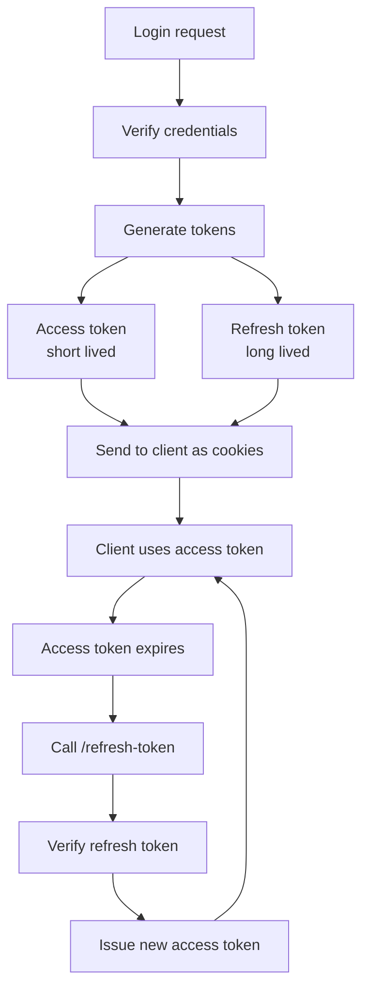

# Refresh token — concept notes

**Project structure (auth module)**
```
modules/
  auth/
    auth.controller.ts
    auth.interface.ts
    auth.routes.ts
    auth.service.ts
```

Route: `app.use("/api/auth", authRouter)` → `auth.routes.ts` → `router.post('/refresh-token', authController.refreshToken)`

---

## 1. Why we need two tokens (access + refresh)

A single long-lived token is dangerous: if it leaks, an attacker has access forever.
A single short-lived token is annoying: the user gets logged out every few minutes.

So we split identity proof into two tokens with different jobs:

| Token | Lifespan | Job | Where stored |
|---|---|---|---|
| Access token | Short (minutes–1 day) | Sent with every API request to prove "this is a logged-in user" | httpOnly cookie (or header) |
| Refresh token | Long (days–weeks) | Only used to get a *new* access token when the old one expires | httpOnly cookie, sometimes also DB |

This way, even if an access token is stolen, it's only useful for a short window. The refresh token rarely travels (only hits `/refresh-token`), so it's less exposed, and because it's `httpOnly`, JavaScript on the page can never read it — only the browser sends it automatically.

## 2. What happens at login

1. User submits email + password.
2. Server checks the password hash against the DB.
3. Server signs **two** JWTs with the same payload (id, name, email, role) but:
   - different secrets (`jwt_access_secret` vs `jwt_refresh_secret`)
   - different expiry (`jwt_access_expires_in` short, `jwt_refresh_expires_in` long)
4. Both tokens are set as httpOnly cookies and sent back to the client.

From this point, the client attaches the access token cookie automatically on every request. Middleware verifies it and puts the decoded payload on `req.user`.

## 3. Why we need to *regenerate* the access token later

The access token is deliberately short-lived — that's the whole point of it. So after it expires:

- The client's next API call fails with 401 (access token invalid/expired).
- Instead of forcing a full re-login, the client silently calls `/api/auth/refresh-token`.
- The server checks the refresh token (still valid, longer expiry) and issues a **new access token**.
- The client resumes normal API calls — the user never notices.

This loop repeats until the refresh token itself expires (then the user must log in again for real), or until the user logs out / is blocked.

## 4. Walking through your code

**`auth.routes.ts`**
```ts
router.post('/refresh-token', authController.refreshToken)
```
Plain POST endpoint, no auth middleware in front of it — because the access token is expired at this point, there's nothing valid to check yet.

**`auth.controller.ts`**
```ts
const refreshToken = catchAsync(async (req, res, next) => {
  const refreshToken = req.cookies.refreshToken;
  const { accessToken } = await authService.refreshToken(refreshToken);

  res.cookie("accessToken", accessToken, {
    httpOnly: true,
    secure: false,
    sameSite: "none",
    maxAge: 1000 * 60 * 60 * 24,
  });

  sendResponse(res, {
    success: true,
    statusCode: httpsStatus.OK,
    message: "Refresh token generate",
    data: { accessToken },
  });
});
```
- Reads the refresh token cookie from the request.
- Passes it to the service to verify and mint a new access token.
- Sets the new access token as a cookie and also returns it in the response body.

**`auth.service.ts`**
```ts
const refreshToken = async (refreshToken: string) => {
  const verifiedRefreshToken = jwtutils.verifyToken(refreshToken, config.jwt_refresh_secret);
  if (!verifiedRefreshToken.success) throw new Error(verifiedRefreshToken.error);

  const { id } = verifiedRefreshToken.data as JwtPayload;
  const user = await prisma.user.findFirstOrThrow({ where: { id } });
  if (user.activeStatus === "BLOCKED") throw new Error("user is blocked!");

  const jwtPayload = { id, name: user.name, email: user.email, role: user.role };
  const accessToken = jwtutils.createToken(jwtPayload, config.jwt_refresh_secret, config.jwt_refresh_expires_in);
  return accessToken;
};
```
- Verifies the refresh token's signature and expiry against `jwt_refresh_secret`.
- Extracts the user `id` embedded in it, re-fetches the user from the DB (so freshly blocked/deleted users can't refresh forever).
- Signs a brand new token to hand back as the "access token."

> **⚠️ Bug to fix**: the new access token is being signed with `config.jwt_refresh_secret` / `jwt_refresh_expires_in`. It should use `config.jwt_access_secret` and `config.jwt_access_expires_in`. As written, the "access token" is really just another refresh-token-shaped token — that breaks the whole short-lived-token security model, and any access-check middleware that expects `jwt_access_secret` will fail to verify it.

## 5. Why `req.cookies.refreshToken` instead of `req.user.id`

`req.user` only exists because some earlier **auth middleware** decoded and verified the access token and attached its payload to the request. At the `/refresh-token` endpoint, the access token is already expired or missing — that's the whole reason the client is calling this endpoint. So there is no valid access token to decode, meaning `req.user` doesn't exist here.

The refresh token cookie is the *only* proof of identity available at this point. So the flow has to:
1. Pull the raw refresh token out of the cookie.
2. Verify it itself (separately, with the refresh secret).
3. Pull the `id` out of *its* payload, not out of `req.user`.

In short: `req.user.id` = "who does the already-verified access token say you are." `req.cookies.refreshToken` = "prove who you are again, using the long-lived token, because the short-lived one just died."

## 6. Flow diagram



## 7. Quick takeaways for future projects

- Two tokens, two secrets, two expiry lengths — never sign both with the same secret/expiry, that defeats the purpose.
- Refresh endpoint has no auth middleware — it reads its identity from the refresh cookie itself, not from `req.user`.
- Always re-check the user's status (blocked/deleted) in the DB during refresh, not just the token signature — a still-valid refresh token shouldn't work for a banned user.
- httpOnly + `secure` (in production) + `sameSite` cookies keep both tokens out of reach of client-side JS and reduce CSRF/XSS exposure.
- When the refresh token itself expires, there is no more silent recovery — the user must log in again.
