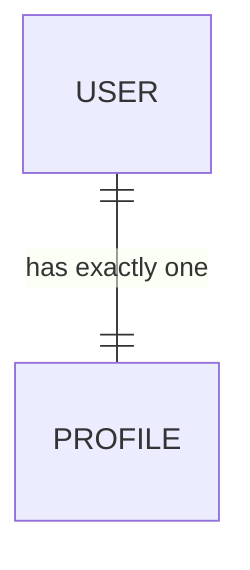
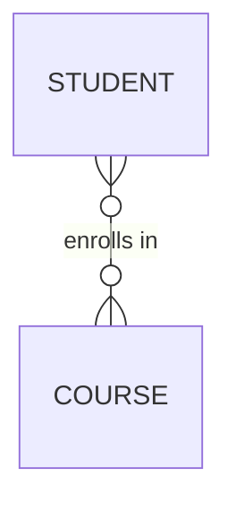
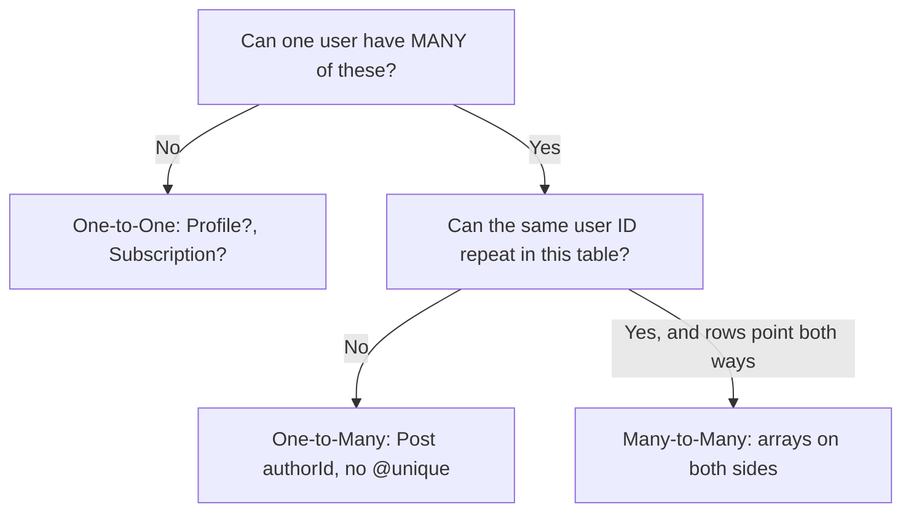
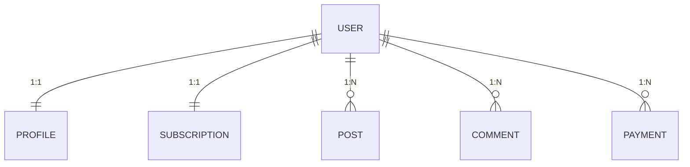
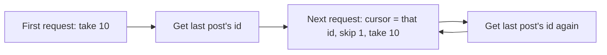

# 📘 My Prisma Study Notes — Relationships, Syntax & Pagination

> A story-style walkthrough of how I finally understood Prisma relationships — from "why do we even need this?" all the way to sorting and pagination.

---

## 📑 Table of Contents

1. [The Problem — Why Relationships Exist](#1-the-problem--why-relationships-exist)
2. [The Building Blocks — Primary Key & Foreign Key](#2-the-building-blocks--primary-key--foreign-key)
3. [The Three Types of Relationships](#3-the-three-types-of-relationships)
   - [3.1 One-to-One](#31-one-to-one-11)
   - [3.2 One-to-Many](#32-one-to-many-1n)
   - [3.3 Many-to-Many](#33-many-to-many-nn)
4. [The Golden Rule — How I Decide Which One to Use](#4-the-golden-rule--how-i-decide-which-one-to-use)
5. [Prisma Syntax Reference](#5-prisma-syntax-reference)
6. [Putting It All Together — The RentNest Example](#6-putting-it-all-together--the-rentnest-example)
7. [Part 11 — Sorting & Pagination](#7-part-11--sorting--pagination)
8. [Final Quick-Reference Table](#8-final-quick-reference-table)

---

## 1. The Problem — Why Relationships Exist

Every table in a database has **one job**. It stores one type of thing, and nothing else.

```
User          Post          Comment
------        ------        ---------
id            id            id
name          title         text
email         description
```

That's clean... until I ask a simple question:

> **"Who created this post?"**

```
User
-----
u1  Ashik

Post
------
"House for Rent"
```

Looking at these two tables side by side, there's no way to answer that. The `Post` table has no idea a user named Ashik exists. **This is the exact reason relationships exist** — tables need a way to *point* at each other.

So I connect them:

```
User
-----
u1 Ashik
   ▲
   │
   │ authorId = u1
   │
Post
-----
"House for Rent"
```

Now the post *remembers* who made it. That one arrow — `authorId = u1` — is the seed of everything else in this note. Once I understood that a relationship is just "one table storing another table's ID," the rest of Prisma stopped feeling like magic.

---

## 2. The Building Blocks — Primary Key & Foreign Key

Before the three relationship types make sense, I need two ideas locked in:

| Concept | What it means | Example |
|---|---|---|
| **Primary Key** | The ID that uniquely identifies *this* row | `User.id`, `Post.id` |
| **Foreign Key** | A column that stores *another table's* ID | `Post.authorId` stores a `User.id` |

So when I see:

```
Post.authorId = "u1"
```

I read it as plain English: *"This post belongs to the user whose id is u1."* That's it — a foreign key is just a table's way of saying "I belong to that other row over there."

With that settled, I'm ready for the three shapes a relationship can take.

---

## 3. The Three Types of Relationships

### 3.1 One-to-One (1:1)

**Real life:** One user has exactly one profile. One profile belongs to exactly one user.



```prisma
model User {
  id      String   @id @default(uuid())
  profile Profile?
}

model Profile {
  id     String @id @default(uuid())
  userId String @unique
  user   User   @relation(fields: [userId], references: [id])
}
```

The detail that matters here is `userId String @unique`. Why unique? Because a profile can only ever belong to **one** user — the same `userId` can never appear twice in the `Profile` table.

**Summary**

| Side | Field | Meaning |
|---|---|---|
| User (One side) | `profile Profile?` | Optional — may not exist |
| Profile (Other side) | `userId String @unique` | Only one row per user allowed |
| Profile | `user User @relation(fields:[userId], references:[id])` | Links back to `User.id` |

This is the simplest case. But real apps rarely stop at "one of something" — that's where the next type comes in.

---

### 3.2 One-to-Many (1:N)

**Real life:** One user can write many posts. Many posts, one author each.


```prisma
model User {
  id    String @id @default(uuid())
  posts Post[]
}

model Post {
  id       String @id @default(uuid())
  authorId String
  author   User   @relation(fields: [authorId], references: [id])
}
```

Notice what's *missing* compared to One-to-One: there's **no `@unique`** on `authorId`. That's deliberate — the same `authorId` (`u1`, `u1`, `u1`...) is allowed to repeat, because one user is allowed to own many posts.

**Summary**

| Side | Field | Meaning |
|---|---|---|
| User (One side) | `posts Post[]` | The `[]` means "many" |
| Post (Many side) | `authorId String` | No `@unique` — repeats are fine |
| Post | `author User @relation(fields:[authorId], references:[id])` | Links back to `User.id` |

**Golden shortcut:** the foreign key *always* lives on the "many" side.

So far every relationship has had a clear "owner" and a clear "owned." But some relationships go both ways at once — and that's the trickiest (and most interesting) one.

---

### 3.3 Many-to-Many (N:N)

**Real life:** A student can enroll in many courses, and a course can have many students.

```
Ashik ──┬── React
        └── Next.js

John  ──── React

React ──┬── Ashik
        └── John
```



```prisma
model Student {
  id      String   @id @default(uuid())
  courses Course[]
}

model Course {
  id       String    @id @default(uuid())
  students Student[]
}
```

What's beautifully simple here: **no `studentId`, no `courseId`, no `@relation` at all.** Prisma quietly builds a hidden join table behind the scenes for me. It's the one relationship type where I *don't* need to think about foreign keys myself — Prisma handles it.

(If I ever need extra info on the relationship itself — like `enrolledAt` or `grade` — I'd switch to an *explicit* join table with its own model. But for a plain many-to-many, arrays on both sides are enough.)

**Summary**

| Side | Field |
|---|---|
| Student | `courses Course[]` |
| Course | `students Student[]` |

Now I have all three shapes. The real skill isn't memorizing the syntax — it's knowing *which one to reach for* when I'm staring at a blank schema. That's where my golden rule comes in.

---

## 4. The Golden Rule — How I Decide Which One to Use

Whenever I'm confused, I stop thinking about Prisma syntax and ask two plain business questions:



| Question | If YES | If NO |
|---|---|---|
| Can one user have many of these? | → One-to-Many (`Post[]`, `Comment[]`) | → One-to-One (`Profile?`) |
| Can the same user ID repeat in this table? | → Don't use `@unique` | → Use `@unique` |

That's genuinely the whole trick. Two questions, answered from the real-world business rule — not from the code — and the correct relationship falls out almost every time.

With the theory settled, here's the syntax I actually type.

---

## 5. Prisma Syntax Reference

These are the pieces I reach for constantly. I've grouped them so related ones sit together instead of being one long alphabetical wall.

### Identity & defaults

| Syntax | Meaning | Example |
|---|---|---|
| `@id` | Marks the primary key | `id String @id` |
| `@default()` | Auto-fills a value if none given | `@default(uuid())` |
| `uuid()` | Generates a UUID | `@default(uuid())` |
| `cuid()` | Generates a CUID | `@default(cuid())` |
| `@updatedAt` | Auto-updates on every change | `updatedAt DateTime @updatedAt` |

### Relationships

| Syntax | Meaning | Example |
|---|---|---|
| `@relation()` | Connects two models | `author User @relation(fields:[authorId], references:[id])` |
| `fields:[...]` | Which column is the foreign key | `fields:[authorId]` |
| `references:[...]` | Which column it points to | `references:[id]` |
| `[]` | "Many" side of a relation | `posts Post[]` |
| `?` | Optional field | `profile Profile?` |

### Constraints & uniqueness

| Syntax | Meaning | Example |
|---|---|---|
| `@unique` | No two rows share this value | `email String @unique` |
| `@@unique([a,b])` | Combination must be unique | `@@unique([userId, houseId])` — can't book the same house twice |
| `@@index([field])` | Speeds up searching | `@@index([email])` |
| `@@id([a,b])` | Composite primary key | Common in join tables |

### Naming & storage

| Syntax | Meaning | Example |
|---|---|---|
| `@map()` | Rename column in the DB | `fullName String @map("full_name")` |
| `@@map()` | Rename the table in the DB | `@@map("users")` |
| `@db.VarChar(255)` | Short text, max length | `title String @db.VarChar(255)` |
| `@db.Text` | Long text | `description String @db.Text` |

### Data types

| Type | Stores | Example |
|---|---|---|
| `DateTime` | Date & time | `2026-07-13T10:35:22` |
| `Boolean` | true/false | `published Boolean` |
| `Int` | Whole number | `price Int` |
| `Float` | Decimal number | `rating Float` |
| `enum` | Fixed set of values | `role Role @default(USER)` |

> **The 10 I use 90% of the time:** `@id`, `@default()`, `@unique`, `@updatedAt`, `@relation()`, `[]`, `?`, `@db.VarChar()` / `@db.Text`, `@map()` / `@@map()`, `enum`.

Now let's see all three relationship types living together in one real schema.

---

## 6. Putting It All Together — The RentNest Example



| Relation | Type | Why |
|---|---|---|
| User → Profile | One-to-One | One user, one profile |
| User → Subscription | One-to-One | One *current* subscription |
| User → Posts | One-to-Many | Many property listings |
| User → Comments | One-to-Many | Many comments over time |
| User → Payments | One-to-Many | A growing payment history |

This is really just the golden rule from Section 4, applied five times in a row. Once the *shapes* click, the last piece of the puzzle is: once I have all this data connected, how do I sort it and pull it back in manageable chunks?

---

## 7. Part 11 — Sorting & Pagination

Having a well-connected schema is only half the story — the other half is fetching that data back sensibly. Nobody wants to load 10,000 posts in one API call. This is where `orderBy`, `skip`, `take`, and `cursor` come in.

### 7.1 `orderBy` — Sorting Results

```javascript
const posts = await prisma.post.findMany({
  orderBy: {
    createdAt: 'desc', // newest first
  },
});
```

Sort by multiple fields:

```javascript
const posts = await prisma.post.findMany({
  orderBy: [
    { price: 'asc' },
    { createdAt: 'desc' },
  ],
});
```

### 7.2 `skip` and `take` — Offset Pagination

Think of `skip` as "how many rows to jump over" and `take` as "how many rows to grab after that."

```javascript
// Page 2, 10 posts per page
const posts = await prisma.post.findMany({
  skip: 10,
  take: 10,
  orderBy: { createdAt: 'desc' },
});
```

```
Page 1 → skip: 0,  take: 10  →  rows 1–10
Page 2 → skip: 10, take: 10  →  rows 11–20
Page 3 → skip: 20, take: 10  →  rows 21–30
```

This is simple, but it has a weakness: if new rows get added while a user is paging through, `skip`/`take` can show duplicates or skip rows. That's the problem **cursor pagination** solves.

### 7.3 `cursor` — Cursor-Based Pagination

Instead of counting rows from the start, a cursor says: *"start right after this specific row."*

```javascript
const posts = await prisma.post.findMany({
  take: 10,
  skip: 1, // skip the cursor itself
  cursor: {
    id: lastPostId, // the last post id from the previous page
  },
  orderBy: { createdAt: 'desc' },
});
```



Cursor pagination is more stable for large or fast-changing tables, because it never depends on counting from the very beginning.

### 7.4 Infinite Scroll — Putting It Into an API

```javascript
// GET /api/posts?cursor=<lastPostId>
export async function GET(req) {
  const { searchParams } = new URL(req.url);
  const cursor = searchParams.get('cursor');

  const posts = await prisma.post.findMany({
    take: 10,
    ...(cursor && {
      skip: 1,
      cursor: { id: cursor },
    }),
    orderBy: { createdAt: 'desc' },
  });

  const nextCursor = posts.length === 10 ? posts[posts.length - 1].id : null;

  return Response.json({ posts, nextCursor });
}
```

On the frontend, each "load more" scroll event just sends the previous `nextCursor` back as the new `cursor` — that's the entire infinite-scroll loop.

### 7.5 Summary — Offset vs Cursor

| | `skip` + `take` (Offset) | `cursor` (Cursor-based) |
|---|---|---|
| How it works | Counts rows from the start | Starts right after a known row |
| Good for | Numbered pages (1, 2, 3…) | Infinite scroll, live feeds |
| Weak point | Can skip/duplicate rows if data changes | Needs a stable, unique field (like `id`) to anchor on |
| Typical use | Admin tables, search results | Social feeds, "load more" |

---

## 8. Final Quick-Reference Table

| Relationship | One Side | Other Side |
|---|---|---|
| **One-to-One** | `profile Profile?` | `userId String @unique` + `user User @relation(...)` |
| **One-to-Many** | `posts Post[]` | `authorId String` + `author User @relation(...)` |
| **Many-to-Many** | `courses Course[]` | `students Student[]` |

| Query Feature | Purpose |
|---|---|
| `orderBy` | Sort results |
| `skip` / `take` | Page-number pagination |
| `cursor` | Stable pagination for infinite scroll |

---

### 🧵 The thread that ties it all together

Every relationship starts with the same tiny question — *"who does this belong to?"* — answered with a foreign key. One-to-one, one-to-many, and many-to-many are just three different answers to "how many times can that key repeat?" And once the data is connected, `orderBy`, `skip`/`take`, and `cursor` are simply how I ask the database to hand it back to me in a sane, human-readable order. That's the whole story.
